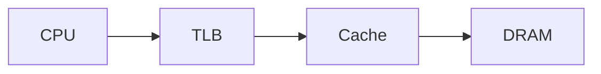

# AGENTS.md

This repository is a public technical blog and living coursework site built with Jekyll and GitHub Pages.

Agents working in this repository should treat the coursework as an evolving technical textbook rather than a static collection of notes.

## Primary goals

- Keep the site technically accurate, professional, and useful for systems engineering study.
- Preserve the distinction between material that has already been studied and material that is only planned.
- Prefer improving existing explanations over creating redundant pages.
- Keep lessons short enough to read and review in one sitting.
- Turn questions, review comments, debugging observations, and experiments into durable improvements to the coursework.

## Site structure

Current major areas include:

- `courses/nic-firmware/`
- `courses/performance-cache/`
- future `courses/openbmc/`
- `_posts/` for the Markdown blog
- `about.markdown` for the professional site description

When adding a new course, add it to `courses/index.md` and use a consistent permalink under `/courses/<course-name>/`.

## Lesson design

Prefer focused lesson pages rather than very large chapters. A useful target is roughly 5–15 minutes of reading per page.

If a lesson becomes too large, split it into smaller pages rather than allowing one page to become difficult to review.

Where appropriate, lessons should include:

1. Why the topic matters.
2. A simple mental model.
3. Hardware/system view.
4. Software/firmware view.
5. An end-to-end trace or worked example.
6. Failure modes and common misconceptions.
7. Debugging or measurement techniques.
8. Performance implications.
9. Knowledge-check questions.
10. Labs or experiments.
11. A short list of durable ideas worth remembering.

Not every lesson needs every section, but explanations should favor connected system models over isolated definitions.

## Covered material vs. planned material

Do not present unstudied material as completed coursework.

Use language such as:

- `Covered so far`
- `Active`
- `Next topics`
- `Planned`

when necessary to make status clear.

When a topic has actually been studied in conversation or through a lab, it can be promoted into active course material.

## Stable headings and annotation anchors

The site is intended to support browser-local review comments attached to lesson sections.

Therefore:

- Prefer descriptive Markdown headings.
- Avoid renaming existing headings unless the new wording materially improves accuracy or clarity.
- When restructuring a reviewed page, preserve the meaning of existing sections whenever possible.
- Avoid combining many unrelated concepts under one heading.
- Keep sections short enough that a comment attached to a heading remains useful context.

A review comment may include:

- page URL;
- section heading;
- heading anchor;
- selected text;
- reviewer comment;
- requested action/category.

Use all available context to locate the intended passage even if the page has changed slightly since the comment was generated.

## Review-report workflow

The intended authoring loop is:

```text
Read lesson
→ add comments in the browser
→ generate a Markdown review report
→ paste the report into ChatGPT or another coding agent
→ update the relevant lesson(s)
→ review the changes
→ clear resolved browser comments
```

When given a review report:

1. Address every actionable comment unless it conflicts with technical correctness or another explicit instruction.
2. Update the existing relevant page rather than duplicating the explanation elsewhere.
3. Add diagrams, examples, debugging notes, interview questions, or labs when requested and useful.
4. Correct misconceptions directly and clearly.
5. Preserve useful existing content while improving weak sections.
6. If a comment exposes a prerequisite gap, either add a concise prerequisite explanation or link to the appropriate lesson.
7. Keep the resulting page readable in one sitting; split it when necessary.

## Diagrams

Mermaid is supported site-wide and should be preferred for architecture, sequence, state, dependency, and data-flow diagrams that can be expressed clearly as text.

Use fenced Mermaid blocks:

````markdown

````

Guidelines:

- Keep diagrams focused enough to remain readable on a phone.
- Prefer several small diagrams over one enormous graph.
- Tie each diagram directly to the surrounding explanation.
- Use stable, descriptive node labels rather than unexplained abbreviations.
- Prefer left-to-right or top-to-bottom flows that match the prose.
- Do not use diagrams decoratively.
- ASCII diagrams remain acceptable when they are simpler or more portable.

Mermaid rendering is implemented in `assets/mermaid.js`. Preserve GitHub Pages compatibility and the site's light/dark readability when modifying it.

## Equations

MathJax is supported site-wide for TeX/LaTeX-style mathematics.

Preferred syntax:

Inline math:

```text
\( T = N / R \)
```

Display math:

```text
$$
AMAT = T_{L1} + MR_{L1} \left(T_{L2} + MR_{L2} T_{mem}\right)
$$
```

or:

```text
\[
BW = \frac{bytes}{second}
\]
```

Guidelines:

- Do not use single `$...$` delimiters for inline math; dollar signs commonly occur in ordinary prose and costs.
- Define every symbol near its first use.
- Follow equations with a plain-language interpretation.
- Prefer equations when they clarify a quantitative relationship, not merely to make a lesson look formal.
- For derivations, show intermediate steps when they are pedagogically useful.
- When useful, pair an equation with a concrete numerical example.
- Keep wide equations usable on mobile; split very long expressions when possible.

MathJax is configured in `_includes/head.html`.

## Labs and experiments

Favor experiments that make the hardware/software model observable.

Examples include:

- descriptor-ring simulators;
- cache-conflict microbenchmarks;
- pointer-chasing latency tests;
- false-sharing experiments;
- interrupt/NAPI measurements;
- RSS/CPU-affinity experiments;
- driver tracing and register inspection.

When adding a lab, state what hypothesis or system behavior it is intended to demonstrate and what should be measured.

## Technical accuracy

- Do not oversimplify a conceptual model into an incorrect hardware claim.
- Clearly distinguish architectural guarantees from implementation examples.
- Qualify microarchitecture-specific details when they are not universal.
- Distinguish virtual-memory events from cache events, coherence from memory ordering, and firmware responsibilities from driver/hardware responsibilities.
- Prefer primary technical documentation when external references are needed.

## Professional scope

The site should remain a technical professional blog and coursework environment.

Appropriate topics include systems engineering, embedded Linux, firmware, NICs, OpenBMC, performance, computer architecture, IoT, embedded security, trading systems, and embodied AI research.

Avoid adding unnecessary personal or family information.

## Jekyll conventions

- Preserve valid YAML front matter.
- Use stable, explicit permalinks for course pages.
- Keep internal links rooted consistently under `/courses/.../` when possible.
- Preserve the existing light/dark theme functionality.
- Preserve Mermaid and MathJax support when modifying the global head or stylesheet.
- Avoid introducing large frameworks or dependencies for features that can be implemented with simple HTML/CSS/JavaScript.
- Keep GitHub Pages compatibility in mind.

## Change discipline

Before restructuring or deleting coursework:

- inspect the existing content;
- preserve valuable explanations, exercises, diagrams, equations, and links;
- update navigation when paths change;
- avoid silently removing material that still belongs in the curriculum.

Prefer small, coherent commits with descriptive messages.

## Guiding principle

The site should get better as it is used.

A question, misunderstanding, failed lab, debugging discovery, or review comment is not just conversational context—it is evidence that the textbook can be improved.
