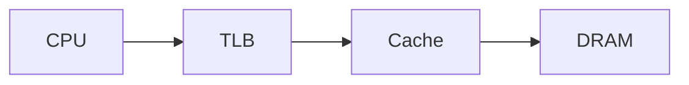

# AGENTS.md

This repository is a public technical blog and living coursework site built with Jekyll and GitHub Pages.

Agents working in this repository should treat the coursework as an evolving technical textbook rather than a static collection of notes.

## Primary goals

- Keep the site technically accurate, professional, and useful for systems engineering study.
- Preserve the distinction between material that has already been studied and material that is only planned.
- Prefer improving existing explanations over creating redundant pages.
- Keep lessons short enough to read and review in one sitting.
- Turn questions, review comments, debugging observations, and experiments into durable improvements to the coursework.
- Build concepts linearly from established knowledge instead of assuming familiarity with terms that have not yet been taught.

## Site structure

Current major areas include:

- `courses/nic-firmware/`
- `courses/performance-cache/`
- `courses/openbmc/`
- `_posts/` for the Markdown blog
- `about.markdown` for the professional site description

When adding a new course, add it to `courses/index.md` and use a consistent permalink under `/courses/<course-name>/`.

## Lesson design

Prefer focused lesson pages rather than very large chapters. A useful target is roughly 5–15 minutes of reading per page.

If a lesson becomes too large, split it into smaller pages rather than allowing one page to become difficult to review.

Where appropriate, lessons should include:

1. Why the topic matters.
2. What the learner is expected to already know.
3. A simple mental model.
4. Hardware/system view.
5. Software/firmware view.
6. An end-to-end trace or worked example.
7. Failure modes and common misconceptions.
8. Debugging or measurement techniques.
9. Performance implications.
10. Knowledge-check questions.
11. Labs or experiments.
12. A short list of durable ideas worth remembering.

Not every lesson needs every section, but explanations should favor connected system models over isolated definitions.

## Prerequisite tracking and concept order

Treat each course as a dependency graph of concepts, not merely an ordered list of pages.

Before using a concept as part of an explanation, diagram, debugging workflow, quiz, or lab, determine whether the learner has already encountered it in the current or an earlier lesson.

Use these rules:

- Build new explanations primarily from concepts already introduced.
- Introduce only a small number of genuinely new concepts at a time.
- When a lesson relies on prior material, include a short `What you should already know`, `Prerequisites`, or equivalent section when useful.
- Do not place unexplained future-course concepts in the critical path of a diagram or worked example.
- If a future concept is useful for orientation, label it explicitly as a **preview** and do not require the learner to understand it yet.
- Prefer diagrams that add one layer or subsystem at a time rather than showing a complete production architecture before its pieces are familiar.
- Keep a conceptual block generic when its internal implementation has not yet been taught. For example, say `deeper NIC logic` before introducing specific steering or parsing mechanisms.
- Distinguish standardized architectural/protocol blocks from descriptive functional labels. Do not draw a functional label as if it must be a discrete hardware module.
- Knowledge checks should primarily test material actually taught in that lesson or earlier lessons. Do not grade an answer as a misconception when it is a reasonable hypothesis about material not yet covered.
- Labs should not require unexplained tools, protocols, or subsystems unless the lab explicitly teaches them first.
- When a review comment says an explanation assumes too much, treat that as a curriculum-ordering defect, not merely a local wording problem. Consider whether the concept belongs later or whether a missing prerequisite should be added earlier.

### Learner state categories

When interpreting quiz answers or review feedback, distinguish among:

- **misconception** — conflicts with material that has already been taught;
- **incomplete model** — partially correct understanding of taught material;
- **learner hypothesis** — a plausible inference about material not yet taught;
- **unknown prerequisite** — a concept the course assumed without establishing it;
- **retained understanding** — previously taught material recalled correctly;
- **applied understanding** — learned material used successfully in a new situation.

This distinction matters for a personalized living course. A learner hypothesis should normally be revisited after the relevant lesson rather than immediately treated as an error.

## Interactive understanding checks

Each completed course lesson should have a short interactive multiple-choice quiz rendered by `assets/quizzes.js`.

The purpose is **retrieval practice and immediate feedback, not grading**.

Guidelines:

- Prefer about 4–6 questions per lesson.
- Each question must have exactly one defensible answer.
- Test concepts actually taught in the current or earlier lessons; do not require unexplained future material.
- Prefer reasoning, prediction, tracing, boundary-identification, and misconception checks over trivia.
- Use plausible distractors that reveal nearby misunderstandings rather than absurd choices.
- Give immediate explanatory feedback after every selected option.
- Allow the learner to change an answer and try again.
- Do not compute or display a score, percentage, grade, pass/fail result, or leaderboard.
- Browser-local response history may be stored for later pedagogy analysis, but the user-facing experience should remain low-stakes.
- Keep question IDs stable when possible so longitudinal response data remains meaningful.
- When lesson content changes materially, review its quiz for stale assumptions or answer keys.
- When adding a new lesson, add a corresponding entry keyed by its permalink in `assets/quizzes.js`.

Quiz response state is currently stored in browser `localStorage` under a lesson-scoped `course-quiz-responses:v1:` key. Treat this as local learning telemetry, not repository content or a durable backend.

## Covered material vs. planned material

Do not present unstudied material as completed coursework.

Use language such as:

- `Covered so far`
- `Active`
- `Next topics`
- `Planned`

when necessary to make status clear.

When a topic has actually been studied in conversation or through a lab, it can be promoted into active course material.

## Stable headings and annotation anchors

Course pages have a browser-local annotation system implemented in `assets/annotations.js`. It adds review-comment controls to `h2`, `h3`, and `h4` lesson headings.

Comments are stored in browser `localStorage`, scoped by lesson URL. They are temporary review notes, not public comments and not repository content.

Therefore:

- Prefer descriptive Markdown headings.
- Avoid renaming existing headings unless the new wording materially improves accuracy or clarity.
- Preserve existing heading IDs/anchors when practical; review reports use them to locate comments.
- When restructuring a reviewed page, preserve the meaning of existing sections whenever possible.
- Avoid combining many unrelated concepts under one heading.
- Keep sections short enough that a comment attached to a heading remains useful context.
- Do not remove or disable `assets/annotations.js` when changing global page assets unless explicitly replacing the annotation system.

A review comment may include:

- page URL;
- section heading;
- heading anchor;
- selected text;
- comment type;
- reviewer comment.

Use all available context to locate the intended passage even if the page has changed slightly since the comment was generated.

## Review-report workflow

The implemented authoring loop is:

```text
Read lesson
→ optionally select relevant text
→ tap the 💬 button beside a section heading
→ add a typed review comment
→ review comments at the bottom of the lesson
→ copy the Markdown report or "prompt + report"
→ paste it into ChatGPT or another coding agent
→ update the relevant lesson(s)
→ mark comments resolved or clear them
```

The bottom review panel supports:

- unresolved/resolved status;
- per-comment deletion;
- `Copy report`;
- `Copy prompt + report`;
- `Clear resolved`;
- page-scoped `Clear all comments` with confirmation.

`Copy report` contains unresolved comments only. Do not require resolved comments to be addressed again unless the user explicitly includes them.

When given a review report:

1. Address every actionable comment unless it conflicts with technical correctness or another explicit instruction.
2. Update the existing relevant page rather than duplicating the explanation elsewhere.
3. Add Mermaid diagrams, equations, examples, debugging notes, interview questions, or labs when requested and useful.
4. Correct misconceptions directly and clearly.
5. Preserve useful existing content while improving weak sections.
6. If a comment exposes a prerequisite gap, either add a concise prerequisite explanation, simplify/defer the dependent concept, or link to the appropriate lesson.
7. Check whether the feedback reveals a broader sequencing problem that should change `AGENTS.md` or the course structure.
8. Keep the resulting page readable in one sitting; split it when necessary.
9. Preserve stable headings/anchors where practical so any remaining browser annotations continue to point to useful locations.

Do not assume browser annotations synchronize across devices. The copied Markdown review report is the handoff format between the browser and the agent.

## Diagrams

Mermaid is supported site-wide and should be preferred for architecture, sequence, state, dependency, and data-flow diagrams that can be expressed clearly as text.

Use fenced Mermaid blocks:

````markdown

````

Guidelines:

- Keep diagrams focused enough to remain readable on a phone.
- Prefer several small diagrams over one enormous graph.
- Tie each diagram directly to the surrounding explanation.
- Use stable, descriptive node labels rather than unexplained abbreviations.
- Prefer left-to-right or top-to-bottom flows that match the prose.
- Do not use diagrams decoratively.
- Build diagrams from already-established concepts when possible; mark future concepts as previews.
- Do not imply that every named function is necessarily a discrete hardware module.
- ASCII diagrams remain acceptable when they are simpler or more portable.

Mermaid rendering is implemented in `assets/mermaid.js`. Preserve GitHub Pages compatibility and the site's light/dark readability when modifying it.

## Equations

MathJax is supported site-wide for TeX/LaTeX-style mathematics.

Preferred syntax:

Inline math:

```text
\( T = N / R \)
```

Display math:

```text
$$
AMAT = T_{L1} + MR_{L1} \left(T_{L2} + MR_{L2} T_{mem}\right)
$$
```

or:

```text
\[
BW = \frac{bytes}{second}
\]
```

Guidelines:

- Do not use single `$...$` delimiters for inline math; dollar signs commonly occur in ordinary prose and costs.
- Define every symbol near its first use.
- Follow equations with a plain-language interpretation.
- Prefer equations when they clarify a quantitative relationship, not merely to make a lesson look formal.
- For derivations, show intermediate steps when they are pedagogically useful.
- When useful, pair an equation with a concrete numerical example.
- Keep wide equations usable on mobile; split very long expressions when possible.

MathJax is configured in `_includes/head.html`.

## Labs and experiments

Favor experiments that make the hardware/software model observable.

Examples include:

- descriptor-ring simulators;
- cache-conflict microbenchmarks;
- pointer-chasing latency tests;
- false-sharing experiments;
- interrupt/NAPI measurements;
- RSS/CPU-affinity experiments;
- driver tracing and register inspection.

When adding a lab, state what hypothesis or system behavior it is intended to demonstrate and what should be measured.

Introduce the required conceptual model and tools before expecting the learner to diagnose results from them.

## Technical accuracy

- Do not oversimplify a conceptual model into an incorrect hardware claim.
- Clearly distinguish architectural guarantees from implementation examples.
- Qualify microarchitecture-specific details when they are not universal.
- Distinguish virtual-memory events from cache events, coherence from memory ordering, and firmware responsibilities from driver/hardware responsibilities.
- Prefer primary technical documentation when external references are needed.

## Professional scope

The site should remain a technical professional blog and coursework environment.

Appropriate topics include systems engineering, embedded Linux, firmware, NICs, OpenBMC, performance, computer architecture, IoT, embedded security, trading systems, and embodied AI research.

Avoid adding unnecessary personal or family information.

## Jekyll conventions

- Preserve valid YAML front matter.
- Use stable, explicit permalinks for course pages.
- Keep internal links rooted consistently under `/courses/.../` when possible.
- Preserve the existing light/dark theme functionality.
- Preserve Mermaid, MathJax, annotation, and quiz support when modifying global page assets.
- Avoid introducing large frameworks or dependencies for features that can be implemented with simple HTML/CSS/JavaScript.
- Keep GitHub Pages compatibility in mind.

## Change discipline

Before restructuring or deleting coursework:

- inspect the existing content;
- preserve valuable explanations, exercises, diagrams, equations, and links;
- update navigation when paths change;
- avoid silently removing material that still belongs in the curriculum.

Prefer small, coherent commits with descriptive messages.

## Guiding principle

The site should get better as it is used.

A question, misunderstanding, failed lab, debugging discovery, or review comment is not just conversational context—it is evidence that the textbook can be improved.
