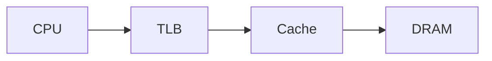

# Spencer Neilan — Systems Coursework

This repository contains the source for my technical blog and living coursework site.

**Website:** [https://spencerbug.github.io](https://spencerbug.github.io)

Current areas of focus include NIC firmware, OpenBMC and platform firmware, performance and cache optimization, embedded and IoT security, trading systems, and embodied AI research.

## Authoring features

The site supports:

- Markdown/Jekyll course pages and blog posts
- persistent light/dark mode
- Mermaid diagrams
- MathJax equations

### Mermaid diagrams

Use a fenced `mermaid` block:

````markdown

````

Mermaid blocks are converted and rendered client-side by `assets/mermaid.js`.

### MathJax equations

Inline equation:

```text
\( E = mc^2 \)
```

Display equation:

```text
$$
AMAT = T_{L1} + MR_{L1} \left(T_{L2} + MR_{L2} T_{mem}\right)
$$
```

Single-dollar inline delimiters are intentionally not enabled so normal dollar amounts in prose are not interpreted as math.

## Agent guidelines

See [`AGENTS.md`](AGENTS.md) for conventions used when updating coursework, handling review comments, preserving lesson structure, and authoring diagrams and equations.
