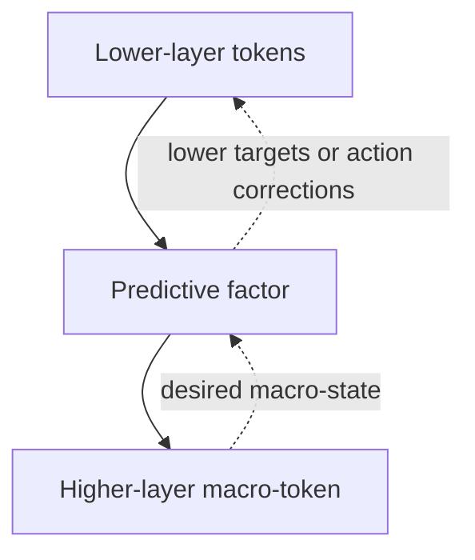





**Part II · Dynamics, temporal basis, and control · approximately 10–12 minutes**

Part I ended with a retained graph of predictive factors. Each factor has participant references, a current relational state \(r_f\), a learned transition law \(F_\theta\), prediction innovation \(\epsilon_f\), and uncertainty. This part asks how that same factor can support both forward prediction and downward control.

## 4. PID becomes a temporal basis, not the state representation

The original inspiration used proportional, integral, and derivative quantities heavily. The important refinement is that PID-like channels are **temporal views of factor state or factor error**, not the underlying representation itself.

For a retained factor \(f\), useful channels include:

| Channel | Source | Interpretation |
| --- | --- | --- |
| \(r_f\) | current relational state | What relationship exists now? |
| \(D_f^r\) | change in relational state | What transformation is occurring? |
| \(\epsilon_f\) | prediction innovation | What did the dynamics model miss? |
| \(I_f^\epsilon\) | persistent innovation | Has the mismatch persisted? |
| \(\delta_f\) | desired minus current relation | How far are we from the requested relationship? |
| \(I_f^\delta\) | persistent goal discrepancy | Has the control discrepancy persisted? |
| \(D_f^\delta\) | change in goal discrepancy | Are we approaching or leaving the goal? |

Not every factor requires every channel at every timestep. In particular, goal channels exist only when the factor currently has a target.

### Relational dynamics

A filtered derivative of relational state can expose ongoing transformation:

$$
D_t^{r,(\tau)}
\approx
\operatorname{LPF}_{\tau}
\left(
\frac{r_t-r_{t-1}}{\Delta t}
\right).
$$

Numerical derivatives amplify noise, so \(\operatorname{LPF}_\tau\) denotes low-pass filtering over a characteristic timescale \(\tau\). A first-order filter can be

$$
y_t
=
y_{t-1}+\alpha_\tau(x_t-y_{t-1}),
$$

with

$$
\alpha_\tau=\frac{\Delta t}{\tau+\Delta t}.
$$

Several \(\tau\) values give the factor both fast and slow views of the same transformation.

### Persistent model mismatch

A leaky integral of innovation can expose systematic prediction error:

$$
I_t^{\epsilon,(\tau)}
=
\lambda_\tau I_{t-1}^{\epsilon,(\tau)}
+
(1-\lambda_\tau)\epsilon_t.
$$

Persistent innovation might indicate a payload change, friction mismatch, sensor drift, unmodeled force, or a bad factorization. This is not another predictive model; it is memory about how the existing factor model is failing.

### Goal-directed control

A desired relational state \(r_f^*\) lives in the same factor-state space as the current relationship. For a hand-object factor, a target could correspond to a latent configuration such as “aligned and in stable contact” even if the coordinates are not explicitly named.

The instantaneous goal discrepancy is

$$
\delta_{f,t}=r_{f,t}^*-r_{f,t}.
$$

PID-like temporal views can then be defined over that control discrepancy:

$$
P_t^\delta=\delta_t,
$$

$$
I_t^{\delta,(\tau)}
=
\lambda_\tau I_{t-1}^{\delta,(\tau)}
+
(1-\lambda_\tau)\delta_t,
$$

$$
D_t^{\delta,(\tau)}
\approx
\operatorname{LPF}_\tau
\left(
\frac{\delta_t-\delta_{t-1}}{\Delta t}
\right).
$$

The interpretation is:

```text
r       what relationship exists?
dr/dt   what transformation is occurring?

ε       what did the model fail to predict?
∫ε      what mismatch persists?

δ       how far are we from a requested relation?
∫δ      how long has that discrepancy persisted?
dδ/dt   are we making progress?
```

This creates a structured temporal basis without claiming that real-world dynamics are literally PID systems. Residual recurrent or state-space memory can still represent delays, hysteresis, oscillation, discontinuous contact, and other dynamics outside that basis.

## Sensitivity belongs to the transition law

The cleanest forward/inverse connection comes from differentiating the learned transition law itself.

Around the current operating point, define

$$
A_{f,t}
=
\frac{\partial F_\theta}{\partial r_f},
\qquad
B_{f,t}
=
\frac{\partial F_\theta}{\partial a_f}.
$$

For small perturbations,

$$
\Delta\hat r_{f,t+1}
\approx
A_{f,t}\Delta r_{f,t}
+
B_{f,t}\Delta a_{f,t}.
$$

The two Jacobians have different jobs:

- \(A_f\) asks how a state perturbation changes the next factor state;
- \(B_f\) asks how an action perturbation changes the next factor state.

This avoids the ambiguous phrase “Jacobian of the factor structure.” We differentiate a concrete learned function with known input and output spaces.

For a one-step desired state \(r_f^*\), define

$$
\delta_f^{\mathrm{next}}
=
r_f^*-\hat r_{f,t+1}.
$$

A local weighted least-squares action correction can be written

$$
\Delta a_f
=
\left(
B_f^T\Lambda_f B_f+R_f
\right)^{-1}
B_f^T\Lambda_f
\delta_f^{\mathrm{next}},
$$

where \(\Lambda_f\) weights factor-state error directions and \(R_f\) regularizes action magnitude or cost.

This is one possible local controller, not a requirement that every factor perform a matrix inverse. In practice, the system may use iterative optimization, learned inverse models, model-predictive control, Jacobian-vector products, or lower-dimensional action ports.

The architectural claim is simpler:

> The forward model learns how actions affect relational state; downward control can reuse that learned action sensitivity instead of learning a completely unrelated control representation.

## The factor need not store a dense Jacobian

Materializing \(A_f\) and \(B_f\) for every factor at every step could be expensive. Many calculations only require directional products such as \(Bv\) or \(B^Tv\). Automatic differentiation can compute Jacobian-vector products and vector-Jacobian products without storing the entire matrix.

That lets sensitivity be a *query against the factor model* rather than permanent metadata embedded in every upward token.

## 7. Reference frames are learned because they simplify factors

A relational state is useful only relative to some coordinate system. PCFH therefore should not merely learn arbitrary embeddings; it should prefer local coordinates in which prediction and inverse control become simpler.

A useful frame should tend to make local factor dynamics:

- lower-dimensional;
- sparse;
- stable across context changes;
- compositional;
- well-conditioned for action inversion.

If a coordinate change is

$$
r'=T_g(r),
$$

then action sensitivity transforms as

$$
B'
=
\frac{\partial T_g}{\partial r}B.
$$

Different coordinate systems can therefore describe the same underlying physical relationship while changing how easy that relationship is to model.

A candidate training objective might combine rollout accuracy, conditioning, sparsity, and transformation composition:

$$
\mathcal L_{\mathrm{frame}}
=
\alpha\mathcal L_{\mathrm{rollout}}
+
\beta\operatorname{cond}(B)
+
\gamma\lVert B\rVert_{\mathrm{off\mbox{-}structure}}
+
\eta\mathcal L_{\mathrm{composition}}.
$$

This is a research objective, not yet a settled loss. The underlying hypothesis is that useful reference frames emerge because they make recurring transformations easier to predict, compose, and invert.

This connects conceptually to group-structured representation learning, including [Homomorphism Autoencoders](https://arxiv.org/abs/2207.12067), and to the broader Koopman-style idea of searching for coordinates that simplify nonlinear dynamics.

## 8. The hierarchy runs in both directions

The same factor hierarchy can be viewed as two traversals.



The upward direction asks:

> Given the current lower-level state and actions, what higher-level relational consequences follow?

The downward direction asks:

> Given a desired higher-level relation, what lower-level target or action change would move the system toward it?

The factor's learned dynamics and sensitivity provide the bridge between the two.

### Control does not have to replace the servo layer

At the physical boundary, conventional bounded control can remain in charge of fast actuator loops. For example,

$$
u_{\mathrm{raw}}
=
K_Pe_t+K_I I_t+K_DD_t+u_{\mathrm{ff}},
$$

followed by a hard safety projection

$$
u_t
=
\operatorname{SafeProject}(u_{\mathrm{raw}}).
$$

`SafeProject` is shorthand for a verified constraint layer: saturation, rate limiting, collision constraints, thermal limits, a control-barrier-function filter, constrained MPC, or another bounded mechanism appropriate to the system.

The learned hierarchy can operate at slower rates and provide setpoints, trajectories, feedforward terms, gain schedules, uncertainty estimates, and termination conditions rather than issuing raw high-frequency motor PWM directly.

A multirate hierarchy is therefore natural: fast local factors can update frequently while higher object, skill, or task factors update more slowly.

## What Part II establishes

The predictive factor is now more than a latent relationship label:

```text
current relation r_f
      ↓
learned transition F
      ↓
predicted next relation
      ↓
innovation ε_f

optional desired relation r*_f
      ↓
goal discrepancy δ_f
      ↓
action sensitivity B_f
      ↓
lower target / action correction
```

PID-like channels provide temporal context around those quantities without replacing the relational state. Reference-frame learning searches for coordinates that simplify the same predictive-control law.

What is still missing is **abstraction**: how a collection of already-learned factors becomes one token that can be handed to another identical block. That is Part III.

**Next:** [Part III · Composition, recursive blocks, and scaling]({{ '/blog/predictive-control-factor-hierarchy/composition-scaling/' | relative_url }})
