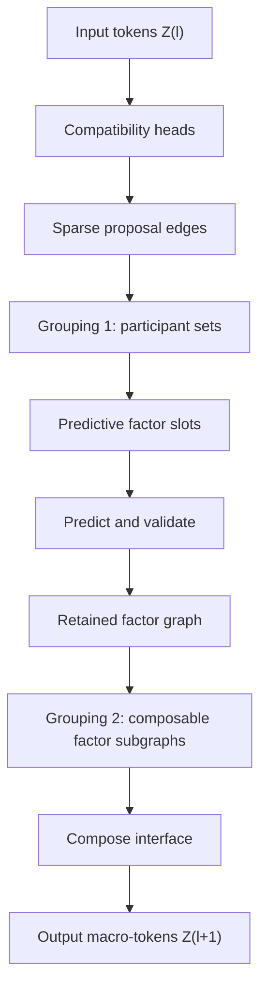

> **AI-generated content disclaimer:** This article was generated with AI assistance from the author's research ideas, questions, and iterative review comments. It describes a speculative research architecture, not an established or peer-reviewed result.



**Part III · Composition, recursive blocks, and scaling · approximately 12–15 minutes**

Part I introduced **Grouping 1**: pairwise compatibility edges are converted into participant-set hypotheses for predictive factors. Part II gave those factors dynamics and a forward/inverse control interpretation.

This part introduces the second, distinct grouping problem:

> Given a graph of already-learned predictive factors, which factor subgraphs can be hidden behind a smaller predictive-control interface and replaced by macro-tokens at the next level?

That is **Grouping 2**, followed by **Compose**.

## The second grouping operation: composition grouping

After factor learning, suppose the current layer contains retained factors such as:

```text
F_motor     motor command ↔ current ↔ joint response
F_link      joint 1 ↔ joint 2 kinematics
F_hand      joint state ↔ hand pose
F_contact   hand pose ↔ object contact
F_object    contact ↔ object motion
```

These factors are themselves connected because they share participants or exchange predictive messages. That creates a **retained factor graph**.

Grouping 2 does not ask which raw tokens belong in one local law. It asks whether a *subgraph of local laws* behaves like one coherent subsystem from the outside.

For example, \(F_{\mathrm{link}}\) and \(F_{\mathrm{hand}}\) might be composable into a hand-motion macro-factor if the upper layer can reason accurately using hand pose, reachable motion, and uncertainty without needing every joint-level interaction.

The special case of a single already-useful factor promoting itself is allowed. But the general operation is factor-subgraph composition.

## 5. Compose means interface-preserving compression

Compose answers one concrete question:

> Can this retained factor subgraph expose a smaller interface upward while preserving the predictions and control effects that matter outside it?

The full pipeline therefore contains four distinct operations that had previously been easy to blur together:

| Operation | Input | Question | Output |
| --- | --- | --- | --- |
| Compatibility | current-layer token pairs | Which pairs deserve more compute? | sparse proposal edges |
| Grouping 1 | proposal edges | Which tokens should be tested in one local law? | participant-set hypotheses |
| Factor learning | participant sets | Does this set admit a useful predictive dynamical model? | retained predictive factors |
| Grouping 2 + Compose | retained factor graph | Which factor subgraph can be hidden behind a smaller external interface? | next-layer macro-token |

That is the central architecture. There is no separate stack of “factor compression,” “Compose compression,” “interface compression,” and “learned compression.” Those phrases all refer to pieces or views of the **same inter-layer composition boundary**.

### Interface-preserving compression

Imagine drawing a cut around a retained factor subgraph.

- **Internal state \(x_A\)** is detailed state needed to model what happens inside the cut.
- **Boundary state \(x_B\)** is the state through which the subsystem interacts with the rest of the factor graph.
- The **interface** is the predictive and controllable relationship visible across the cut: what the outside can observe, request, influence, and remain uncertain about.


A higher object-manipulation layer should not need every motor current if the arm subsystem can expose an interface such as hand pose, reachable velocity, force envelope, contact effect, and uncertainty.

The lower-level details are not erased globally. They remain available below the abstraction boundary for local prediction, execution, and downward control. They are merely **hidden from the next layer's default state representation**.

### A learned composition function

One way to write the macro-state is

$$
s_A=\phi_\theta(x_A,x_B).
$$

The function \(\phi_\theta\) is a learned composition operator. It can be implemented by a graph encoder, attention mechanism, state-space block, or another structured model.

The success criterion is not reconstruction of every hidden variable. It is preservation of external behavior.

### Three mathematical views of eliminating internal detail

These are three views of **one composition operation**, not three architectural stages.

**Probabilistic view.** If \(\psi(x_A,x_B)\) describes joint compatibility, internal variables can be marginalized:

$$
\psi_{\mathrm{eff}}(x_B)
=
\int\psi(x_A,x_B)\,dx_A.
$$

**Optimization view.** If \(E(x_A,x_B)\) is local incompatibility, an effective boundary cost can be

$$
E_{\mathrm{eff}}(x_B)
=
\min_{x_A}E(x_A,x_B).
$$

**Learned predictive-control view.** Train the macro-state to preserve quantities such as:

- future boundary state;
- action-to-effect mappings;
- reachable transformations;
- important uncertainty;
- temporal dynamics;
- safety-relevant couplings.

The third view is probably the most directly useful for implementation. The first two explain what “eliminating internal detail” means mathematically.

### Sparsity is not abstraction

A graph can be extremely sparse while still containing many state variables. If 10,000 tokens each retain four neighbors, interaction search is sparse, but an upper layer still cannot afford to reason over all 10,000 states indefinitely.

PCFH therefore has three different reductions:

```text
edge sparsity       fewer pairwise proposals
factor sparsity     fewer retained local laws
composition         fewer / smaller states exposed upward
```

If an early layer already discovers a sufficiently compact state, later layers should be allowed to stop compressing, pass tokens through, or operate at the same effective scale. Hierarchy depth is useful only when another predictive-control abstraction genuinely exists.

## How a composed subsystem becomes a factor token

Let \(M\) denote a composable factor subgraph. Its next-layer token can be a fixed-width projection such as

$$
z_M^{(\ell+1)}
=
P_\ell\!\left[
 s_M,
 D_M,
 I_M^\epsilon,
 \Sigma_M,
 e_M^{\mathrm{frame}},
 e_M^{\mathrm{interface}},
 e_M^{\mathrm{type}}
\right].
$$

Possible components are:

- \(s_M\): current macro relational state;
- \(D_M\): current macro transformation summary;
- \(I_M^\epsilon\): persistent mismatch summary;
- \(\Sigma_M\): uncertainty summary;
- \(e_M^{\mathrm{frame}}\): local-frame descriptor;
- \(e_M^{\mathrm{interface}}\): exposed action/effect interface;
- \(e_M^{\mathrm{type}}\): optional learned factor-family embedding;
- \(P_\ell\): projection to the fixed token width expected by the next layer.

A small handle can point back to the lower-level composed subgraph when a higher layer requests a rollout, sensitivity query, or downward target. The full participant list, raw source values, learned weights, and dense Jacobians do not need to be embedded in the token.

This makes the hierarchy **lossy upward but not destructive overall**.

## 6. Objecthood becomes a dynamical property

This composition criterion suggests an operational notion of objecthood or subsystem coherence.

A factor subgraph deserves promotion when:

1. its internal relationships are stable and strongly predictive;
2. interaction with the outside can be summarized through a smaller interface;
3. the interface preserves useful prediction;
4. it preserves relevant controllability and reachability;
5. it preserves important uncertainty and safety-relevant effects.

Conceptually,

$$
\text{macro-factor quality}
\sim
\frac{\text{predictive/control information preserved across the boundary}}
{\text{internal degrees of freedom kept explicit upward}}.
$$

This is not yet an exact loss. It expresses the intended pressure.

A rigid object is a natural example: thousands of pixels can move coherently while a much smaller state—pose, velocity, geometry, material/contact parameters—captures most of what another subsystem needs to predict and control its interaction with the object.

A limb can have similar structure. So can a skill, if many lower-level trajectories can be hidden behind an interface such as “move the hand along this reachable path with this force envelope.”

Objecthood, body-part structure, tools, and temporally extended actions could therefore emerge from one composition criterion rather than independent hand-coded categories.

## 9. A repeating block

The architecture can now be written as a typed transformation:

$$
\boxed{
\mathcal B_\ell:
Z^{(\ell)}\longrightarrow Z^{(\ell+1)}
}
$$

where both \(Z^{(\ell)}\) and \(Z^{(\ell+1)}\) are sets of fixed-interface tokens.

One full block is:



The tiling rule is therefore simply

```text
Z^0 → Block 0 → Z^1 → Block 1 → Z^2 → Block 2 → Z^3 → ...
```

The next block does not need a special hidden representation. It receives the same *kind* of token contract produced by the previous block.

Downward targets travel through the retained handles and factor sensitivities described in Part II.

### What scale does one block operate at?

A block does not correspond to a fixed semantic scale like “pixels,” “joints,” or “objects.” It operates at whatever scale its input tokens already represent.

The capacity knobs have different interpretations:

| Knob | What increases | Hypothesized benefit | Main cost/risk |
| --- | --- | --- | --- |
| token count \(N\) | simultaneous state elements | more entities/signals represented at once | routing cost |
| factor-slot budget \(F_{\max}\) | simultaneous local laws | more overlapping relationships | factor compute and memory |
| token/factor dimension \(d\) | state per representation | richer local nonlinear dynamics/interfaces | dense neural compute |
| compatibility heads \(H\) | proposal subspaces | more distinct relationship hypotheses | routing redundancy |
| neighbors \(k\) | retained proposal edges | more candidate interactions | graph compute / false positives |
| hierarchy depth \(L\) | serial composition stages | broader compositional scope | latency / optimization difficulty |
| temporal memory | retained history | slower processes and skills | state and training complexity |

None of these automatically equals “more intelligence.” They are capacity knobs whose value has to be established empirically.

### Rough compute scaling

Let:

- \(N\) be input-token count;
- \(H\) compatibility-head count;
- \(d_h\) per-head embedding width;
- \(k\) retained candidate neighbors per token;
- \(F\) retained predictive factors;
- \(m\) average participants per factor;
- \(d_f\) factor-state dimension;
- \(E_f\) retained factor-graph edges;
- \(C_{\mathrm{dyn}}\) cost of one shared dynamics evaluation.

Then the major pressures are roughly:

| Stage | Rough scaling | Design implication |
| --- | --- | --- |
| dense compatibility | \(O(HN^2d_h)\) | quadratic routing cannot survive very large \(N\) |
| sparse retained edges | \(O(HNkd_h)\) after candidate retrieval | useful only if \(k\ll N\) |
| factor encoding | about \(O(Fmd_f)\) plus encoder cost | active factor count must remain bounded |
| factor dynamics | \(O(FC_{\mathrm{dyn}})\) | shared weights do not make active factors free |
| factor message passing | \(O(E_fd_f)\) plus message cost | retained factor graph must also remain sparse |
| composition grouping | sparse-graph cost for practical heuristics | exact combinatorial search is unacceptable |

With \(N=1024\) and \(H=8\), a dense compatibility layer has

$$
8\times1024^2=8{,}388{,}608
$$

head-specific pair scores. Keeping only \(k=16\) edges per token gives an edge budget of about

$$
8\times1024\times16=131{,}072.
$$

That is 64 times fewer retained head-edges. It does **not** solve the candidate-retrieval problem by itself; an implementation still needs a scalable way to avoid materializing the full dense matrix when \(N\) becomes very large.

<div id="pcfh-scaling-explorer" class="pcfh-plot" aria-label="Interactive dense versus sparse routing scaling plot"></div>

### Pipeline latency

Depth differs from width because hierarchy stages have serial dependencies. If \(T_\ell\) is the forward latency of block \(\ell\), a simple worst-case upward traversal is

$$
T_{\mathrm{up}}
\approx
\sum_{\ell=0}^{L-1}T_\ell.
$$

Within a layer, factor evaluations can often run in parallel. More factor slots therefore increase throughput demand more than unavoidable serial depth. Additional hierarchy levels, by contrast, add latency unless layers are pipelined, updated asynchronously, or run at different rates.

A practical embodied implementation would likely be multirate: low-level sensorimotor factors can update quickly, while object, skill, and task factors update more slowly and cache their most recent effective state.

### What capabilities might scale?

The architecture makes testable scaling hypotheses:

- more **width** should support more simultaneous entities or sensorimotor variables;
- more **factor slots** should support more simultaneous and overlapping relationships;
- more **factor-state capacity** should support richer local laws and interfaces;
- more **temporal memory** should support delays and temporally extended factors;
- more **useful depth** should support relations among already-composed relations.

Depth only “wins” if deeper models improve predictive/control efficiency, transfer, planning horizon, or robustness at matched compute. If another level simply copies its input or adds latency, it has failed its architectural purpose.

## 10. A possible emergent hierarchy

Semantic levels should not be hard-coded, but a successful system might produce something resembling:

| Level | Possible effective tokens | Characteristic relation |
| --- | --- | --- |
| 0 | sensor and actuator channels | signal response |
| 1 | local dynamical factors | command-response / kinematics |
| 2 | limbs and rigid components | body/object transforms |
| 3 | contacts and manipulable interfaces | affordances / object effects |
| 4 | temporally extended action factors | skills |
| 5 | task-state factors | consequences |

Some branches may stop earlier than others. The hierarchy should be driven by whether composition discovers a smaller useful interface, not by a fixed semantic depth target.

## What Part III establishes

The full recursive representation path is now explicit:

```text
TOKEN GRAPH
   ↓ compatibility
PAIRWISE PROPOSALS
   ↓ Grouping 1
PARTICIPANT SETS
   ↓ learn / validate
PREDICTIVE FACTOR GRAPH
   ↓ Grouping 2
COMPOSABLE FACTOR SUBGRAPHS
   ↓ Compose
MACRO-TOKEN GRAPH
   ↓ repeat
```

This is the piece that makes PCFH a hierarchy rather than merely a sparse relational dynamics model.

Part IV turns the remaining open choices into experiments and specifies what evidence should count against the idea.

**Next:** [Part IV · Experiments and falsification]({{ '/blog/predictive-control-factor-hierarchy/experiments/' | relative_url }})
