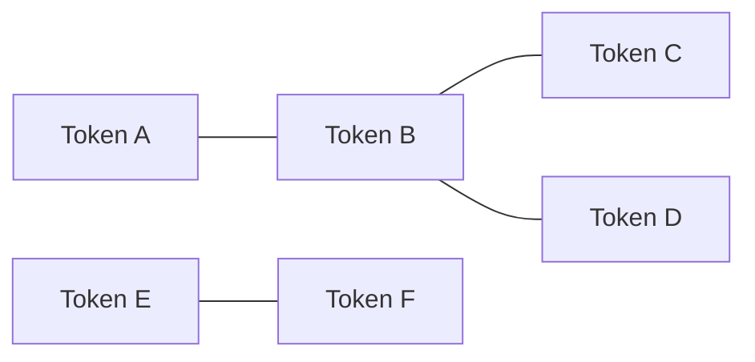
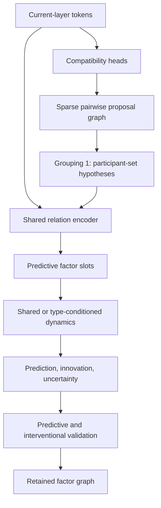





**Part I · From variables to predictive factors · approximately 12–15 minutes**

The original version of this article tried to introduce the entire hierarchy, control theory, abstraction, scaling, and experiments in one pass. That made individual ideas understandable in isolation but obscured the architecture as a whole. This revision is a four-part series built around one typed dataflow.

The core proposal is a hierarchy in which each layer receives a set of tokens, discovers sparse dynamical relationships among them, learns predictive factors for those relationships, and then composes selected factor subgraphs into macro-tokens for the next layer. Prediction runs upward through the hierarchy; desired states can condition the same learned factors downward for control.

## Architecture at a glance

There are **two different grouping operations** in PCFH, and keeping them separate makes the rest of the design much easier to follow.

```mermaid
flowchart LR
    Z["Layer l tokens"] --> H["Compatibility heads"]
    H --> E["Sparse pairwise proposal edges"]
    E --> G1["Grouping 1: participant sets"]
    G1 --> F["Predictive factor slots"]
    F --> R["Retained factor graph"]
    R --> G2["Grouping 2: composable factor subgraphs"]
    G2 --> C["Compose predictive-control interface"]
    C --> Z2["Layer l+1 macro-tokens"]
```



The stages have different meanings:

1. **Compatibility** asks which pairs of current-layer tokens appear dynamically related.
2. **Participant grouping** turns pairwise proposals into a hypothesis about which tokens should participate in one predictive factor.
3. **Factor learning** encodes the current relationship and learns how it changes.
4. **Factor retention** keeps useful hypotheses as nodes in a factor graph.
5. **Composition grouping** asks whether several retained factors form a subsystem whose internal detail can be hidden behind a smaller external interface.
6. **Compose** emits that subsystem as a fixed-interface macro-token to the next layer.

The same block can then repeat because the output is again a set of tokens.

This series treats the **interfaces between those stages as the architecture**. The exact sparse-routing algorithm, grouping algorithm, neural parameterization, and composition loss are still research choices to compare experimentally.

## 1. Three quantities that must remain separate

The first design mistake to avoid is treating every kind of error as the representation itself. A factor needs to distinguish the current relationship, failure of the dynamics model, and discrepancy from a desired relationship.

### Relational state

A **relational state** is a learned description of the current configuration or interaction among a factor's participants.

For a simple pair of current-layer tokens \(z_i\) and \(z_j\), a relation encoder could compute

$$
r_{ij,t}=g_\theta(z_{i,t},z_{j,t}).
$$

For a factor \(f\) with participant set \(S_f\), the more general form is

$$
r_{f,t}
=
g_\theta\!\left(\{z_{i,t}:i\in S_f\},c_{f,t}\right),
$$

where \(c_{f,t}\) is optional context such as a factor-type embedding or local reference frame.

The participant tokens still contain their live current values. The factor stores **references or assignments to those tokens** and derives \(r_{f,t}\) from their current contents. In other words, “participating variables” identifies *which variables are involved*; it does not duplicate their current state inside the factor specification.

The relational state itself *is* current runtime state. For a hand-object factor, components of \(r_f\) might eventually behave like relative pose, contact mode, slip state, or another latent coordinate that makes the joint dynamics simple. Those meanings are learned rather than hand-labelled.

### Model innovation

A factor dynamics model predicts the next relational state:

$$
\hat r_{f,t+1}
=
F_\theta(r_{f,t},a_{f,t},c_{f,t}),
$$

where \(a_{f,t}\) is the action input visible to the factor.

When the next observation arrives, the relation encoder produces \(r_{f,t+1}\). The transition innovation is

$$
\epsilon_{f,t+1}
=
r_{f,t+1}-\hat r_{f,t+1}.
$$

So \(r_f\) answers **what relationship exists now?**, while \(\epsilon_f\) answers **what did the learned law fail to predict?**

### Goal discrepancy

When a higher level requests a desired relational state \(r_f^*\), define

$$
\delta_{f,t}
=
r^*_{f,t}-r_{f,t}.
$$

This is a control discrepancy, not a model error. A factor can be perfectly predicted while still being far from its goal, or exactly at its goal while the dynamics model is inaccurate.

The three streams are therefore:

```text
r        current relational state
ε        prediction innovation
δ        goal discrepancy
```

Part II will use these three quantities to build the temporal and control side of the architecture.

## 2. The fundamental primitive: a learned dynamical factor

A **predictive factor** is a learned local dynamical model attached to a sparse set of participants. It is not an attention head, and it is not necessarily pairwise.

It helps to separate the factor's relatively persistent specification from its time-varying state:

```text
factor_spec := {
    participant_refs_or_assignments,
    relation_encoder,
    dynamics_model_or_type,
    local_reference_frame,
    exposed_action_ports,
    temporal_constants
}

factor_state[t] := {
    relational_state,
    predicted_next_relational_state,
    innovation,
    temporal_summaries,
    uncertainty
}
```

`participant_refs_or_assignments` can be hard indices, sparse soft assignments, or another routing representation. The live token contents remain in the current layer.

### The predictive residual is just the transition error

The residual does not need to be an additional mysterious object. Given participant values at the next timestep,

$$
e^{\mathrm{pred}}_{f,t+1}
=
g_\theta(z_{S_f,t+1})
-
F_\theta(r_{f,t},a_{f,t},c_{f,t}).
$$

Since \(g_\theta(z_{S_f,t+1})=r_{f,t+1}\),

$$
e^{\mathrm{pred}}_{f,t+1}=\epsilon_{f,t+1}.
$$

A Gaussian-style transition likelihood can then be written as

$$
\psi_f
\propto
\exp\left[
-\frac12
(e_f^{\mathrm{pred}})^T
\Lambda_f
 e_f^{\mathrm{pred}}
\right].
$$

Here \(\Lambda_f\) is an **information or precision matrix**. It is not the learned relationship and it is not multiplied by a Jacobian because of some special architectural rule. It simply weights residual directions according to uncertainty and scale. If the residual coordinates carry physical units, the precision entries carry the corresponding inverse-squared units so the exponent is dimensionless.

The learned relationship is represented by the current factor state \(r_f\) together with the transition law \(F_\theta\).

### A factor slot is an instance, not a new network

A practical implementation would probably use a bounded pool of **factor slots**. Each active slot contains one factor instance: its participant assignments, current relational state, uncertainty, and persistent bookkeeping. Shared neural weights can implement the relation encoder and dynamics model across many slots.

That distinction matters for scaling. If every pair of tokens instantiated an independent neural network, the design would be dead on arrival. The intended structure is sparse routing into shared learned machinery.

## 3. Attention discovers participation; factors learn laws

The compatibility mechanism is a proposal system. It does not itself learn the full transformation law.

For candidate current-layer tokens \(i\) and \(j\), head \(h\) can produce a pairwise score such as

$$
C_{ij,h}
=
q_{i,h}^T M_h k_{j,h}
+
b_h(\rho_{ij,t},\dot\rho_{ij,t},a_t,\Delta t,m_{ij,t-1}).
$$

The symbols are:

- \(i,j\): current-layer token indices;
- \(h\): compatibility-head index;
- \(q_{i,h}=W_h^Qz_{i,t}\): query representation of token \(i\);
- \(k_{j,h}=W_h^Kz_{j,t}\): key representation of token \(j\);
- \(M_h\): a learned bilinear compatibility matrix;
- \(\rho_{ij,t}\): cheap pairwise features available before a full factor exists;
- \(\dot\rho_{ij,t}\): optional recent change in those pairwise features;
- \(a_t\): relevant action context;
- \(\Delta t\): elapsed time;
- \(m_{ij,t-1}\): optional cached summary if a previous retained factor involved the pair;
- \(b_h\): a learned auxiliary scoring function;
- \(C_{ij,h}\): the final proposal score.

Crucially, the score does **not** require computing a full predictive factor for every possible pair. Compatibility is the cheaper routing stage that decides which interactions deserve more compute.

### What is a sparse compatibility graph?

Treat the current tokens as graph nodes. A dense proposal mechanism can conceptually score all pairs, but only a bounded subset of edges is retained.



A retained edge means roughly:

> These two tokens look worth testing as participants in a common dynamical factor.

It does **not** yet mean that they belong to one object, one cause, or one permanent factor.

With multiple heads, the graph is really a sparse **multi-relational proposal graph**: the same pair can receive different scores under different learned notions of compatibility.

### How compatibility scores become predictive factors

The first half of the block is:



This diagram intentionally stops at the **retained factor graph**. The second grouping operation—composition of already-learned factors into a macro-subsystem—happens later and is the subject of Part III.

A candidate factor can be created in seven conceptual steps:

1. **Score edges.** Compatibility heads compute \(C_{ij,h}\).
2. **Sparsify.** Keep a bounded set of strong candidate edges.
3. **Participant-group proposal.** Turn pairwise edges into one or more candidate participant sets.
4. **Allocate factor slots.** Each group hypothesis receives an active factor instance.
5. **Encode and predict.** The factor encoder computes \(r_f\); shared dynamics predict \(\hat r_{f,t+1}\).
6. **Validate.** Prediction, persistence, intervention response, uncertainty, and control usefulness determine whether the hypothesis is worth retaining.
7. **Build the retained factor graph.** Useful predictive factors become nodes for later message passing and composition.

The expensive learned dynamics therefore run on sparse factor hypotheses rather than all \(N^2\) token pairs.

#### Does A–B plus B–C imply one A–B–C factor?

This question refers specifically to **pairwise compatibility edges in the first grouping stage**.

Suppose a compatibility head gives a high score to A–B and another high score to B–C. Does that mean the participant-grouping algorithm should create one factor over \(\{A,B,C\}\)?

**No—not automatically. Pairwise compatibility is not transitive.**

A–B and B–C could arise because:

- all three variables really participate in one coherent transformation;
- B participates in two different transformations;
- A and C share only an indirect path through B;
- one edge is causal and the other merely correlated;
- two compatibility heads are expressing different relationship families.

Ordinary connected components therefore make a useful **proposal heuristic**, but not a sufficient definition of factor membership. A long chain of locally strong edges could otherwise collapse into one enormous factor.

Possible participant-grouping algorithms include:

- per-head connected components followed by a group-level predictive test;
- seed-and-grow grouping where a token is added only when joint prediction improves;
- learned factor slots with sparse token-to-slot assignments, related in spirit to [Slot Attention](https://arxiv.org/abs/2006.15055);
- hyperedge proposal networks that score sets directly;
- graph clustering constrained by intervention consistency.

The acceptance criterion should be closer to:

> Does this proposed participant set admit a coherent, reusable dynamical law that predicts or controls better than the relevant smaller alternatives?

That question is deliberately left open for experiment rather than smuggled into “connected component” as an architectural assumption.

There is a **similar but separate** overlap question later when already-learned factor nodes are grouped for composition. Part III treats that as Grouping 2 rather than conflating it with compatibility-edge grouping.

### Interactive PCFH block explorer

The two views below are a toy visualization, not a learned model. They are intended to make the data types concrete.

The compatibility heatmap shows the same six tokens under two different heads. Switch heads to see that a pair can be important under one relationship family and unimportant under another.

<div id="pcfh-compatibility-heatmap" class="pcfh-plot" aria-label="Interactive compatibility-head heatmap"></div>

The second visualization shows the **type flow** through one upward block. Sankey width is only illustrative; it should not be interpreted as a probability or conserved physical quantity.

<div id="pcfh-pipeline-sankey" class="pcfh-plot pcfh-plot-wide" aria-label="Interactive PCFH block pipeline"></div>

The important transition is:

```text
raw/current tokens
    → pairwise proposals
    → participant groups
    → predictive factor slots
    → retained factor graph
    → composition groups
    → macro-token interfaces
```

That is the complete upward representational path. Part II adds the factor dynamics and downward control path; Part III explains the second grouping stage and why its output can tile recursively.

## What Part I establishes

The architecture now has a precise first half:

- token contents are distinct from participant references;
- relational state is current factor state, not prediction error;
- model innovation and goal discrepancy remain separate quantities;
- compatibility heads create pairwise *proposals*;
- **Grouping 1** converts those edges into participant-set hypotheses;
- factor slots learn and validate local dynamical laws;
- validated factors form a retained factor graph;
- the second grouping operation acts on that factor graph, not on raw compatibility edges.

This makes the core proposal close to a typed pipeline rather than a collection of loosely connected metaphors.

### Neighboring ideas

The factor-discovery side is related to [Neural Relational Inference](https://arxiv.org/abs/1802.04687), which learns interaction graphs and dynamics from trajectories. Learned slot-based grouping is also relevant as a candidate implementation family; [Slot Attention](https://arxiv.org/abs/2006.15055) is one representative example. PCFH's additional hypothesis is that retained dynamical factors can be recursively composed into predictive-control interfaces and traversed in both directions.

**Next:** [Part II · Dynamics, temporal basis, and control]({{ '/blog/predictive-control-factor-hierarchy/dynamics-control/' | relative_url }})
