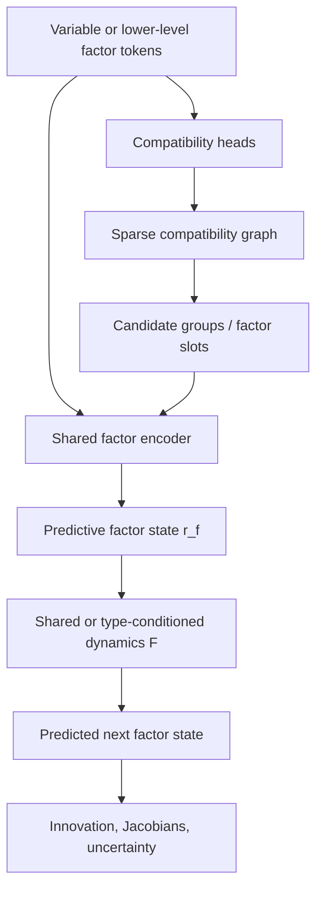
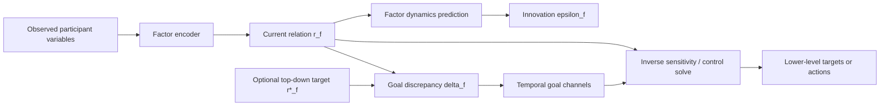
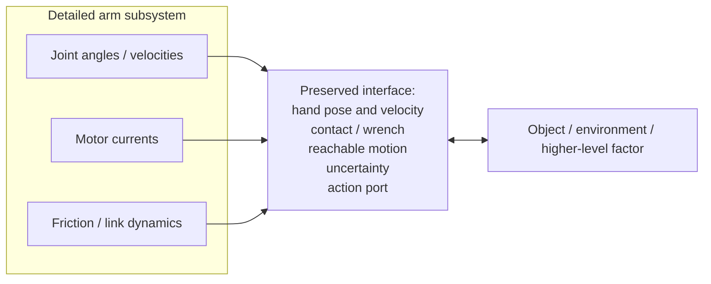
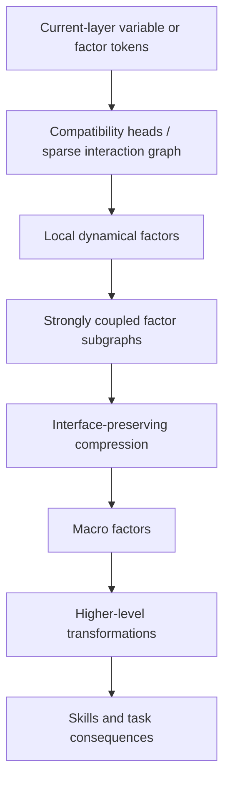
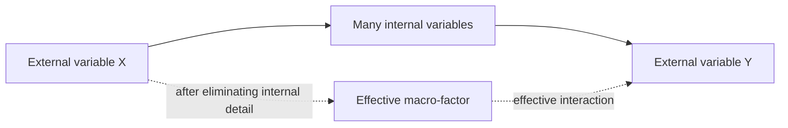

> **AI-generated content disclaimer:** This article was generated with AI assistance from the author's research ideas, questions, and iterative review comments. It describes a speculative research architecture, not an established or peer-reviewed result. The equations and design choices below should be read as working hypotheses to test, refine, or falsify.

What if perception, abstraction, prediction, and control were not separate subsystems, but different traversals of the same learned hierarchy?

This post sketches a research architecture I am tentatively calling a **Predictive Control Factor Hierarchy (PCFH)**. The central idea is to learn a hierarchy of dynamical factors that preserve the predictive and controllable interfaces between parts of a system while progressively hiding internal detail.

The architecture began from the idea of representing relationships between sensorimotor variables with several temporal views: the current relation, how it is changing, whether prediction errors persist, and whether a desired relation is being approached. A learned compatibility mechanism then proposes which variables may participate in common transformations. Those proposals are turned into **predictive factors**: small learned models of how a selected group of variables evolves and responds to action.

The hierarchy repeats two operations:

1. **Relate** variables by discovering candidate groups and learning their transformation laws.
2. **Compose** tightly coupled factors into higher-level factors that preserve the external behavior needed for prediction and control.

The result is a candidate mechanism for learning objects, body parts, affordances, skills, and task-level consequences from the same underlying machinery.

## 1. Three quantities that must remain separate

An early version of the idea treated prediction error itself as the relational coordinate. That does not work.

Suppose a model predicts a relationship perfectly. Its prediction error goes to zero, but the relationship itself may still be highly informative: a hand can be 30 cm above an object, in contact with it, or grasping it while all three states are predicted perfectly.

The architecture therefore needs to distinguish three quantities.

### Relational state

For two variables or factors \(z_i\) and \(z_j\), define a learned relational coordinate

$$
r_{ij,t} = g_\theta(z_{i,t}, z_{j,t}).
$$

Here \(z_i\) and \(z_j\) are the current representations of two variables or lower-level factors. The function \(g_\theta\) is a **learned relation encoder**, with trainable parameters \(\theta\). It takes the two representations and maps them into a coordinate \(r_{ij}\) that is useful for predicting their joint dynamics. The output could be scalar, such as a learned distance-like quantity, or a vector containing several relational coordinates.

For example, if the inputs represented a robot hand and an object, useful components of \(r_{ij}\) might eventually behave like relative position, orientation, contact state, or another learned coordinate that makes their interaction easy to model. Those meanings are not supplied by the designer; they are what the learning objective would ideally discover.

This says **what the relationship currently is**.

### Model innovation

A dynamics model predicts how that relationship should evolve:

$$
\hat r_{ij,t+1} = F_\theta(r_{ij,t}, a_t, c_t),
$$

where \(a_t\) is action and \(c_t\) is context. The model innovation is

$$
\epsilon_{ij,t+1} = r_{ij,t+1} - \hat r_{ij,t+1}.
$$

This says **how wrong the current model is**.

The notation above is intentionally compact. It does **not** require a separately trained predictive network for every possible pair \((i,j)\). A scalable implementation would normally share the parameters of \(F_\theta\) across many factor instances and condition the model on the factor's participants, type embedding, local reference frame, or other context. Section 3 makes the distinction between pairwise compatibility scores and predictive factors explicit.

### Goal error

When the system is controlling toward a desired relation \(r^*\), define

$$
\delta_{ij,t} = r^*_{ij,t} - r_{ij,t}.
$$

This says **how far the current relation is from the desired relation**.

That gives the architecture three distinct information streams:

```text
r        relational state: what relation exists now?
ε        model innovation: what did the model fail to predict?
δ        goal discrepancy: how far are we from a requested relation?
```

Conflating them would destroy useful structure. A relation can be perfectly predicted while still being far from a goal, and a system can be at its goal while a poor dynamics model continues to make prediction errors.

## 2. The fundamental primitive: a learned dynamical factor

A **predictive factor** is a small learned dynamical model attached to a selected group of variables. It is not the same thing as an attention head and it is not necessarily restricted to a pair. A factor might involve two variables, several sensors and an actuator, two lower-level factors, or some other sparse subset proposed by the routing mechanism.

A factor can be represented conceptually as

```text
factor := {
    participating_variables,
    relational_state,
    predicted_next_state,
    residual,
    jacobian,
    uncertainty,
    temporal_scales,
    action_sensitivity,
    local_reference_frame
}
```

The factor therefore contains both a **state description** and a **law for how that state changes**.

For a factor \(f\), let \(x_f\) denote the states and actions that participate in that factor, and let its residual be \(e_f(x_f)\). A probabilistic factor can assign compatibility using an information matrix \(\Lambda_f\):

$$
\psi_f(x_f)
\propto
\exp\left(-\frac{1}{2} e_f^T \Lambda_f e_f\right).
$$

Here \(e_f\) measures how far the participating variables are from satisfying the factor's learned relationship, while \(\Lambda_f\) weights errors by confidence and scale.

Locally, the residual can be linearized:

$$
e_f(x + \Delta x)
\approx
e_f(x) + J_f \Delta x,
$$

where

$$
J_f = \frac{\partial e_f}{\partial x}.
$$

The Jacobian is especially important because it has both a forward and inverse interpretation.

**Forward question:** if I change this action or state variable, how will the relationship change?

**Inverse question:** if this relationship is wrong, which lower-level variables should change to reduce the error?

A local damped correction can take the form

$$
\Delta x
=
-
\left(J^T \Lambda J + \lambda I\right)^{-1}
J^T \Lambda e.
$$

The same learned sensitivity structure can therefore support prediction and control.

## 3. Attention discovers participation; factors learn laws

This is the part of the architecture where two ideas that are easy to conflate must be separated:

- the **compatibility mechanism** decides which variables are worth trying together;
- the **predictive factor model** learns what happens when those variables interact.

A compatibility head can score candidate interactions:

$$
C_{ij,h}
=
q_{i,h}^T M_h k_{j,h}
+
b_h(r_{ij}, \epsilon_{ij}, \dot r_{ij}, a_t, \Delta t).
$$

Here \(C_{ij,h}\) is a score saying how plausible it is that variables \(i\) and \(j\) participate in the kind of interaction represented by head \(h\). It does **not** yet say what the transformation law is.

### What does one compatibility head mean?

There are at least two plausible designs.

1. **Generic proposal heads.** Every head simply proposes interactions from a different learned subspace. The system does not initially know whether a head corresponds to contact, rigid motion, command-response coupling, or anything else.
2. **Factor-family heads.** Each head becomes associated with a recurring family of dynamics and proposes participants specifically for that family.

The second design is more interpretable, but the first is less restrictive. In either case, multiple heads are useful because the same variables may participate in several simultaneous transformations. A motor command and joint angle may participate in a command-response factor while that same joint angle also participates in a rigid-link or kinematic factor.

The compatibility score therefore means roughly:

> **These variables look worth routing into the same candidate dynamical model.**

It is not a probability that they belong to some single unknown factor that will only be identified later, nor does every pair need its own predictive model.

### How compatibility scores become predictive factors

A concrete forward pipeline could be:



A possible implementation would work as follows:

1. **Score candidate edges.** Compatibility heads compute \(C_{ij,h}\).
2. **Sparsify.** Keep only strong or top-\(k\) edges, or use learned sparse gates. This produces a sparse interaction graph rather than treating every possible pair as meaningful.
3. **Form candidate groups.** Connected neighborhoods, learned factor slots, hyperedge proposals, or another grouping mechanism turn compatible edges into candidate sets of participants.
4. **Encode a factor.** A shared factor encoder reads the participant states and produces a relational factor state \(r_f\).
5. **Predict the factor.** A shared or factor-type-conditioned dynamics network predicts \(\hat r_{f,t+1}\).
6. **Measure what was missed.** Compare prediction with observation to obtain innovation \(\epsilon_f\), uncertainty, and local sensitivities.
7. **Retain useful factors.** Factors that consistently improve prediction, intervention response, or control can persist; weak proposals can disappear.

The important scaling point is that the expensive predictive machinery is attached to the **sparse retained factors**, not to every entry in an \(N\times N\) compatibility matrix.

For example, suppose a layer contains a motor command \(u_1\), joint angle \(q_1\), motor current \(i_1\), and a hand-position estimate \(p_h\). Compatibility might suggest strong edges among \(u_1,q_1,i_1\), forming one candidate command-response factor. A different head might strongly connect \(q_1\) with other joint variables and \(p_h\), forming a candidate kinematic factor. The factor encoders then learn the laws of those groups; the compatibility scores only routed the participants.

This distinction matters. A transformer-like mechanism can be useful for sparse routing and factor proposal without forcing the entire architecture to inherit the semantics of ordinary row-wise softmax attention.

Real dynamical graphs can contain multiple simultaneous causes, weak couplings, independent factors, and genuine null relationships. Sparse sigmoid gates, entmax-style sparsity, top-\(k\) routing, or explicit null edges may be more appropriate than requiring every variable to distribute all of its attention somewhere.

This part of the design is related to work such as [Neural Relational Inference](https://arxiv.org/abs/1802.04687), which learns interaction graphs and dynamics from trajectories. The proposed hierarchy adds explicit multiscale temporal structure, recursive factor composition, learned reference frames, and a shared predictive-control interpretation.

## 4. PID becomes a temporal basis, not the state representation

With the factor-creation pipeline established, the temporal signals inside each retained factor can be introduced without giving any one of them special status.

For a factor \(f\), the useful channels are:

| Channel | Source | What it asks |
| --- | --- | --- |
| \(r_f\) | current factor state | What relationship exists now? |
| \(D_f^r\) | change in relational state | What transformation is occurring? |
| \(\epsilon_f\) | prediction innovation | What did the dynamics model fail to predict? |
| \(I_f^\epsilon\) | persistent innovation | Has the same model mismatch persisted? |
| \(\delta_f\) | desired minus current relation | How far is a targeted factor from its requested relation? |
| \(I_f^\delta\) | persistent goal discrepancy | How long has the discrepancy persisted? |
| \(D_f^\delta\) | change in goal discrepancy | Are we approaching or moving away from the goal? |

Not every factor needs every channel at every moment. In particular, \(\delta_f\) and its temporal channels exist only when a factor is currently being given a target.

### Relational dynamics

Filtered derivatives of relational state expose ongoing transformation:

$$
D^{r,(\tau)}_t
\approx
\operatorname{LPF}_{\tau}
\left(
\frac{r_t-r_{t-1}}{\Delta t}
\right).
$$

**LPF** means **low-pass filter**. Numerical derivatives are extremely sensitive to sensor noise, so instead of using the raw finite difference directly, the derivative is smoothed over a timescale \(\tau\). A simple first-order low-pass filter is

$$
y_t = y_{t-1} + \alpha_\tau(x_t-y_{t-1}),
$$

with

$$
\alpha_\tau = \frac{\Delta t}{\tau + \Delta t}.
$$

A small \(\tau\) follows fast changes but passes more noise; a large \(\tau\) gives a slower, smoother estimate. Using several \(\tau\) values gives the factor both fast and slow views of the same change.

### Persistent model mismatch

A leaky integral of prediction innovation can expose systematic model error:

$$
I^{\epsilon,(\tau)}_t
=
\lambda_\tau I^{\epsilon,(\tau)}_{t-1}
+
(1-\lambda_\tau)\epsilon_t.
$$

Persistent innovation could indicate payload changes, friction mismatch, sensor drift, unmodeled external forces, or a poor factorization.

This is still part of the **same predictive factor**. It is not a second model layered on top of the factor; it is a memory channel summarizing whether the factor's prediction has been systematically wrong.

### Goal-directed control

Goal error is also computed **at a factor**, but only when top-down control asks that factor to reach a desired relational state.

Suppose the current factor state is \(r_f\) and the higher level requests \(r_f^*\). Then

$$
\delta_f = r_f^* - r_f.
$$

The factor can maintain proportional, integral, and derivative views of that control discrepancy:

$$
P^\delta_t = \delta_t,
$$

$$
I^{\delta,(\tau)}_t
=
\lambda_\tau I^{\delta,(\tau)}_{t-1}
+
(1-\lambda_\tau)\delta_t,
$$

$$
D^{\delta,(\tau)}_t
\approx
\operatorname{LPF}_{\tau}
\left(
\frac{\delta_t-\delta_{t-1}}{\Delta t}
\right).
$$

So we are not taking a mysterious extra PID error "over predictive-factor heads." The sequence is simply:



The factor's learned Jacobian or action sensitivity then answers which lower-level variables can reduce \(\delta_f\). Higher-level goals can therefore be converted into lower-level targets without inventing a separate control representation.

The complete interpretation is:

```text
r       what relationship exists?
dr/dt   what transformation is occurring?

ε       what did the model fail to predict?
∫ε      what mismatch persists?

δ       how far is a targeted factor from its desired relation?
∫δ      how long has the discrepancy persisted?
dδ/dt   are we making progress?
```

Multiple timescales \(\tau\) provide a structured temporal basis without claiming that all real-world dynamics are literally PID systems. Residual recurrent or state-space memory can model delays, hysteresis, contact transitions, oscillations, and other dynamics that fall outside that basis.

## 5. Compose means interface-preserving compression

The most important refinement is a stronger, concrete definition of **Compose**.

Imagine drawing a line around a group of lower-level factors that we want to replace with one higher-level factor.

- **Internal variables \(x_A\)** are variables needed to describe what happens *inside* that group: for a robot arm, this might include individual joint angles, joint velocities, motor currents, friction states, or link flex.
- **Boundary variables \(x_B\)** are the variables through which that group interacts with the rest of the model. "Boundary" means the **interaction cut in the graph**, not necessarily a physical surface. Examples include the arm's end-effector pose, contact force, an incoming requested motion, or an outgoing effect on an object.
- The **interface** is the information and action relationship exposed across that boundary: what the outside can observe about the subsystem, what it can request from it, and how the subsystem can affect the outside world.

A useful macro-factor should hide internal detail while leaving that interface sufficiently intact.



The phrase **interface-preserving abstraction** therefore means:

> Replace a detailed subsystem with a smaller learned state, while keeping enough of its input-output behavior that the rest of the hierarchy can make nearly the same relevant predictions and control decisions.

For example, an object-manipulation factor should not need to know every motor current in the arm. It may only need to know where the hand is, how it can move, what force it can apply, whether it is in contact, and how uncertain those quantities are. If replacing the detailed arm with that summary produces the same useful predictions about the object and the same reachable control effects, then the interface has been preserved.

### The learned compression function \(\phi_\theta\)

One way to write the learned composition step is

$$
s_A = \phi_\theta(x_A, x_B).
$$

Here \(\phi_\theta\) is simply the **learned composition or encoding function**. It reads the detailed subsystem state \(x_A\), optionally conditioned on its boundary state \(x_B\), and produces a smaller macro-state \(s_A\). The higher layer then reasons with \(s_A\) and the exposed interface instead of all of \(x_A\).

This notation is not meant to prescribe a specific neural network. \(\phi_\theta\) could be implemented by a graph network, attention-based encoder, state-space model, or another learned structured model.

### Three mathematical views of eliminating internal detail

The same idea can be viewed in several ways.

**Probabilistic view.** If \(\psi(x_A,x_B)\) describes the joint compatibility of internal and boundary variables, internal variables can be marginalized:

$$
\psi_{\mathrm{eff}}(x_B)
=
\int \psi(x_A,x_B)\,dx_A.
$$

The result tells the higher layer how plausible boundary configurations are without explicitly representing the internal variables.

**Optimization view.** Let \(E(x_A,x_B)\) be the total local **factor energy or incompatibility cost**: a low value means the detailed variables jointly satisfy their learned factor relationships well. One possible definition is

$$
E(x_A,x_B)
=
\frac{1}{2}\sum_{f\in A} e_f^T\Lambda_f e_f.
$$

If the internal state is not itself important to the outside world, it can be eliminated by asking for the best internal configuration compatible with each boundary state:

$$
E_{\mathrm{eff}}(x_B)
=
\min_{x_A} E(x_A,x_B).
$$

**Learned predictive-control view.** Train \(\phi_\theta\) so that the macro-state preserves the external quantities that matter: future boundary state, action-to-effect mappings, reachable transformations, uncertainty, temporal dynamics, and safety-relevant couplings.

The learned version would therefore attempt to preserve:

- externally visible state,
- action-to-effect mappings,
- reachable transformations,
- important uncertainty,
- relevant temporal dynamics,
- safety-critical couplings,

while discarding unnecessary internal detail.

That is the intended meaning of **interface-preserving compression**. It is more constrained than generic pooling or an autoencoder bottleneck because the success criterion is not merely reconstruction of the original state. The compressed factor must continue to support the external predictions and control queries that matter.

## 6. Objecthood becomes a dynamical property

This gives a possible operational definition of an object or coherent subsystem.

Here **boundary** keeps the same meaning as in Section 5: the graph cut where a candidate subsystem exchanges influence, observations, or control with things outside it. It does not necessarily mean the physical skin or geometric edge of an object.

A candidate cluster deserves promotion when:

1. its internal relationships are stable and strongly predictive,
2. its interaction with the outside world can be summarized through a much smaller interface,
3. that compressed interface preserves prediction,
4. it preserves relevant controllability and reachability,
5. it preserves important uncertainty and safety-relevant effects.

The phrase **internal degrees of freedom** means the number of independent coordinates needed to specify the subsystem's internal configuration. A seven-joint robot arm, for example, may require seven joint-angle coordinates just to specify its configuration, plus velocities and other hidden dynamical state. A rigid object observed through thousands of pixels may have a much smaller physical state, such as pose, velocity, and a few material/contact parameters.

Conceptually,

$$
\text{factor quality}
\sim
\frac{\text{predictive/control information preserved across the interface}}
{\text{internal degrees of freedom that must remain explicit}}.
$$

This is not yet a proposed exact training loss; it expresses the desired tradeoff. A good higher-level factor preserves what other parts of the system need while making fewer internal coordinates explicit.

A rigid object is a natural example. Thousands of pixels may move coherently, but interaction with the object can often be summarized by pose, velocity, geometry, contact properties, and a few latent physical parameters.

A limb has a similar structure. So may a learned skill: many muscle or joint trajectories can be hidden behind a smaller interface such as "move the hand along this reachable path with this force envelope."

That suggests that objects, body parts, tools, and temporally extended actions may all arise from the same abstraction operator rather than from separate hand-designed modules.

## 7. Reference frames are learned because they simplify factors

The system should not merely learn arbitrary embeddings. It should search for local coordinate systems in which transformation laws become simple.

A useful reference frame should make the local factor dynamics:

- lower-dimensional,
- sparse,
- stable across context changes,
- compositional,
- well-conditioned for inverse control.

If a coordinate transformation is \(r' = T_g(r)\), then the Jacobian transforms as

$$
J'
=
\frac{\partial T_g}{\partial r}J.
$$

The underlying physical relationship should remain consistent even when its coordinates change.

A possible frame objective could combine rollout error, Jacobian conditioning, sparsity, and transformation composition:

$$
\mathcal L_{\text{frame}}
=
\alpha\,\mathcal L_{\text{rollout}}
+
\beta\,\operatorname{cond}(J)
+
\gamma\,\lVert J\rVert_{\text{off-structure}}
+
\eta\,\mathcal L_{\text{composition}}.
$$

This connects to group-structured representation learning and to the idea behind Koopman-style methods: find coordinates in which nonlinear dynamics become simpler to predict and control. Related examples include [Homomorphism Autoencoders](https://arxiv.org/abs/2207.12067) and work on [symmetry-based disentanglement through interaction](https://arxiv.org/abs/1904.00243).

The distinctive hypothesis here is that useful frames are discovered recursively because they simplify both **prediction and inverse control**.

## 8. The hierarchy runs in both directions

The hierarchy can now be pictured as repeated factor discovery and interface-preserving compression. The compatibility mechanism is part of every upward step; it is what proposes the sparse interaction structure from which factors are built.



Here **local dynamical factor** means a factor involving a relatively small subset of variables at the current layer. "Local" refers to locality in the current **interaction graph or abstraction level**, not necessarily physical distance. At the sensor layer, a local factor might involve one actuator and a few sensor channels. At a higher layer, a local factor might relate a hand factor, an object factor, and a contact factor.

Upward, the system asks:

> What increasingly abstract consequence follows from these lower-level transformations?

Downward, it asks:

> What lower-level transformations would satisfy this desired higher-level relation?

A simple action path might look like:


The reverse path conditions higher-level factors on desired states and uses their learned sensitivities to solve for feasible lower-level targets.

At the physical boundary, a hard real-time controller can remain conventional and bounded. First define a raw command

$$
u_{\mathrm{raw}}
=
K_P e_t + K_I I_t + K_D D_t + u_{\mathrm{ff}}.
$$

Then project that requested command into a verified safe command set \(\mathcal U_{\mathrm{safe}}(x_t)\):

$$
u_t
=
\operatorname{SafeProject}(\nu_{\mathrm{raw}})
=
\arg\min_{u\in\mathcal U_{\mathrm{safe}}(x_t)}
\lVert u-\nu_{\mathrm{raw}}\rVert^2.
$$

`SafeProject` is therefore not a particular algorithm or neural-network layer. It is shorthand for a **hard safety filter** that modifies a requested command as little as possible while satisfying constraints such as actuator limits, forbidden states, collision constraints, thermal limits, or verified stability/recoverability conditions. In a simple system this could be saturation and rate limiting; in a richer system it might be a constrained optimization, control-barrier-function filter, or model-predictive safety layer.

The learned hierarchy need not replace kilohertz servo loops. It can instead provide setpoints, trajectories, feedforward terms, bounded gain schedules, uncertainty estimates, and termination conditions at slower rates.

## 9. A repeating block

One layer of the architecture might eventually look like this:

```text
INPUT
    N variable/factor tokens
    lower-level action ports
    history
    optional top-down target

1. PROPOSE
    compatibility heads score candidate interactions
    sparsification produces a candidate graph

2. RELATE
    candidate groups become factor instances
    shared factor encoder determines relational coordinates

3. PREDICT
    shared or type-conditioned dynamics predicts factor evolution

4. COMPARE
    compute innovation and multiscale temporal channels

5. DIFFERENTIATE
    estimate state/action sensitivities and uncertainty

6. MESSAGE PASS
    exchange predictive constraints among retained factors

7. COMPOSE
    find subgraphs that admit interface-preserving compression

8. EMIT UPWARD
    macro-state, effective dynamics, macro-action interface, uncertainty

9. CONDITION DOWNWARD
    receive desired macro-state

10. INVERT
    solve for feasible lower targets/actions

11. VERIFY
    reachability, uncertainty, and safety constraints
```

The same block could in principle operate over very different scales. At low levels the variables might be encoder readings and tactile patches. At higher levels they could be limbs, contacts, manipulation primitives, objects, or skills.

### What scale does one block operate at?

Let:

- \(N\) = number of tokens entering the layer,
- \(H\) = number of compatibility heads,
- \(d_h\) = per-head embedding dimension,
- \(k\) = candidate neighbors retained per token after sparsification,
- \(F\) = number of retained factor instances,
- \(m\) = average number of participants per factor,
- \(d_f\) = factor-state dimension,
- \(E_f\) = number of factor-to-factor message edges,
- \(p\) = local number of variables/actions used by an inverse solve.

The exact cost depends heavily on implementation, but the important asymptotic pressures are visible before choosing a network architecture.

| Block step | Rough scaling | Main concern |
| --- | --- | --- |
| Dense compatibility | \(O(HN^2d_h)\) time, \(O(HN^2)\) scores | Quadratic in tokens |
| Sparse compatibility with \(k\) candidates/token | \(O(HNkd_h)\) after candidate retrieval | Requires an efficient routing/indexing scheme |
| Form/encode factors | roughly \(O(F m d_f)\) plus encoder-network cost | Factor count must remain sparse |
| Predict factor dynamics | \(O(F\,C_{\mathrm{dyn}})\) | \(C_{\mathrm{dyn}}\) is cost of one shared dynamics evaluation |
| Temporal channels | \(O(Fd_f)\) | Usually cheap |
| Factor message passing | \(O(E_fd_f)\) plus message-network cost | Dense factor graphs would again become quadratic |
| Compose / cluster | often \(O(E_f)\) to \(O(E_f\log F)\) for graph heuristics | Exact combinatorial grouping is not acceptable at scale |
| Explicit local inverse solve | up to \(O(p^3)\) for a dense small least-squares solve | Keep \(p\) local and small |
| Safety projection | problem-dependent | Keep the hard constrained problem low-dimensional and bounded |

Here \(C_{\mathrm{dyn}}\) is deliberately left symbolic because a tiny MLP, graph block, recurrent model, and state-space model have different costs.

Jacobians deserve a special warning. Materializing a full Jacobian for every factor can be expensive. In many control computations the system only needs products such as \(Jv\) or \(J^Tv\). Automatic-differentiation **Jacobian-vector products (JVPs)** and **vector-Jacobian products (VJPs)** can compute those directional sensitivities without storing the entire dense Jacobian.

The architecture therefore cannot allow every compatibility edge to become a permanent factor. If \(F\) grew as \(O(N^2)\), the hierarchy would simply move the quadratic problem downstream. A practical design needs \(F\) closer to \(O(N)\) or \(O(Nk)\), with aggressive pruning, reuse, and composition.

A concrete scale example shows why. With \(N=1024\) tokens and \(H=8\) compatibility heads, a dense compatibility stage contains

$$
8\times 1024^2 = 8{,}388{,}608
$$

pair scores before doing any factor prediction. If each token retains only \(k=16\) candidates, the retained head-edge budget is approximately

$$
8\times1024\times16 = 131{,}072,
$$

about **64 times fewer candidate scores**. That does not by itself solve candidate retrieval, but it shows why sparsity is an architectural requirement rather than an optional optimization.

At higher layers, \(N\) should ideally shrink because composition replaces many lower-level factors with fewer macro-factors. If the hierarchy works, increasingly expensive reasoning can then operate over a much smaller number of effective variables.

## 10. A possible emergent hierarchy

The layers should not be hard-coded to semantic categories, but a successful system might eventually produce something resembling:

| Level | Possible effective variables | Characteristic transformation |
| --- | --- | --- |
| 0 | sensor and actuator channels | signal response |
| 1 | local motion factors | kinematics |
| 2 | limbs and rigid components | body/object transforms |
| 3 | contact relationships | manipulation and affordance |
| 4 | temporally extended action factors | skills |
| 5 | object/task state factors | consequences |

The interpretation is secondary. What matters is whether each abstraction genuinely provides a simpler predictive-control interface than the variables beneath it.

## 11. Why this resembles renormalization

**Renormalization** is a family of ideas from statistical physics and quantum field theory for describing a system at progressively coarser scales. Instead of tracking every microscopic degree of freedom, one groups or eliminates short-scale variables and asks for a new, effective description that preserves the large-scale behavior of interest.

A simple mental model is a lattice containing enormous numbers of interacting microscopic variables. At one scale, the theory describes the individual variables and their local couplings. After coarse-graining, blocks of microscopic variables are replaced by fewer coarse variables. The parameters of the model change because the coarse variables must still reproduce the large-scale observable behavior generated by all the hidden microscopic interactions.

```text
microscopic variables + microscopic interaction laws
                    ↓
        group / average / eliminate detail
                    ↓
fewer effective variables + new effective interaction laws
```

An **effective interaction** is the net relationship that remains between the variables we kept **after hidden variables have been eliminated**. It need not correspond to one original microscopic connection.

For example, imagine two visible endpoints connected only through a chain of hidden springs and joints. If the internal coordinates are eliminated, the endpoints still have a predictable force-displacement relationship. At the coarse level we can represent that whole chain as an **effective coupling between the endpoints**, even though the actual force is physically transmitted through all the hidden components.

That is closely related to the interface idea in Section 5:



In the optimization notation from Section 5,

$$
E_{\mathrm{eff}}(x_B)
=
\min_{x_A} E(x_A,x_B)
$$

is a simple example of how eliminating internal variables can induce an effective relationship among the boundary variables that remain. The higher level no longer knows which internal configuration produced the effect; it only retains the rule necessary to predict and control the exposed interface.

The analogy to PCFH is therefore:

```text
many lower-level dynamical variables
        ↓
identify a coherent subsystem
        ↓
eliminate internal state
        ↓
retain a macro-state and its effective external interactions
        ↓
repeat at the next level
```

The difference is the selection criterion. A physical renormalization procedure usually coarse-grains according to spatial or energy scale and preserves selected large-scale observables. PCFH would instead try to learn which variables can be eliminated according to **predictive and controllable interface structure**.

So "effective interaction" in this architecture means something concrete: **the learned input-output or relational law between retained higher-level variables after lower-level details have been hidden**. For an arm macro-factor, that could be the effective relationship between requested hand motion, achievable hand pose, contact force, and the object it is manipulating, without exposing every joint-current trajectory.

This is only a structural analogy; the proposed hierarchy is not claiming to implement the renormalization group used in physics. The useful shared idea is that a good coarse description should preserve the behavior that matters while removing degrees of freedom that no longer need to remain explicit.

Objects and skills would then be useful effective descriptions rather than primitive categories supplied by the designer.

## 12. Developmental learning

A plausible training sequence would begin with safe, bounded interventions rather than passive observation.

### Phase 1: Safe excitation

A conservative baseline controller generates small perturbations, repeated trajectories, load changes, and contacts.

### Phase 2: Learn local influence structure

The model learns which actions and variables predict future changes in which other variables.

### Phase 3: Discover factors

Sparse factor proposals and bottlenecks search for groups whose joint dynamics are simpler and more predictive than their separate descriptions.

### Phase 4: Discover useful frames

The model searches for coordinates that improve rollout prediction, transformation composition, Jacobian sparsity, conditioning, and generalization.

### Phase 5: Learn inverse control

The hierarchy initially operates around known stable controllers, proposing residual corrections and feedforward actions before taking on more general latent control.

### Phase 6: Add higher temporal levels

Repeated lower-level transformation sequences become candidate macro-actions or skills.

### Phase 7: Add task objectives

Task reward selects desired high-level consequences. Physical safety and actuator limits remain outside the reward system as hard constraints.

## 13. Failure modes that could kill the idea

The architecture should be treated as a falsifiable research hypothesis, not a story that can explain any result after the fact.

Important risks include:

- **Correlation masquerading as causality.** Co-moving variables may share an unseen cause. Randomized interventions are essential.
- **Quadratic factor search.** Pairwise relationships become intractable at scale. Sparse candidate generation is necessary.
- **Factor explosion.** Sparsifying compatibility is not enough if every retained edge becomes a long-lived factor. Factor count must itself be bounded and pruned.
- **Hierarchy collapse.** Upper levels may simply copy lower-level state without discovering useful interfaces.
- **Gauge ambiguity.** Many coordinate systems may explain the same physical dynamics. Equivalent frames should be acceptable if their transformation laws remain consistent.
- **Singular inverse control.** Some desired changes are unreachable, underactuated, or ill-conditioned.
- **Model exploitation.** A planner may discover errors in the learned dynamics rather than good actions.
- **Representation drift.** Changing a lower-level factor can invalidate higher-level controllers.
- **PID overconstraint.** Delay, hysteresis, backlash, discontinuous contact, and long memory require richer residual dynamics.
- **High-level integral windup.** Persistent unresolved goals can become pathological if accumulation is not bounded, resettable, and conditioned on reachability.
- **Safety-critical weak couplings.** Sparsity objectives can accidentally discard interactions that matter rarely but catastrophically.

The hard safety plane should therefore remain separate from task reward. Learned control outputs should be projected through verified actuator, state, and stability constraints wherever possible. Work such as [Safe exploration with learning-based MPC](https://arxiv.org/abs/1803.08287) illustrates one family of approaches to maintaining recoverability while learning.

## 14. The first experiment

The first test should be much smaller than vision.

Use a simulated two- or three-link arm with:

- permuted and differently scaled sensor channels,
- joint encoders,
- motor commands,
- end-effector coordinates,
- contact sensing,
- variable payload,
- a movable object,
- rotated external coordinate frames.

Do not tell the model which channel represents what.

Compare:

1. a flat MLP dynamics model,
2. a transformer dynamics model,
3. a neural relational inference model,
4. a compatibility model without structured temporal channels,
5. a temporal-relational model without hierarchy,
6. the full two-level factor hierarchy.

The central question is no longer whether any particular temporal feature improves prediction. It is:

> **Can a learned system discover a compact factorization of a dynamical system such that eliminating internal variables produces higher-level factors that preserve both prediction and controllability?**

The strongest evidence would be emergence of something functionally equivalent to an end-effector or arm-level factor that can answer:

- Where will the hand go?
- Which actions change its position?
- Is the requested state reachable?
- How uncertain is the prediction?

while hiding the individual sensor channels that implement it.

Then perturb the embodiment and coordinates:

- rotate the camera frame,
- change sensor gains,
- permute encoder channels,
- change link masses,
- attach a payload.

If the higher-level factor remains meaningful while the lower-level realization adapts, that would be evidence of a genuine reference-frame-like abstraction rather than simple trajectory compression.

Key ablations should include:

```text
remove_integral_channels
remove_derivative_channels
remove_interventions
remove_composition_loss
remove_shared_forward_inverse_structure
remove_hierarchy
remove_reference-frame objective
```

The proposal should be considered weakened if generic temporal memory performs just as well, factor edges fail interventional tests, learned frames do not transfer across coordinate changes, hierarchy provides no matched-compute advantage, or the forward model provides no measurable benefit to inverse control.

## 15. The core hypothesis

The architecture can be summarized by one repeating primitive and one repeating operation.

The primitive is a learned dynamical factor:

$$
\boxed{
\text{Factor}
=
(\text{participants},\ \text{relation},\ \text{dynamics},\ \text{innovation},\ \text{Jacobian},\ \text{uncertainty},\ \text{frame},\ \text{timescales})
}
$$

The hierarchical operation is interface-preserving composition:

$$
\boxed{
\text{Compose}
=
\text{eliminate internal state while preserving external predictive-control behavior}
}
$$

Compatibility heads propose and route candidate participants. Factor encoders turn retained groups into relational states. Shared dynamics models learn their transformation laws. Temporal channels expose change, persistent model mismatch, and goal discrepancy at several timescales. Reference-frame learning searches for coordinates that simplify the effective dynamics. Factor composition creates abstraction. Jacobians connect forward prediction to inverse control. Top-down conditioning turns desired high-level consequences into feasible lower-level transformations.

The deepest hypothesis is therefore that **prediction and control may be dual traversals of the same learned hierarchy of effective dynamical factors**.

If that is true, the same architecture could potentially acquire a body model, discover object-relative coordinates, learn manipulable interfaces, compose actions into skills, and eventually express high-level goals in the same representational language it uses to drive precise physical behavior.
