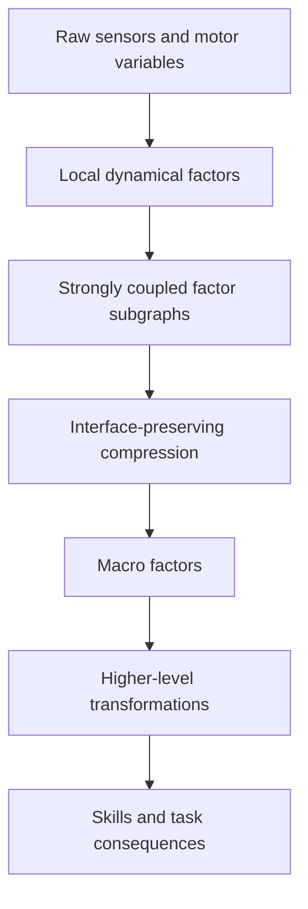

What if perception, abstraction, prediction, and control were not separate subsystems, but different traversals of the same learned hierarchy?

This post sketches a research architecture I am tentatively calling a **Predictive Control Factor Hierarchy (PCFH)**. The central idea is to learn a hierarchy of dynamical factors that preserve the predictive and controllable interfaces between parts of a system while progressively hiding internal detail.

The architecture began from a simpler idea: represent relationships between sensorimotor variables using proportional, integral, and derivative structure, then use learned compatibility matrices to discover which variables participate in common transformations. Stress-testing that idea exposed something deeper. PID-like channels are useful, but they are not the fundamental representation. The more general primitive is a **learned dynamical factor** containing a relational state, prediction residual, local sensitivity or Jacobian, uncertainty, timescale, and reference frame.

The hierarchy then repeats two operations:

1. **Relate** variables by learning their transformation laws.
2. **Compose** tightly coupled factors into higher-level factors that preserve the external behavior needed for prediction and control.

The result is a candidate mechanism for learning objects, body parts, affordances, skills, and task-level consequences from the same underlying machinery.

## 1. Three quantities that must remain separate

An early version of the idea treated prediction error itself as the relational coordinate. That does not work.

Suppose a model predicts a relationship perfectly. Its prediction error goes to zero, but the relationship itself may still be highly informative: a hand can be 30 cm above an object, in contact with it, or grasping it while all three states are predicted perfectly.

The architecture therefore needs to distinguish three quantities.

### Relational state

For two variables or factors \(z_i\) and \(z_j\), define a learned relational coordinate

$$
r_{ij,t} = g_\theta(z_{i,t}, z_{j,t}).
$$

This says **what the relationship currently is**.

### Model innovation

A dynamics model predicts how that relationship should evolve:

$$
\hat r_{ij,t+1} = F_\theta(r_{ij,t}, a_t, c_t),
$$

where \(a_t\) is action and \(c_t\) is context. The model innovation is

$$
\epsilon_{ij,t+1} = r_{ij,t+1} - \hat r_{ij,t+1}.
$$

This says **how wrong the current model is**.

### Goal error

When the system is controlling toward a desired relation \(r^*\), define

$$
\delta_{ij,t} = r^*_{ij,t} - r_{ij,t}.
$$

This says **how far the current relation is from the desired relation**.

That gives the architecture three distinct information streams:

```text
r        relational state
ε        model surprise / innovation
δ        control discrepancy
```

Conflating them would destroy useful structure.

## 2. The fundamental primitive: a learned dynamical factor

Rather than treating attention as the architecture itself, imagine that attention or compatibility only proposes which variables should participate in a common factor.

A factor can be represented conceptually as

```text
factor := {
    participating_variables,
    relational_state,
    residual,
    jacobian,
    uncertainty,
    temporal_scales,
    action_sensitivity,
    local_reference_frame
}
```

For a factor \(f\), let its residual be \(e_f(x_f)\). A probabilistic factor can assign compatibility using an information matrix \(\Lambda_f\):

$$
\psi_f(x_f)
\propto
\exp\left(-\frac{1}{2} e_f^T \Lambda_f e_f\right).
$$

Locally, the residual can be linearized:

$$
e_f(x + \Delta x)
\approx
e_f(x) + J_f \Delta x,
$$

where

$$
J_f = \frac{\partial e_f}{\partial x}.
$$

The Jacobian is especially important because it has both a forward and inverse interpretation.

**Forward question:** if I change this action or state variable, how will the relationship change?

**Inverse question:** if this relationship is wrong, which lower-level variables should change to reduce the error?

A local damped correction can take the form

$$
\Delta x
=
-
\left(J^T \Lambda J + \lambda I\right)^{-1}
J^T \Lambda e.
$$

The same learned sensitivity structure can therefore support prediction and control.

## 3. Attention discovers participation; factors learn laws

A compatibility mechanism can score candidate interactions:

$$
C_{ij,h}
=
q_{i,h}^T M_h k_{j,h}
+
b_h(r_{ij}, \epsilon_{ij}, \dot r_{ij}, a_t, \Delta t).
$$

But the compatibility score should answer only one question:

> Which variables probably participate in a common transformation?

The learned factor answers the harder question:

> What law relates them?

This distinction matters. A transformer-like mechanism could be useful for sparse routing and factor proposal without forcing the entire architecture to inherit the semantics of ordinary row-wise softmax attention.

Real dynamical graphs can contain multiple simultaneous causes, weak couplings, independent factors, and genuine null relationships. Sparse sigmoid gates, entmax-style sparsity, top-\(k\) routing, or explicit null edges may be more appropriate than requiring every variable to distribute all of its attention somewhere.

This part of the design is related to work such as [Neural Relational Inference](https://arxiv.org/abs/1802.04687), which learns interaction graphs and dynamics from trajectories. The proposed hierarchy adds explicit multiscale temporal structure, recursive factor composition, learned reference frames, and a shared predictive-control interpretation.

## 4. PID becomes a temporal basis, not the state representation

PID-like structure still has a useful role, but it now appears in three different places.

### Relational dynamics

Filtered derivatives of relational state expose ongoing transformation:

$$
D^{r,(\tau)}_t
\approx
\operatorname{LPF}_{\tau}
\left(
\frac{r_t-r_{t-1}}{\Delta t}
\right).
$$

This says that a relationship is changing now.

### Persistent model mismatch

A leaky integral of prediction innovation can expose systematic model error:

$$
I^{\epsilon,(\tau)}_t
=
\lambda_\tau I^{\epsilon,(\tau)}_{t-1}
+
(1-\lambda_\tau)\epsilon_t.
$$

Persistent innovation could indicate payload changes, friction mismatch, sensor drift, unmodeled external forces, or a poor factorization.

### Goal-directed control

PID structure can also operate over actual control discrepancy:

$$
P^\delta_t = \delta_t,
$$

$$
I^{\delta,(\tau)}_t
=
\lambda_\tau I^{\delta,(\tau)}_{t-1}
+
(1-\lambda_\tau)\delta_t,
$$

$$
D^{\delta,(\tau)}_t
\approx
\operatorname{LPF}_{\tau}
\left(
\frac{\delta_t-\delta_{t-1}}{\Delta t}
\right).
$$

The interpretation becomes cleaner:

```text
r       what relationship exists?
dr/dt   what transformation is occurring?

ε       what did the model fail to predict?
∫ε      what mismatch persists?

δ       how far are we from the desired relation?
∫δ      how long has the discrepancy persisted?
dδ/dt   are we making progress?
```

Multiple timescales \(\tau\) provide a structured temporal basis without claiming that all real-world dynamics are literally PID systems. Residual recurrent or state-space memory can model delays, hysteresis, contact transitions, oscillations, and other dynamics that fall outside that basis.

## 5. Compose means interface-preserving compression

The most important refinement is a stronger definition of **Compose**.

Suppose a subsystem has internal variables \(x_A\) and interacts with the rest of the world through boundary variables \(x_B\). A higher-level factor should hide as much of \(x_A\) as possible while preserving the information needed to predict and control interactions through \(x_B\).

Probabilistically, internal variables can be marginalized:

$$
\psi_{\mathrm{eff}}(x_B)
=
\int \psi(x_A,x_B)\,dx_A.
$$

In an optimization view, one can eliminate them by defining

$$
E_{\mathrm{eff}}(x_B)
=
\min_{x_A} E(x_A,x_B).
$$

The learned version of this operation would attempt to preserve:

- externally visible state,
- action-to-effect mappings,
- reachable transformations,
- important uncertainty,
- relevant temporal dynamics,
- safety-critical couplings,

while discarding unnecessary internal detail.

That is different from generic pooling or autoencoder compression. It is **interface-preserving abstraction**.

A low-level arm may contain motor currents, joint angles, joint velocities, friction, elasticity, and individual link dynamics. A higher-level factor may expose only an end-effector pose, velocity, contact state, reachable wrench or motion, uncertainty, and an effective action interface.

The internal realization becomes hidden without losing what another subsystem needs in order to interact with the arm.

## 6. Objecthood becomes a dynamical property

This gives a possible operational definition of an object or coherent subsystem.

A candidate cluster deserves promotion when:

1. its internal relationships are stable and strongly predictive,
2. its interaction with the outside world can be summarized through a much smaller interface,
3. that compressed interface preserves prediction,
4. it preserves relevant controllability and reachability,
5. it preserves important uncertainty and safety-relevant effects.

Conceptually,

$$
\text{factor quality}
\sim
\frac{\text{predictive/control information preserved at the boundary}}
{\text{internal degrees of freedom retained}}.
$$

A rigid object is a natural example. Thousands of pixels may move coherently, but interaction with the object can often be summarized by pose, velocity, geometry, contact properties, and a few latent physical parameters.

A limb has a similar structure. So may a learned skill.

That suggests that objects, body parts, tools, and temporally extended actions may all arise from the same abstraction operator rather than from separate hand-designed modules.

## 7. Reference frames are learned because they simplify factors

The system should not merely learn arbitrary embeddings. It should search for local coordinate systems in which transformation laws become simple.

A useful reference frame should make the local factor dynamics:

- lower-dimensional,
- sparse,
- stable across context changes,
- compositional,
- well-conditioned for inverse control.

If a coordinate transformation is \(r' = T_g(r)\), then the Jacobian transforms as

$$
J'
=
\frac{\partial T_g}{\partial r}J.
$$

The underlying physical relationship should remain consistent even when its coordinates change.

A possible frame objective could combine rollout error, Jacobian conditioning, sparsity, and transformation composition:

$$
\mathcal L_{\text{frame}}
=
\alpha\,\mathcal L_{\text{rollout}}
+
\beta\,\operatorname{cond}(J)
+
\gamma\,\lVert J\rVert_{\text{off-structure}}
+
\eta\,\mathcal L_{\text{composition}}.
$$

This connects to group-structured representation learning and to the idea behind Koopman-style methods: find coordinates in which nonlinear dynamics become simpler to predict and control. Related examples include [Homomorphism Autoencoders](https://arxiv.org/abs/2207.12067) and work on [symmetry-based disentanglement through interaction](https://arxiv.org/abs/1904.00243).

The distinctive hypothesis here is that useful frames are discovered recursively because they simplify both **prediction and inverse control**.

## 8. The hierarchy runs in both directions

The hierarchy can now be pictured as repeated factor discovery and interface-preserving compression.



Upward, the system asks:

> What increasingly abstract consequence follows from these lower-level transformations?

Downward, it asks:

> What lower-level transformations would satisfy this desired higher-level relation?


The reverse path conditions higher-level factors on desired states and solves for feasible lower-level targets.

At the physical boundary, a hard real-time controller can remain conventional and bounded:

$$
u_t
=
\operatorname{SafeProject}
\left(
K_P e_t + K_I I_t + K_D D_t + u_{\mathrm{ff}}
\right).
$$

The learned hierarchy need not replace kilohertz servo loops. It can instead provide setpoints, trajectories, feedforward terms, bounded gain schedules, uncertainty estimates, and termination conditions at slower rates.

## 9. A repeating block

One layer of the architecture might eventually look like this:

```text
INPUT
    variable tokens
    lower-level action ports
    history
    optional top-down target

1. PROPOSE
    compatibility network proposes candidate factors

2. RELATE
    factor encoder determines relational coordinates

3. PREDICT
    dynamics model predicts relational evolution

4. COMPARE
    compute innovation and multiscale temporal channels

5. DIFFERENTIATE
    estimate state/action Jacobians and uncertainty

6. MESSAGE PASS
    exchange predictive constraints among factors

7. COMPOSE
    find subgraphs that admit interface-preserving compression

8. EMIT UPWARD
    macro-state, effective dynamics, macro-action interface, uncertainty

9. CONDITION DOWNWARD
    receive desired macro-state

10. INVERT
    solve for feasible lower targets/actions

11. VERIFY
    reachability, uncertainty, and safety constraints
```

The same block could in principle operate over very different scales. At low levels the variables might be encoder readings and tactile patches. At higher levels they could be limbs, contacts, manipulation primitives, objects, or skills.

## 10. A possible emergent hierarchy

The layers should not be hard-coded to semantic categories, but a successful system might eventually produce something resembling:

| Level | Possible effective variables | Characteristic transformation |
| --- | --- | --- |
| 0 | sensor and actuator channels | signal response |
| 1 | local motion factors | kinematics |
| 2 | limbs and rigid components | body/object transforms |
| 3 | contact relationships | manipulation and affordance |
| 4 | temporally extended action factors | skills |
| 5 | object/task state factors | consequences |

The interpretation is secondary. What matters is whether each abstraction genuinely provides a simpler predictive-control interface than the variables beneath it.

## 11. Why this resembles renormalization

There is an interesting structural analogy to renormalization in physics.

At each level, microscopic degrees of freedom are eliminated while effective interactions are retained at the next scale.

```text
many microscopic variables
        ↓
coarse grain / eliminate internal state
        ↓
effective variables
        ↓
effective interaction laws
```

The difference is the selection criterion. This hierarchy would not coarse-grain only by physical scale. It would retain variables according to **predictive and controllable interface structure**.

The hierarchy might therefore be better understood as

```text
microscopic dynamical factors
        ↓
effective dynamical factors
        ↓
effective dynamical factors
        ↓
...
```

Objects and skills would then be useful effective descriptions rather than primitive categories supplied by the designer.

## 12. Developmental learning

A plausible training sequence would begin with safe, bounded interventions rather than passive observation.

### Phase 1: Safe excitation

A conservative baseline controller generates small perturbations, repeated trajectories, load changes, and contacts.

### Phase 2: Learn local influence structure

The model learns which actions and variables predict future changes in which other variables.

### Phase 3: Discover factors

Sparse factor proposals and bottlenecks search for groups whose joint dynamics are simpler and more predictive than their separate descriptions.

### Phase 4: Discover useful frames

The model searches for coordinates that improve rollout prediction, transformation composition, Jacobian sparsity, conditioning, and generalization.

### Phase 5: Learn inverse control

The hierarchy initially operates around known stable controllers, proposing residual corrections and feedforward actions before taking on more general latent control.

### Phase 6: Add higher temporal levels

Repeated lower-level transformation sequences become candidate macro-actions or skills.

### Phase 7: Add task objectives

Task reward selects desired high-level consequences. Physical safety and actuator limits remain outside the reward system as hard constraints.

## 13. Failure modes that could kill the idea

The architecture should be treated as a falsifiable research hypothesis, not a story that can explain any result after the fact.

Important risks include:

- **Correlation masquerading as causality.** Co-moving variables may share an unseen cause. Randomized interventions are essential.
- **Quadratic factor search.** Pairwise relationships become intractable at scale. Sparse candidate generation is necessary.
- **Hierarchy collapse.** Upper levels may simply copy lower-level state without discovering useful interfaces.
- **Gauge ambiguity.** Many coordinate systems may explain the same physical dynamics. Equivalent frames should be acceptable if their transformation laws remain consistent.
- **Singular inverse control.** Some desired changes are unreachable, underactuated, or ill-conditioned.
- **Model exploitation.** A planner may discover errors in the learned dynamics rather than good actions.
- **Representation drift.** Changing a lower-level factor can invalidate higher-level controllers.
- **PID overconstraint.** Delay, hysteresis, backlash, discontinuous contact, and long memory require richer residual dynamics.
- **High-level integral windup.** Persistent unresolved goals can become pathological if accumulation is not bounded, resettable, and conditioned on reachability.
- **Safety-critical weak couplings.** Sparsity objectives can accidentally discard interactions that matter rarely but catastrophically.

The hard safety plane should therefore remain separate from task reward. Learned control outputs should be projected through verified actuator, state, and stability constraints wherever possible. Work such as [Safe exploration with learning-based MPC](https://arxiv.org/abs/1803.08287) illustrates one family of approaches to maintaining recoverability while learning.

## 14. The first experiment

The first test should be much smaller than vision.

Use a simulated two- or three-link arm with:

- permuted and differently scaled sensor channels,
- joint encoders,
- motor commands,
- end-effector coordinates,
- contact sensing,
- variable payload,
- a movable object,
- rotated external coordinate frames.

Do not tell the model which channel represents what.

Compare:

1. a flat MLP dynamics model,
2. a transformer dynamics model,
3. a neural relational inference model,
4. a compatibility model without structured temporal channels,
5. a PID-relational model without hierarchy,
6. the full two-level factor hierarchy.

The central question is no longer merely whether PID features improve prediction. It is:

> **Can a learned system discover a compact factorization of a dynamical system such that eliminating internal variables produces higher-level factors that preserve both prediction and controllability?**

The strongest evidence would be emergence of something functionally equivalent to an end-effector or arm-level factor that can answer:

- Where will the hand go?
- Which actions change its position?
- Is the requested state reachable?
- How uncertain is the prediction?

while hiding the individual sensor channels that implement it.

Then perturb the embodiment and coordinates:

- rotate the camera frame,
- change sensor gains,
- permute encoder channels,
- change link masses,
- attach a payload.

If the higher-level factor remains meaningful while the lower-level realization adapts, that would be evidence of a genuine reference-frame-like abstraction rather than simple trajectory compression.

Key ablations should include:

```text
remove_integral_channels
remove_derivative_channels
remove_interventions
remove_composition_loss
remove_shared_forward_inverse_structure
remove_hierarchy
remove_reference-frame objective
```

The proposal should be considered weakened if generic temporal memory performs just as well, factor edges fail interventional tests, learned frames do not transfer across coordinate changes, hierarchy provides no matched-compute advantage, or the forward model provides no measurable benefit to inverse control.

## 15. The core hypothesis

The architecture can be summarized by one repeating primitive and one repeating operation.

The primitive is a learned dynamical factor:

$$
\boxed{
\text{Factor}
=
(\text{relation},\ \text{residual},\ \text{Jacobian},\ \text{uncertainty},\ \text{frame},\ \text{timescale})
}
$$

The hierarchical operation is interface-preserving composition:

$$
\boxed{
\text{Compose}
=
\text{eliminate internal state while preserving external predictive-control behavior}
}
$$

Attention proposes and routes candidate factors. Structured P/I/D-like channels expose change, persistence, and discrepancy across time. Reference-frame learning searches for coordinates that simplify the effective dynamics. Factor composition creates abstraction. Jacobians connect forward prediction to inverse control. Top-down conditioning turns desired high-level consequences into feasible lower-level transformations.

The deepest hypothesis is therefore not that PID belongs inside a neural network. It is that **prediction and control may be dual traversals of the same learned hierarchy of effective dynamical factors**.

If that is true, the same architecture could potentially acquire a body model, discover object-relative coordinates, learn manipulable interfaces, compose actions into skills, and eventually express high-level goals in the same representational language it uses to drive precise physical behavior.
