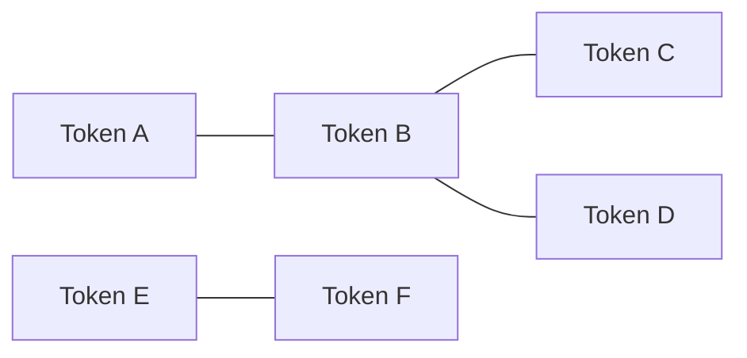
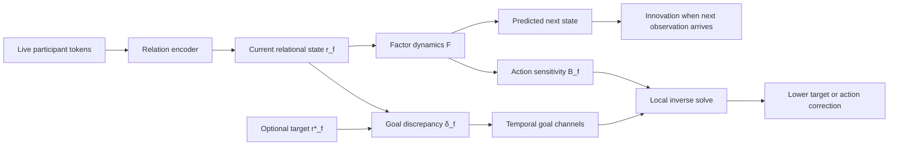
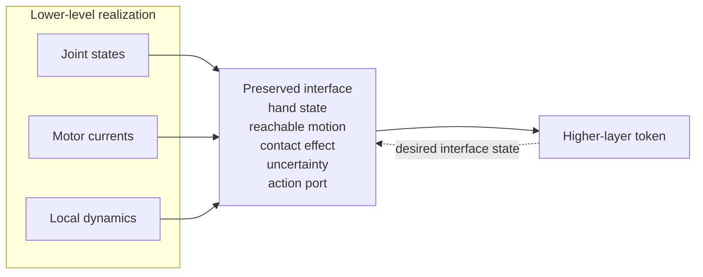
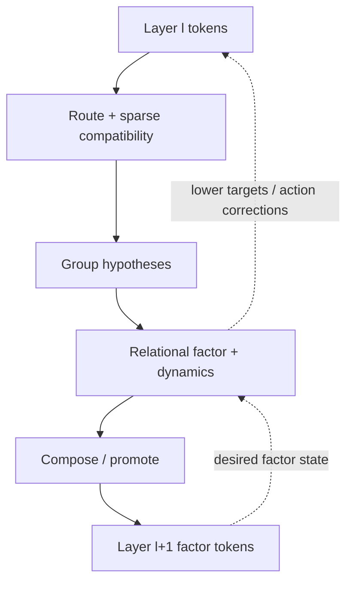
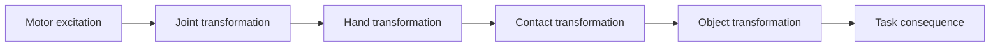
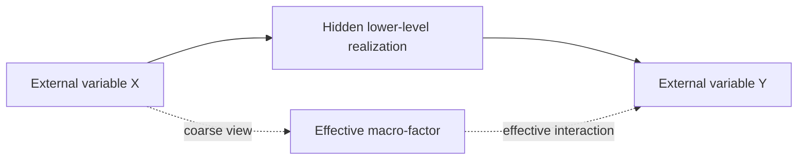

> **AI-generated content disclaimer:** This article was generated with AI assistance from the author's research ideas, questions, and iterative review comments. It describes a speculative research architecture, not an established or peer-reviewed result. The equations and design choices below should be read as working hypotheses to test, refine, or falsify.

What if perception, abstraction, prediction, and control were not separate subsystems, but different traversals of the same learned hierarchy?

This post sketches a research architecture I am tentatively calling a **Predictive Control Factor Hierarchy (PCFH)**. The central idea is to learn a hierarchy of dynamical factors that preserve the predictive and controllable interfaces between parts of a system while progressively hiding internal detail.

The architecture begins with sensor, actuator, or lower-level factor tokens. A learned compatibility mechanism proposes which tokens may participate in common transformations. Those proposals become **predictive factors**: small learned models of the current relationship among a selected set of participants, how that relationship changes, and how actions influence it. Factors that expose a sufficiently compact external interface can then be promoted into tokens for the next layer.

The hierarchy therefore repeats two conceptual operations:

1. **Relate**: discover candidate participants and learn their joint dynamical law.
2. **Compose**: expose a validated factor to the next layer through a smaller predictive-control interface while keeping its detailed realization below.

These are not two unrelated compression systems. Relate creates and tests a factor inside a layer; Compose is the inter-layer promotion step that makes a factor usable as a token by the next block.

## Architecture at a glance

The most important architectural requirement is that the output of one block has the same *kind* of interface as the input to the next block.

```mermaid
flowchart LR
    Z0[Layer 0 tokens<br/>sensors, actuators, local state]
    B0[PCFH block 0<br/>route → group → relate/predict → compose]
    Z1[Layer 1 factor tokens]
    B1[PCFH block 1<br/>route → group → relate/predict → compose]
    Z2[Layer 2 factor tokens]
    B2[PCFH block 2<br/>same machinery]
    Z3[Layer 3 factor tokens]

    Z0 --> B0 --> Z1 --> B1 --> Z2 --> B2 --> Z3
    Z3 -. desired state .-> B2
    B2 -. lower target .-> Z2
    Z2 -. lower target .-> B1
    B1 -. lower target .-> Z1
    Z1 -. lower target .-> B0
```



At the bottom, a token might represent one sensor channel or actuator command. At a higher layer, a token might represent a joint, hand, object, contact relationship, or skill-like macro-state. The block does not require those semantic categories to be hard-coded.

A higher-layer token is **not the entire lower-level factor structure flattened into a vector**. It is a fixed-width interface containing the factor's current effective state and enough descriptors for other factors to predict and control through it. The detailed participant states and factor machinery remain available at the lower layer for local prediction and downward control.

That distinction will matter throughout the rest of the article.

## 1. Three quantities that must remain separate

An early version of the idea treated prediction error itself as the relational coordinate. That does not work.

Suppose a model predicts a relationship perfectly. Its prediction error goes to zero, but the relationship itself may still be highly informative: a hand can be 30 cm above an object, in contact with it, or grasping it while all three states are predicted perfectly.

The architecture therefore needs to distinguish three quantities.

### Relational state

A **relational state** is the current latent state of a relationship among a factor's participants. It is not merely metadata saying that two variables are connected, and it is not a prediction of the future. It is the factor's compressed answer to:

> Given the current participant values, what configuration or interaction state are these participants in *right now*?

For a simple pair of tokens \\(z_i\\) and \\(z_j\\), a learned relation encoder could produce

$$
r_{ij,t} = g_\theta(z_{i,t}, z_{j,t}).
$$

For a factor with participant set \\(S_f\\), the more general form is

$$
r_{f,t}
=
g_\theta\!\left(\{z_{i,t}:i\in S_f\}, c_{f,t}\right),
$$

where \\(c_{f,t}\\) can contain context such as a local reference-frame embedding or factor type.

The output \\(r_{f,t}\\) can be scalar or vector-valued. For a hand-object factor, useful learned coordinates might behave like relative position, relative orientation, contact mode, slip state, or another coordinate that makes their joint dynamics easy to predict. Those meanings are not supplied by the designer; they are what the learning objective would ideally discover.

The original participant values \\(z_{i,t}\\) still exist in the current layer. The relational state \\(r_{f,t}\\) is a derived runtime state of the factor, not a replacement for the participant storage inside that layer.

This says **what the relationship currently is**.

### Model innovation

A dynamics model predicts how the relational state should evolve:

$$
\hat r_{f,t+1}
=
F_\theta(r_{f,t}, a_{f,t}, c_{f,t}),
$$

where \\(a_{f,t}\\) is the action or lower-level control input visible to the factor.

When the next observation arrives, the relation encoder produces the new current state \\(r_{f,t+1}\\). The transition innovation is

$$
\epsilon_{f,t+1}
=
r_{f,t+1}-\hat r_{f,t+1}.
$$

This says **how wrong the current dynamics model was**.

A scalable implementation does not require a separately trained predictive network for every factor instance. The parameters of \\(F_\theta\\) can be shared across many factors and conditioned on factor type, participant descriptors, local frame, or another learned context.

### Goal error

When the system is controlling toward a desired relational state \\(r_f^*\\), define

$$
\delta_{f,t}
=
r^*_{f,t}-r_{f,t}.
$$

This says **how far the current relation is from a requested relation**.

That gives the architecture three distinct information streams:

```text
r        relational state: what relation exists now?
ε        model innovation: what did the dynamics model fail to predict?
δ        goal discrepancy: how far are we from a requested relation?
```

Conflating them would destroy useful structure. A relation can be perfectly predicted while still being far from a goal, and a system can be at its goal while a poor dynamics model continues to make prediction errors.

## 2. The fundamental primitive: a learned dynamical factor

A **predictive factor** is a small learned dynamical model attached to a selected group of participants. It is not the same thing as an attention head and it is not necessarily restricted to a pair. A factor might involve two variables, several sensors and an actuator, several lower-level factor tokens, or some other sparse subset proposed by the routing mechanism.

The word *factor* is easiest to understand if we separate its relatively persistent **specification** from its time-varying **runtime state**.

```text
factor_spec := {
    participant_refs_or_assignments,
    relation_encoder,
    dynamics_model_or_type,
    local_reference_frame,
    exposed_action_ports,
    temporal_constants
}

factor_state[t] := {
    relational_state,
    predicted_next_relational_state,
    innovation,
    temporal_summaries,
    uncertainty
}
```

The `participant_refs_or_assignments` identify which current-layer tokens participate. They are **references, indices, or soft assignment weights**, not copies of the current sensor values. The live current values remain in the layer's token set and are read by the relation encoder each timestep.

The factor's \\(r_{f,t}\\) *is* a current state description, but it is the current **relational state of the factor**, derived from the live participant values. The predicted next state \\(\hat r_{f,t+1}\\) is a separate quantity.

### From a predictive factor to a residual function

The previous wording made the residual \\(e_f\\) appear to come from nowhere. A concrete definition is obtained directly from the factor's encoder and dynamics model.

Given the participant state at \\(t+1\\), define the **predictive residual**

$$
e^{\mathrm{pred}}_{f,t+1}
=
g_\theta(z_{S_f,t+1})
-
F_\theta(r_{f,t},a_{f,t},c_{f,t}).
$$

Because \\(g_\theta(z_{S_f,t+1})=r_{f,t+1}\\), this is simply

$$
e^{\mathrm{pred}}_{f,t+1}
=
\epsilon_{f,t+1}.
$$

So the residual is not a mysterious extra object inside the factor. It is the discrepancy between the factor state observed at the next timestep and the factor state predicted by the learned transition law.

A Gaussian-style transition likelihood can then be written

$$
\psi_f
\propto
\exp\left(
-\frac{1}{2}
(e_f^{\mathrm{pred}})^T
\Lambda_f
 e_f^{\mathrm{pred}}
\right).
$$

Here \\(\Lambda_f\\) is an **information or precision matrix**. It is not the learned relationship itself. The relationship is represented by \\(r_f\\) together with the dynamics model \\(F_\theta\\). The matrix \\(\Lambda_f\\) only says how strongly different residual directions should be weighted according to uncertainty and scale.

Thus \\(\Lambda_f e_f\\) means **precision-weighted residual**: uppercase Lambda multiplied by the residual vector. It is not a separate symbol such as “lambda-e,” and it is not itself the relational state.

If the residual channels have physical units, the corresponding entries of \\(\Lambda_f\\) carry inverse-squared units so the quadratic energy is dimensionless. A latent implementation can instead normalize factor-state coordinates so the weighting is easier to learn.

### Sensitivity belongs to the transition law

It is clearer to differentiate the learned dynamics than to speak vaguely of “the Jacobian of the whole factor structure.” Around the current operating point, define

$$
A_{f,t}
=
\frac{\partial F_\theta}{\partial r_f},
\qquad
B_{f,t}
=
\frac{\partial F_\theta}{\partial a_f}.
$$

Then a small perturbation obeys the local approximation

$$
\Delta \hat r_{f,t+1}
\approx
A_{f,t}\,\Delta r_{f,t}
+
B_{f,t}\,\Delta a_{f,t}.
$$

The two Jacobians answer different questions:

- \\(A_f\\): if the current relational state changes, how does the next relational state change?
- \\(B_f\\): if the action changes, how does the next relational state change?

For inverse control, suppose the desired next relational state is \\(r_f^*\\), producing the one-step target discrepancy

$$
\delta_f^{\mathrm{next}}
=
r_f^*-
\hat r_{f,t+1}.
$$

A local weighted least-squares action correction can be

$$
\Delta a_f
=
\left(
B_f^T\Lambda_f B_f + R_f
\right)^{-1}
B_f^T\Lambda_f
\delta_f^{\mathrm{next}},
$$

where \\(R_f\\) is a positive-semidefinite action regularization matrix. In normalized action coordinates one could choose \\(R_f=\lambda I\\), but writing \\(R_f\\) explicitly avoids pretending that one scalar damping coefficient automatically has compatible physical units with every action coordinate.

This gives the architecture a much cleaner forward/inverse duality:

> The forward model learns how state and action perturbations change a factor. The inverse controller uses the action sensitivity of that same model to choose a local correction.

The factor need not permanently store dense Jacobian matrices. They can be evaluated only when needed, or used through Jacobian-vector and vector-Jacobian products.

## 3. Attention discovers participation; factors learn laws

Two ideas that are easy to conflate must remain separate:

- the **compatibility mechanism** proposes which tokens are worth trying together;
- the **predictive factor model** learns the relationship and transformation law of a selected group.

A compatibility head can score candidate pairwise interactions. One possible form is

$$
C_{ij,h}
=
q_{i,h}^T M_h k_{j,h}
+
b_h(\rho_{ij,t},\dot\rho_{ij,t},a_t,\Delta t,m_{ij,t-1}).
$$

The variables are:

- \\(i,j\\): candidate token indices in the current layer;
- \\(h\\): compatibility-head index;
- \\(z_{i,t},z_{j,t}\\): current token representations;
- \\(q_{i,h}=W^Q_hz_{i,t}\\): learned query representation of token \\(i\\) for head \\(h\\);
- \\(k_{j,h}=W^K_hz_{j,t}\\): learned key representation of token \\(j\\);
- \\(M_h\\): learned bilinear compatibility matrix for that head;
- \\(\rho_{ij,t}\\): cheap pairwise features available *before* a full factor exists, such as a learned relative embedding;
- \\(\dot\rho_{ij,t}\\): optional recent change in those pairwise features;
- \\(a_t\\): relevant current action context;
- \\(\Delta t\\): elapsed time;
- \\(m_{ij,t-1}\\): optional cached summary from a previously retained factor involving the pair; it can be zero when no such factor exists;
- \\(b_h\\): learned function that converts those auxiliary signals into a compatibility bias;
- \\(C_{ij,h}\\): the resulting proposal score.

This formulation deliberately does **not** require a full relational state or innovation for every possible pair. Those are expensive factor-level quantities and should exist primarily for retained factors, not for all \\(N^2\\) pairs.

### What does one compatibility head mean?

There are at least two plausible designs.

1. **Generic proposal heads.** Every head proposes interactions from a different learned subspace without being assigned a semantic meaning.
2. **Factor-family heads.** A head becomes associated with a recurring family of dynamics and proposes participants specifically for that family.

The second design is more interpretable, but the first is less restrictive. Multiple heads are useful because one token can participate in several simultaneous transformations. A joint-angle token might participate in both a motor-response factor and a kinematic-link factor.

The compatibility score therefore means roughly:

> **These tokens look worth testing inside the same candidate dynamical model.**

It is a routing proposal, not yet a claim that the tokens form one object, one cause, or one permanent factor.

### What is a sparse compatibility graph?

For one layer, imagine every current token as a node. A dense compatibility computation considers every possible token pair. After scoring, the architecture keeps only a small subset of useful edges.



Each retained edge can carry a score, head identity, direction, and other lightweight proposal features. With multiple heads the result is better thought of as a sparse multi-relational graph than as one ordinary untyped adjacency matrix.

**Sparse** means that the number of retained edges \\(E\\) is much smaller than the \\(N^2\\) pairs that could exist. For example, top-\\(k\\) routing might retain only \\(k\\) candidate neighbors per token.

The graph has three important limitations:

1. An edge means “test this interaction,” not “these nodes are definitely one factor.”
2. The graph may contain overlapping interaction families.
3. Graph connectivity is not automatically transitive factor membership.

### How compatibility scores become predictive factors

A concrete forward pipeline is:

```mermaid
flowchart TD
    A[Current-layer tokens Z^l]
    B[Compatibility heads]
    C[Sparse proposal graph]
    D[Candidate grouping]
    E[Relation encoder]
    F[Candidate factor state r_f]
    G[Shared / type-conditioned dynamics]
    H[Prediction + innovation + uncertainty]
    I[Predictive / interventional validation]
    J[Compose / promote interface]
    K[Next-layer factor token z_f^(l+1)]

    A --> B --> C --> D
    A --> E
    D --> E --> F --> G --> H --> I --> J --> K
```

A possible implementation would work as follows:

1. **Score candidate edges.** Compatibility heads compute \\(C_{ij,h}\\).
2. **Sparsify.** Keep strong or top-\\(k\\) edges, learned sparse gates, or another bounded candidate set.
3. **Propose groups.** Convert compatible edges into candidate participant sets.
4. **Encode a current factor state.** A shared relation encoder reads the live participant values and produces \\(r_{f,t}\\).
5. **Predict.** Shared or type-conditioned dynamics predict \\(\hat r_{f,t+1}\\).
6. **Validate.** Prediction, interventions, persistence, uncertainty, and useful control sensitivity determine whether the factor earns continued compute.
7. **Compose/promote when justified.** A sufficiently useful factor exposes a compact interface as one token to the next layer.

The expensive predictive machinery is therefore attached to the **sparse retained factor hypotheses**, not to every entry in an \\(N\times N\\) compatibility matrix.

#### Does A–B plus B–C imply one A–B–C factor?

Not necessarily. This is an important open design question rather than something the architecture should quietly assume.

Suppose the graph contains a strong A–B edge and a strong B–C edge.

- If A–B came from a rigid-motion head and B–C came from a contact-response head, the natural interpretation may be **two overlapping factors**, not one three-token factor.
- Even if both edges came from the same head, taking an ordinary connected component can over-merge a long chain of locally compatible tokens into one giant factor.
- A three-token A–B–C factor should therefore be treated as a **group hypothesis** and validated at the group level.

Possible grouping mechanisms include:

- per-head connected components followed by a consistency test;
- seed-and-grow neighborhoods that add a token only if joint prediction improves;
- learned factor slots with soft token-to-factor assignments, related in spirit to [Slot Attention](https://arxiv.org/abs/2006.15055);
- hyperedge proposal networks that directly score sets rather than inferring sets only from pair edges;
- graph community or clustering methods constrained by predictive and interventional evidence.

A useful acceptance test is not merely “are these nodes connected?” but something closer to:

> Does modeling this set jointly produce a simpler, more stable, more predictive and controllable law than modeling its members separately?

For example, A–B and B–C should only become one A–B–C factor if the three-way model has coherent dynamics and survives interventions that distinguish shared causes from accidental correlation.

The first experiments should explicitly compare grouping strategies rather than freezing one of them into the architecture prematurely.

#### How does a factor become a factor token?

A factor structure contains much more machinery than the next layer should have to ingest. The upward interface should therefore be a **fixed-width token projection**, for example

$$
z_f^{(\ell+1)}
=
P_\ell\!\left[
 r_{f,t},
 D_f^r,
 I_f^\epsilon,
 \Sigma_f,
 e_f^{\mathrm{frame}},
 e_f^{\mathrm{interface}},
 e_f^{\mathrm{type}}
\right],
$$

where:

- \\(r_{f,t}\\) is the current macro relational state;
- \\(D_f^r\\) summarizes current relational change;
- \\(I_f^\epsilon\\) summarizes persistent model mismatch;
- \\(\Sigma_f\\) summarizes uncertainty;
- \\(e_f^{\mathrm{frame}}\\) describes the factor's learned local coordinate frame;
- \\(e_f^{\mathrm{interface}}\\) describes exposed predictive/control ports or affordances;
- \\(e_f^{\mathrm{type}}\\) is an optional learned factor-family embedding;
- \\(P_\ell\\) projects the bundle to the fixed token width expected by layer \\(\ell+1\\).

A small out-of-band factor handle can point back to the lower-level factor instance when the hierarchy needs a rollout, sensitivity query, or downward target. The next layer does **not** need the full participant list, every raw source value, every model parameter, or a materialized Jacobian embedded in the token.

This makes the hierarchy **lossy upward but not destructive overall**. Upper layers see the compressed effective state. Lower layers still retain the detailed realization needed to execute, refine, or debug that state.

For example, suppose a layer contains a motor command \\(u_1\\), joint angle \\(q_1\\), motor current \\(i_1\\), and hand-position estimate \\(p_h\\). Compatibility might suggest a command-response factor over \\(u_1,q_1,i_1\\). Another head might connect \\(q_1\\) with other joints and \\(p_h\\) to form a kinematic factor. Those factors can overlap because they describe different laws. Only factors that develop useful compact interfaces need to become higher-level tokens.

This distinction is related to work such as [Neural Relational Inference](https://arxiv.org/abs/1802.04687), which learns interaction graphs and dynamics from trajectories. The proposed hierarchy adds explicit multiscale temporal structure, recursive factor promotion, learned reference frames, and a shared predictive-control interpretation.

## 4. PID becomes a temporal basis, not the state representation

With the factor-creation pipeline established, temporal signals can be added without giving any one of them special status.

For a retained factor \\(f\\), useful channels include:

| Channel | Source | What it asks |
| --- | --- | --- |
| \\(r_f\\) | current factor state | What relationship exists now? |
| \\(D_f^r\\) | change in relational state | What transformation is occurring? |
| \\(\epsilon_f\\) | prediction innovation | What did the dynamics model fail to predict? |
| \\(I_f^\epsilon\\) | persistent innovation | Has the same model mismatch persisted? |
| \\(\delta_f\\) | desired minus current relation | How far is a targeted factor from its requested relation? |
| \\(I_f^\delta\\) | persistent goal discrepancy | How long has the discrepancy persisted? |
| \\(D_f^\delta\\) | change in goal discrepancy | Are we approaching or moving away from the goal? |

Not every factor needs every channel at every moment. In particular, \\(\delta_f\\) and its temporal channels exist only when a factor is being given a target.

### Relational dynamics

Filtered derivatives of relational state expose ongoing transformation:

$$
D^{r,(\tau)}_t
\approx
\operatorname{LPF}_{\tau}
\left(
\frac{r_t-r_{t-1}}{\Delta t}
\right).
$$

**LPF** means **low-pass filter**. Numerical derivatives are extremely sensitive to sensor noise, so instead of using the raw finite difference directly, the derivative is smoothed over a timescale \\(\tau\\). A simple first-order low-pass filter is

$$
y_t
=
y_{t-1}+
\alpha_\tau(x_t-y_{t-1}),
$$

with

$$
\alpha_\tau
=
\frac{\Delta t}{\tau+\Delta t}.
$$

A small \\(\tau\\) follows fast changes but passes more noise; a large \\(\tau\\) gives a slower, smoother estimate. Using several \\(\tau\\) values gives the factor both fast and slow views of the same transformation.

### Persistent model mismatch

A leaky integral of prediction innovation can expose systematic model error:

$$
I^{\epsilon,(\tau)}_t
=
\lambda_\tau I^{\epsilon,(\tau)}_{t-1}
+
(1-\lambda_\tau)\epsilon_t.
$$

Persistent innovation could indicate payload changes, friction mismatch, sensor drift, unmodeled external forces, or a poor factorization.

This is still part of the **same predictive factor**. It is a memory channel summarizing whether that factor's prediction has been systematically wrong, not a second predictive model layered over it.

### Goal-directed control

A desired relational state is simply a requested value in the same latent coordinates used to describe the factor's current relationship.

For example, if a hand-object factor has learned coordinates corresponding to relative pose and contact, a higher-level controller might request a relational state corresponding to “hand aligned with object and in stable contact.” The semantics need not be named explicitly; the important point is that both current and desired configurations inhabit the same factor-state space.

Suppose the current factor state is \\(r_f\\) and a higher level requests \\(r_f^*\\). Then

$$
\delta_f
=
r_f^*-r_f.
$$

The factor can maintain proportional, integral, and derivative views of that control discrepancy:

$$
P_t^\delta=\delta_t,
$$

$$
I^{\delta,(\tau)}_t
=
\lambda_\tau I^{\delta,(\tau)}_{t-1}
+
(1-\lambda_\tau)\delta_t,
$$

$$
D^{\delta,(\tau)}_t
\approx
\operatorname{LPF}_{\tau}
\left(
\frac{\delta_t-\delta_{t-1}}{\Delta t}
\right).
$$

The sequence is therefore:



The learned action sensitivity \\(B_f\\) answers which lower-level action changes can reduce a predicted goal discrepancy. Higher-level goals can therefore be converted into lower-level targets without inventing a separate control representation.

The complete interpretation is:

```text
r       what relationship exists?
dr/dt   what transformation is occurring?

ε       what did the model fail to predict?
∫ε      what mismatch persists?

δ       how far is a targeted factor from its desired relation?
∫δ      how long has the discrepancy persisted?
dδ/dt   are we making progress?
```

Multiple timescales \\(\tau\\) provide a structured temporal basis without claiming that all real-world dynamics are literally PID systems. Residual recurrent or state-space memory can model delays, hysteresis, contact transitions, oscillations, and other dynamics outside that basis.

## 5. Compose means interface-preserving compression

Up to this point, the architecture has only explained how to discover and validate factors *inside one layer*. A hierarchy still needs a precise answer to a different question:

> What does this layer emit so the next layer can run the same algorithm again?

That is the role of **Compose**.

Compose is not an additional compression system stacked after “factor compression.” The relation encoder and Compose do different jobs:

| Operation | Question | Does it hide source tokens from the next layer? |
| --- | --- | --- |
| Candidate grouping | Which current-layer tokens should be tested together? | No |
| Relation encoding | What is the current state of this candidate relationship? | No |
| Predictive validation | Does the proposed factor actually have a useful law? | No |
| Compose / promote | Can the factor expose a smaller sufficient interface upward? | **Yes** |

Grouping can therefore produce a useful factor without immediately making it a new abstraction level. A motor command, motor current, and joint angle may be grouped because their joint dynamics are predictable, while an upper layer may still need some constituent details. Only after the factor has a sufficient external interface should those details be hidden from the upper layer.

An implementation could fuse relation encoding and Compose into one neural module, but conceptually they should remain distinct because their success criteria differ.

### Interface-preserving compression

Imagine drawing a line around a lower-level subsystem that we want to expose as one higher-level factor token.

- **Internal variables \\(x_A\\)** are the detailed states needed inside that subsystem: for a robot arm, individual joint angles, velocities, motor currents, friction states, or link flex.
- **Boundary variables \\(x_B\\)** are variables through which the subsystem interacts with the rest of the model. “Boundary” means the **interaction cut in the learned graph**, not necessarily a physical surface.
- The **interface** is what the outside must know or request across that cut: externally visible state, action ports, reachable effects, uncertainty, and relevant constraints.



The phrase **interface-preserving abstraction** therefore means:

> Replace the detailed view *seen by the next layer* with a smaller learned state while preserving enough input-output behavior that the next layer can make nearly the same relevant predictions and control decisions.

The detailed lower-level state is not necessarily erased from memory. It remains available below the abstraction boundary for local dynamics and execution.

### The learned compression function \\(\phi_\theta\\)

One way to write the promotion step is

$$
s_A
=
\phi_\theta(x_A,x_B),
$$

where \\(s_A\\) is the macro-state exposed upward. In practice, this is the same conceptual operation represented earlier by the factor-token projection \\(P_\ell\\): it packages the validated factor into the next layer's token interface.

There are therefore **not** four successive compression layers called predictive-factor compression, Compose, interface-preserving compression, and learned compression. They are different descriptions of one architectural boundary:

```text
lower-level detail
      ↓
learn and validate a factor
      ↓
Compose / interface-preserving learned projection
      ↓
next-layer factor token
```

### Three mathematical views of eliminating internal detail

The following are three ways to think about the **same Compose operation**, not three extra stages in the network.

**Probabilistic view.** If \\(\psi(x_A,x_B)\\) describes the joint compatibility of internal and boundary variables, internal variables can be marginalized:

$$
\psi_{\mathrm{eff}}(x_B)
=
\int \psi(x_A,x_B)\,dx_A.
$$

The result describes the boundary without explicitly exposing every internal state.

**Optimization view.** Let \\(E(x_A,x_B)\\) be a local incompatibility cost. Eliminating internal detail can be viewed as

$$
E_{\mathrm{eff}}(x_B)
=
\min_{x_A} E(x_A,x_B).
$$

The higher layer cares about the effective relationship among the retained variables, not which internal configuration achieved it.

**Learned predictive-control view.** Train \\(\phi_\theta\\) so that the macro-state preserves the external quantities that matter:

- future boundary state,
- action-to-effect mappings,
- reachable transformations,
- important uncertainty,
- temporal dynamics,
- safety-relevant couplings.

This is more constrained than generic pooling or an autoencoder bottleneck because reconstruction of every hidden detail is not the objective. The compressed interface is good when it preserves the predictions and control queries that matter outside the subsystem.

### Sparsity is not the same thing as abstraction

A sparse compatibility graph can still contain many nodes. Sparsity only says that each node participates in relatively few candidate interactions.

For example, a first layer could contain 10,000 tokens but only 40,000 meaningful edges. That graph is very sparse compared with 100 million possible directed pairs, yet an upper layer would still be overwhelmed if all 10,000 token states had to remain explicit.

The three reductions are therefore different:

```text
edge sparsity        fewer candidate interactions
factor sparsity      fewer retained relational hypotheses
Compose              fewer / smaller states exposed to the next layer
```

If one early layer already discovers a small sufficient set of macro-tokens, the hierarchy should **not** keep compressing merely because more layers were configured. Later blocks should be able to pass through, stop promoting, or operate at the same effective scale. Depth is useful only when another predictive-control abstraction actually exists.

## 6. Objecthood becomes a dynamical property

This gives a possible operational definition of an object or coherent subsystem.

A candidate factor deserves promotion when:

1. its internal relationships are stable and strongly predictive;
2. its interaction with the outside world can be summarized through a much smaller interface;
3. that interface preserves useful prediction;
4. it preserves relevant controllability and reachability;
5. it preserves important uncertainty and safety-relevant effects.

The phrase **internal degrees of freedom** means the number of independent coordinates needed to specify the subsystem's detailed configuration. A seven-joint robot arm may require seven joint-angle coordinates just to specify configuration, plus velocities and hidden dynamical state. A rigid object observed through thousands of pixels may have a much smaller effective physical state such as pose, velocity, and a few material or contact parameters.

Conceptually,

$$
\text{factor quality}
\sim
\frac{
\text{predictive/control information preserved across the interface}
}{
\text{internal degrees of freedom kept explicit upward}
}.
$$

This is not yet an exact training loss; it expresses the desired tradeoff. A good higher-level factor preserves what other parts of the system need while hiding details that no longer need to remain explicit at that level.

A rigid object is a natural example. Thousands of pixels may move coherently, but interaction with the object can often be summarized by pose, velocity, geometry, contact properties, and a few latent physical parameters.

A limb has a similar structure. So may a learned skill: many joint trajectories can be hidden behind an interface such as “move the hand along this reachable path with this force envelope.”

Objects, body parts, tools, and temporally extended actions could therefore emerge from the same promotion criterion rather than from separate hand-designed semantic modules.

## 7. Reference frames are learned because they simplify factors

The system should not merely learn arbitrary embeddings. It should search for local coordinate systems in which transformation laws become simple.

A useful reference frame should make local factor dynamics:

- lower-dimensional,
- sparse,
- stable across context changes,
- compositional,
- well-conditioned for inverse control.

If a coordinate transformation is \\(r'=T_g(r)\\), then the state and action sensitivities transform with the new coordinates. For example,

$$
B'
=
\frac{\partial T_g}{\partial r}
B.
$$

The underlying physical relationship should remain consistent even when its coordinates change.

A possible frame objective could combine rollout error, sensitivity conditioning, sparsity, and transformation composition:

$$
\mathcal L_{\mathrm{frame}}
=
\alpha\,\mathcal L_{\mathrm{rollout}}
+
\beta\,\operatorname{cond}(B)
+
\gamma\,\lVert B\rVert_{\mathrm{off\mbox{-}structure}}
+
\eta\,\mathcal L_{\mathrm{composition}}.
$$

This connects to group-structured representation learning and to the idea behind Koopman-style methods: find coordinates in which nonlinear dynamics become simpler to predict and control. Related examples include [Homomorphism Autoencoders](https://arxiv.org/abs/2207.12067) and work on [symmetry-based disentanglement through interaction](https://arxiv.org/abs/1904.00243).

The distinctive hypothesis here is that useful frames are discovered recursively because they simplify both **prediction and inverse control**.

## 8. The hierarchy runs in both directions

The same repeated block supports an upward representational path and a downward control path.



Upward, the system asks:

> What smaller effective state preserves the consequences of these lower-level transformations?

Downward, it asks:

> What lower-level state or action changes would satisfy this desired higher-level relation?

A simple action path might eventually look like:



The reverse path conditions higher-level factors on desired states and uses learned sensitivities to solve for feasible lower-level targets.

At the physical boundary, a hard real-time controller can remain conventional and bounded. First define a raw command

$$
u_{\mathrm{raw}}
=
K_Pe_t+K_I I_t+K_DD_t+u_{\mathrm{ff}}.
$$

Then project that requested command into a verified safe command set \\(\mathcal U_{\mathrm{safe}}(x_t)\\):

$$
u_t
=
\operatorname{SafeProject}(u_{\mathrm{raw}})
=
\arg\min_{u\in\mathcal U_{\mathrm{safe}}(x_t)}
\lVert u-u_{\mathrm{raw}}\rVert^2.
$$

`SafeProject` is shorthand for a **hard safety filter** that modifies a requested command as little as possible while satisfying actuator limits, collision constraints, thermal limits, forbidden states, or verified stability/recoverability conditions. In a simple system this could be saturation and rate limiting; in a richer system it might be constrained optimization, a control-barrier-function filter, or a model-predictive safety layer.

The learned hierarchy need not replace kilohertz servo loops. It can provide setpoints, trajectories, feedforward terms, bounded gain schedules, uncertainty estimates, and termination conditions at slower rates.

## 9. A repeating block

One PCFH block must be explicitly typed as a transformation from one token set to another:

$$
\boxed{
\mathcal B_\ell:
Z^{(\ell)}
\longrightarrow
Z^{(\ell+1)}
}
$$

where \\(Z^{(\ell)}\\) is a set of fixed-interface tokens at layer \\(\ell\\), and \\(Z^{(\ell+1)}\\) is a set of promoted factor tokens with the same general token contract.

A block could operate as follows:

```text
INPUT
    Z^(l): current variable/factor tokens
    action/context ports
    local history
    optional top-down targets

1. ROUTE
    compatibility heads score candidate pairwise interactions
    sparse routing retains a bounded proposal graph

2. GROUP
    candidate grouping proposes participant sets
    grouping is a hypothesis, not automatic connected-component closure

3. RELATE
    relation encoder computes current relational state r_f

4. PREDICT + VALIDATE
    shared/type-conditioned dynamics predicts factor evolution
    compare prediction with observation
    retain useful, stable, intervention-consistent factors

5. TEMPORALIZE + DIFFERENTIATE
    update multiscale temporal channels
    compute uncertainty and state/action sensitivities as needed

6. OPTIONAL MESSAGE PASS
    exchange constraints among retained factors at the same layer

7. COMPOSE / PROMOTE
    test whether a factor exposes a smaller sufficient interface
    project that interface into a fixed-width next-layer token

OUTPUT UPWARD
    Z^(l+1): promoted factor tokens

DOWNWARD PATH
    receive desired next-layer factor states
    use factor sensitivities to produce lower targets/action corrections
    enforce reachability, uncertainty, and safety constraints
```

This is the tiling rule:

```text
Z^0 → Block 0 → Z^1 → Block 1 → Z^2 → Block 2 → Z^3 → ...
```

The architecture does not require a second hidden token format between blocks. The output contract of one block is deliberately the input contract of the next.

### What scale does one block operate at?

A block does **not** correspond to a fixed physical scale such as “pixels,” “joints,” or “objects.” It operates at whatever scale its input tokens already represent.

A useful mental model is:

```text
more input tokens / wider factor state
        = more detail at one level

more retained factor slots
        = more simultaneous relationships at that level

more layers
        = more opportunities to build relations among already-composed factors

more temporal memory / timescales
        = longer or richer local dynamics
```

None of these automatically produces more intelligence. They are capacity knobs that support different kinds of structure *if the training objective discovers something useful to do with them*.

#### The main scaling knobs

| Knob | What grows | Hypothesized capability gain | Main cost/risk |
| --- | --- | --- | --- |
| Layer width \\(N\\) | simultaneous tokens | more entities/signals represented at once | routing cost |
| Factor slots \\(F_{\max}\\) | simultaneous retained relations | more overlapping interactions and causes | factor compute/memory |
| Token/factor dimension \\(d\\) | state carried per token | richer local dynamics/interface state | denser neural compute |
| Compatibility heads \\(H\\) | proposal subspaces/families | more distinct interaction hypotheses | routing compute; redundancy |
| Neighbors per token \\(k\\) | sparse proposal edges | more candidate interactions | graph compute; false positives |
| Hierarchy depth \\(L\\) | serial abstraction stages | larger compositional scope; potentially longer effective action chains | latency, optimization difficulty |
| Temporal scales/memory | retained history | delays, slow dynamics, skill-duration structure | state/memory and training difficulty |

A robot with many independent tactile patches may need large \\(N\\) but only small \\(k\\). A scene with many overlapping contacts may need more factor slots. A system reasoning about skills composed of other skills may benefit from additional depth, but only after lower layers have produced useful macro-tokens.

#### Sparse does not mean small

This distinction is easy to miss. If every one of 1,000 tokens keeps only 8 neighbors, the graph is sparse, but there are still 1,000 token states. Sparsity makes **interaction search** manageable; Compose is what can make the **next layer's state space** smaller.

If the first block already emits only 20 sufficient macro-tokens, the next block begins with \\(N=20\\), not 1,000. If no further useful compression exists, the hierarchy should stop rather than force another abstraction.

#### Rough compute scaling

Let:

- \\(N\\) = tokens entering a layer;
- \\(H\\) = compatibility heads;
- \\(d_h\\) = per-head embedding dimension;
- \\(k\\) = retained candidate neighbors per token;
- \\(F\\) = retained factor instances;
- \\(m\\) = average participants per factor;
- \\(d_f\\) = factor-state dimension;
- \\(E_f\\) = factor-to-factor message edges;
- \\(C_{\mathrm{dyn}}\\) = cost of one shared dynamics evaluation.

The important pressures are:

| Block step | Rough scaling | Why it matters |
| --- | --- | --- |
| Dense compatibility | \\(O(HN^2d_h)\\) | quadratic in tokens |
| Sparse compatibility after candidate retrieval | about \\(O(HNkd_h)\\) | manageable if \\(k\ll N\\) |
| Encode factors | roughly \\(O(Fmd_f)\\) plus encoder cost | factor count must remain bounded |
| Predict factor dynamics | \\(O(F C_{\mathrm{dyn}})\\) | shared weights help, but every active factor still costs compute |
| Temporal channels | \\(O(Fd_f)\\) | usually cheap |
| Factor message passing | \\(O(E_fd_f)\\) plus message cost | factor graph must also remain sparse |
| Compose/group heuristics | often near sparse-graph cost for practical heuristics | exact combinatorial grouping is unacceptable |

A dense compatibility stage with \\(N=1024\\) and \\(H=8\\) considers

$$
8\times1024^2
=
8{,}388{,}608
$$

head-specific pair scores. If an efficient sparse router retains only \\(k=16\\) candidates per token, the retained edge budget is approximately

$$
8\times1024\times16
=
131{,}072,
$$

about 64 times fewer retained head-edges. This does **not** solve the candidate-retrieval problem by itself; it only shows why a scalable implementation cannot allow every possible pair to become a long-lived factor.

#### Pipeline latency

Depth differs from width because layers are at least partly serial. If \\(T_\ell\\) is the forward latency of one active block, a simple worst-case upward traversal is approximately

$$
T_{\mathrm{up}}
\approx
\sum_{\ell=0}^{L-1} T_\ell.
$$

Factor evaluations *within* one layer can often run in parallel, so adding more factor slots primarily increases throughput demand and hardware utilization. Adding more layers adds serial dependency unless computation is pipelined or some layers run asynchronously.

A practical embodied system would probably be **multirate** rather than forcing the whole hierarchy to run at one clock. For example, lower sensorimotor factors might update at hundreds or thousands of hertz, object/contact factors at tens or hundreds of hertz, and long-horizon task factors more slowly. Those rates are illustrative, not architectural requirements.

The downward path can also use cached factor states and sensitivities rather than waiting for a fresh full upward sweep for every actuator update.

#### What aspects of capability might scale?

The architecture makes several testable scaling hypotheses:

- **More width** should support more simultaneous entities or sensorimotor variables.
- **More factor slots** should support more simultaneous, overlapping relationships.
- **More factor-state capacity** should support richer nonlinear local dynamics and interfaces.
- **More temporal memory** should support slower processes, delays, and temporally extended factors.
- **More useful depth** should support relations among already-composed relations: for example joint → hand → contact → manipulation → task consequence.

The important word is *useful*. If deeper layers do not improve predictive/control efficiency at matched compute, depth is not earning its cost. Scaling experiments should measure whether extra capacity produces better factorization, transfer, intervention robustness, planning horizon, and control—not merely lower training loss.

## 10. A possible emergent hierarchy

The layers should not be hard-coded to semantic categories, but a successful system might eventually produce something resembling:

| Level | Possible effective variables | Characteristic transformation |
| --- | --- | --- |
| 0 | sensor and actuator channels | signal response |
| 1 | local motion factors | kinematics |
| 2 | limbs and rigid components | body/object transforms |
| 3 | contact relationships | manipulation and affordance |
| 4 | temporally extended action factors | skills |
| 5 | object/task state factors | consequences |

The interpretation is secondary. What matters is whether each abstraction genuinely provides a simpler predictive-control interface than the variables beneath it. Some systems may need fewer levels; others may branch or maintain different effective depths for different parts of the world model.

## 11. Why this resembles renormalization

This section is an analogy, not an additional architectural mechanism.

**Renormalization** is a family of ideas from statistical physics and quantum field theory for describing a system at progressively coarser scales. Instead of tracking every microscopic degree of freedom, one groups or eliminates short-scale variables and derives an effective description that preserves selected large-scale behavior.

A simple mental model is:

```text
microscopic variables + microscopic interaction laws
                    ↓
        eliminate unnecessary internal detail
                    ↓
fewer effective variables + effective interaction laws
```

An **effective interaction** is the net relationship that remains between retained variables after hidden variables have been eliminated. It need not correspond to one original microscopic connection.

For example, two endpoints connected through many hidden springs and joints can still have a predictable force-displacement relationship after the internal coordinates are hidden. At the coarse level, that chain appears as an effective coupling between the endpoints.

That is structurally similar to Compose:



The difference is the selection criterion. A physical renormalization procedure usually coarse-grains according to spatial or energy scale and preserves chosen large-scale observables. PCFH would instead try to discover abstractions according to **predictive and controllable interface structure**.

So “effective interaction” in this architecture means something concrete: the learned input-output or relational law among retained higher-level variables after lower-level details have been hidden from that level.

The useful shared idea is simply that a good coarse description preserves the behavior that matters while removing degrees of freedom that no longer need to remain explicit.

## 12. Developmental learning

A plausible training sequence would begin with safe, bounded interventions rather than passive observation.

### Phase 1: Safe excitation

A conservative baseline controller generates small perturbations, repeated trajectories, load changes, and contacts.

### Phase 2: Learn local influence structure

The model learns which actions and variables predict future changes in which other variables.

### Phase 3: Discover factors

Sparse factor proposals search for groups whose joint dynamics are more stable and useful than treating every token independently.

### Phase 4: Learn promotion criteria and useful frames

Candidate factors are tested for compact predictive-control interfaces while the model searches for coordinates that improve rollout prediction, sensitivity conditioning, sparsity, and generalization.

### Phase 5: Learn inverse control

The hierarchy initially operates around known stable controllers, proposing residual corrections and feedforward actions before taking on more general latent control.

### Phase 6: Add higher temporal levels

Repeated lower-level transformation sequences become candidate macro-actions or skill-like factors.

### Phase 7: Add task objectives

Task reward selects desired high-level consequences. Physical safety and actuator limits remain outside the reward system as hard constraints.

## 13. Failure modes that could kill the idea

The architecture should be treated as a falsifiable research hypothesis, not a story that can explain any result after the fact.

Important risks include:

- **Correlation masquerading as causality.** Co-moving variables may share an unseen cause. Randomized interventions are essential.
- **Quadratic routing.** Pairwise compatibility becomes intractable at scale without sparse candidate retrieval.
- **Transitive over-grouping.** A–B and B–C compatibility can incorrectly collapse an entire connected chain into one factor.
- **Factor explosion.** Sparsifying compatibility is not enough if every retained edge becomes a long-lived factor.
- **Premature compression.** Compose may hide lower-level variables that later turn out to matter for prediction, control, or safety.
- **Hierarchy collapse.** Upper levels may simply copy lower-level state instead of discovering useful interfaces.
- **Unnecessary hierarchy.** Extra levels may add latency without producing new predictive-control abstractions.
- **Gauge ambiguity.** Many coordinate systems may explain the same physical dynamics. Equivalent frames should be acceptable if their transformation laws remain consistent.
- **Singular inverse control.** Some desired changes are unreachable, underactuated, or ill-conditioned.
- **Model exploitation.** A planner may discover errors in the learned dynamics rather than good actions.
- **Representation drift.** Changing a lower-level factor can invalidate higher-level controllers.
- **PID overconstraint.** Delay, hysteresis, backlash, discontinuous contact, and long memory require richer residual dynamics.
- **High-level integral windup.** Persistent unresolved goals can become pathological if accumulation is not bounded, resettable, and conditioned on reachability.
- **Safety-critical weak couplings.** Sparsity objectives can accidentally discard interactions that matter rarely but catastrophically.

The hard safety plane should therefore remain separate from task reward. Learned control outputs should be projected through verified actuator, state, and stability constraints wherever possible. Work such as [Safe exploration with learning-based MPC](https://arxiv.org/abs/1803.08287) illustrates one family of approaches to maintaining recoverability while learning.

## 14. The first experiment

The first test should be much smaller than vision.

Use a simulated two- or three-link arm with:

- permuted and differently scaled sensor channels,
- joint encoders,
- motor commands,
- end-effector coordinates,
- contact sensing,
- variable payload,
- a movable object,
- rotated external coordinate frames.

Do not tell the model which channel represents what.

Compare:

1. a flat MLP dynamics model;
2. a transformer dynamics model;
3. a neural relational inference model;
4. a compatibility model without structured temporal channels;
5. a temporal-relational model without hierarchy;
6. the full two-level factor hierarchy.

The central question is:

> **Can a learned system discover a compact factorization of a dynamical system such that higher-level factor tokens preserve both prediction and controllability while hiding unnecessary lower-level detail?**

The strongest evidence would be emergence of something functionally equivalent to an end-effector or arm-level factor that can answer:

- Where will the hand go?
- Which actions change its position?
- Is the requested state reachable?
- How uncertain is the prediction?

while hiding individual sensor channels from the upper layer.

### Grouping experiment

Candidate grouping should be an explicit experiment rather than an undocumented assumption. Compare at least:

```text
per_head_connected_components
seed_and_grow_with_predictive_gain
learned_factor_slots
pair_factors_only
```

Measure:

- one-step and rollout prediction error;
- intervention consistency;
- false transitive merges;
- factor persistence under sensor permutation;
- compression ratio;
- inverse-control quality;
- active factor count and compute.

A useful synthetic case would deliberately create A–B and B–C couplings that belong to different causal mechanisms. A grouping algorithm that automatically returns A–B–C should fail that test.

### Scaling experiment

The architecture should also be tested as a pipeline, not only as a prediction model. Sweep:

- input-token count \\(N\\);
- retained neighbors \\(k\\);
- factor-slot budget \\(F_{\max}\\);
- factor dimension \\(d_f\\);
- hierarchy depth \\(L\\).

Measure wall-clock latency, peak memory, factor count, compression ratio, rollout quality, control quality, and transfer under matched compute. This directly tests whether extra depth and factor capacity buy useful abstraction rather than merely more parameters.

Then perturb the embodiment and coordinates:

- rotate the camera frame;
- change sensor gains;
- permute encoder channels;
- change link masses;
- attach a payload.

If a higher-level factor remains meaningful while its lower-level realization adapts, that would be evidence of a genuine reference-frame-like abstraction rather than simple trajectory compression.

Key ablations should include:

```text
remove_integral_channels
remove_derivative_channels
remove_interventions
remove_compose_promotion_loss
remove_shared_forward_inverse_structure
remove_hierarchy
remove_reference_frame_objective
replace_grouping_strategy
```

The proposal should be considered weakened if generic temporal memory performs just as well, factor edges fail interventional tests, grouping is unstable or transitive in the wrong way, learned frames do not transfer across coordinate changes, hierarchy provides no matched-compute advantage, or the forward model provides no measurable benefit to inverse control.

## 15. The core hypothesis

The architecture can now be summarized as one repeated typed transformation.

A factor has a persistent specification and a time-varying relational state:

$$
\boxed{
\text{Factor}
=
(\text{participant references},
\text{relation encoder},
\text{dynamics},
\text{interface},
\text{frame};
\text{current relational state},
\text{innovation},
\text{uncertainty},
\text{timescales})
}
$$

The within-layer operation is **Relate**:

$$
\boxed{
\text{Relate}
=
\text{propose participants}
\rightarrow
\text{encode current relation}
\rightarrow
\text{learn and validate its dynamics}
}
$$

The inter-layer operation is **Compose**:

$$
\boxed{
\text{Compose}
=
\text{hide lower-level realization from the next layer while preserving a predictive-control interface}
}
$$

And the tiling rule is

$$
\boxed{
Z^{(\ell)}
\xrightarrow{\mathcal B_\ell}
Z^{(\ell+1)}.
}
$$

Compatibility heads propose sparse pairwise edges. Grouping turns those edges into candidate factor hypotheses without assuming that ordinary graph connectivity equals factor membership. Relation encoders compute the current relational state from live participant values. Shared dynamics models predict how that state evolves. Temporal channels expose change, persistent model mismatch, and goal discrepancy. State and action Jacobians provide a local forward/inverse sensitivity structure. Compose packages only the validated macro-state and interface information needed by the next block, while detailed lower-level state remains available for execution and downward control.

The deepest hypothesis is therefore that **prediction and control may be dual traversals of the same learned hierarchy of effective dynamical factors**.

If that is true, the same repeated block could potentially acquire a body model, discover object-relative coordinates, learn manipulable interfaces, compose actions into skills, and eventually express high-level goals in the same representational language it uses to drive precise physical behavior.
