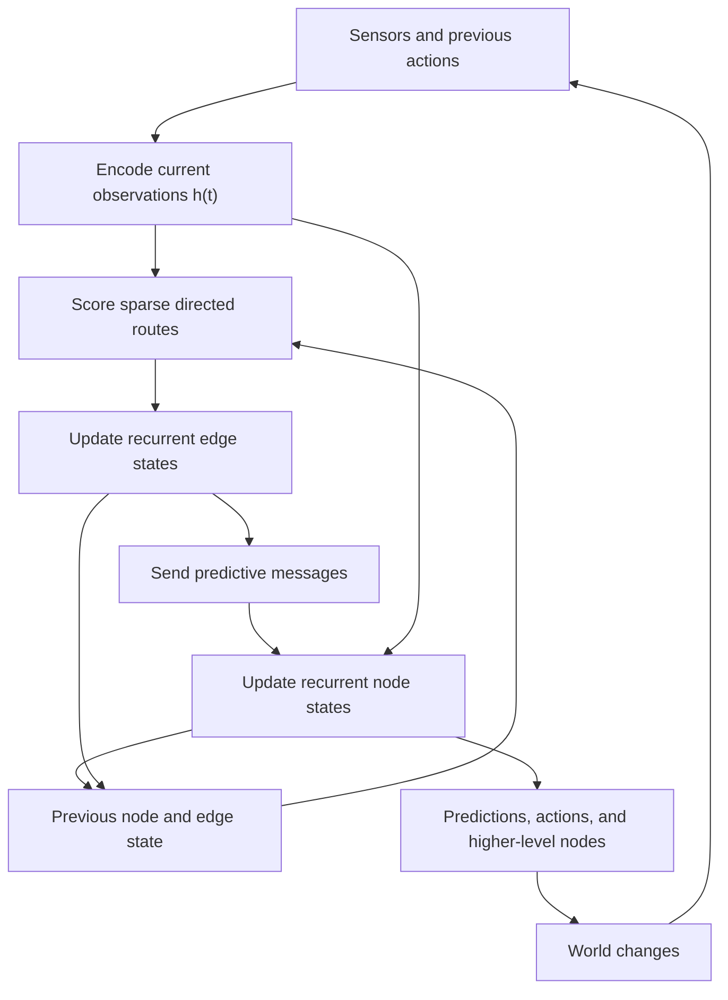
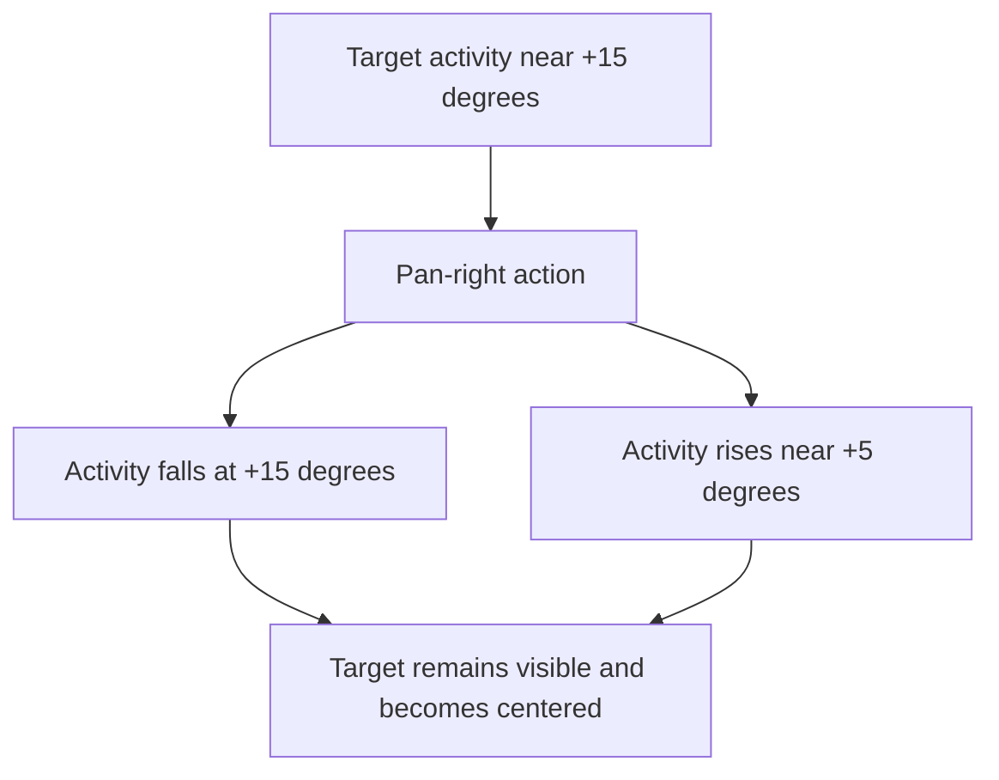
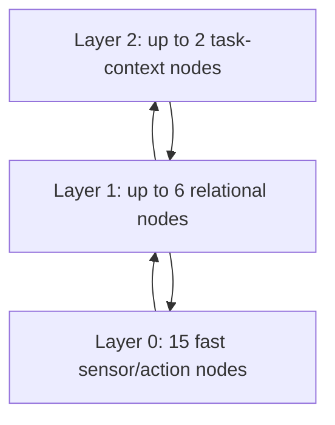



This is a working research proposal, not a finished architecture. The aim of this first version is to make the idea concrete enough to criticize, simulate, and eventually falsify.

## The problem: the world does not arrive as a sequence of independent frames

A robot does not see a fresh, unrelated world every 30 milliseconds.

It sees a room, turns its camera, watches an object slide across its image, moves an arm, feels contact, and then sees the consequences. Most of what matters is not contained in any single observation. It lives in the continuity between observations:

- which signals tend to change together;
- which signals predict other signals;
- how an action transforms what will be sensed next;
- which relationships remain stable while their low-level participants change;
- and which small part of a large sensor stream deserves more computation right now.

A conventional attention layer can compare everything with everything else, but it usually rebuilds those comparisons for each new input. A conventional recurrent network preserves history, but often compresses the whole stream into a relatively undifferentiated hidden state. Explicit tracking systems can carry identity from one location to another, but they introduce a separate correspondence mechanism that must decide that *this token now* is *that token from before*.

The question behind **Recurrent Predictive Routing (RPR)** is:

> Can a system preserve history inside a sparse graph of recurrent nodes and relationships, and route computation according to which relationships actually improve prediction?

The hope is that tracking, selective attention, and some forms of object persistence can then emerge from the same predictive machinery rather than being installed as separate subsystems.

## A layman's picture

Imagine following a red ball with a camera.

At first the ball activates a sensor region on the right side of the image. The camera turns right. Activity falls in that region and rises in a neighboring region nearer the center. The action, the falling activity, the rising activity, and the continued visibility of the ball form a repeatable pattern.

RPR does not begin by declaring that both regions contain “the same ball.” Instead, it remembers the relationships that made the transition predictable:

```text
ball-like activity on the right
    + turn-camera-right action
    + falling right-side activity
    + rising center activity
    = continued successful engagement
```

After enough experience, the system may learn that turning the camera right preserves a higher-level relationship even though the low-level sensor nodes involved in that relationship keep changing.

That is the central intuition: **persistence can live in a recurrent predictive pattern instead of an explicit token-to-token transport map.**

## Architecture at a glance

Before building the pieces one by one, here is the whole loop.



At each timestep, the block does six things:

1. Encode the current sensor values and previous action.
2. Score possible directed relationships between nodes.
3. Retain only a small number of routes.
4. Update the memory attached to those selected relationships.
5. Send predictive messages along them and update node memory.
6. Produce predictions, actions, and inputs to a slower or more abstract copy of the same block.

Two design choices are especially important.

First, a route should become valuable because it improves prediction relative to what the destination can already predict from its own history—not merely because two signals look similar.

Second, core RPR has **no separate temporal-transport head**. It does not explicitly learn a matrix saying that image token 7 at time \(t\) became image token 8 at time \(t+1\). The recurrence, action-conditioned transitions, and hierarchy are asked to carry that continuity implicitly.

We will now rebuild this diagram from the bottom up.

## A concrete toy world

To keep the symbols attached to something physical, consider a simulated pan-camera robot in a \(4\text{ m}\times3\text{ m}\) room.

The robot is at \((0.5,1.5)\text{ m}\). A target is fixed at \((2.8,2.1)\text{ m}\), and a distractor is fixed at \((3.2,0.8)\text{ m}\). The target begins \(14.62^\circ\) to the robot's right at a range of \(2.38\text{ m}\). The camera has a \(110^\circ\) field of view divided into twelve soft bearing bins centered at

$$
[-55,-45,-35,-25,-15,-5,5,15,25,35,45,55]^\circ.
$$

```text
bearing_bins_deg = range(-55, 56, step=10)  # 12 bins
room_m = [4.0, 3.0]
robot_xy_m = [0.5, 1.5]
target_xy_m = [2.8, 2.1]
```

Each visual-bin token receives four raw values:

```text
[target_activation, distractor_activation, normalized_range, activation_change]
```

The toy input contains fifteen tokens:

| Token group | Count | Raw values | Encoded width |
|---|---:|---|---:|
| Visual bearing bins | 12 | 4 per bin | 16 |
| Camera proprioception | 1 | \(\sin\phi,\cos\phi,\dot\phi\) | 16 |
| Pan action | 1 | commanded angular velocity | 16 |
| Engagement summary | 1 | visibility and centeredness | 16 |
| **Layer-0 total** | **15** | heterogeneous | **\(15\times16\)** |

This is deliberately tiny. It is large enough to exhibit action-conditioned sensor motion, but small enough that every recurrent state and edge can be inspected.

### Interactive world and sensor geometry

Move the time slider. The camera turns toward the target. In the right-hand plot, target activity migrates from the \(+15^\circ\) retinal bin toward the center while distractor activity moves farther left.

<div id="rpr-geometry-explorer" class="pcfh-plot pcfh-plot-wide" aria-label="Interactive RPR camera tracking geometry"></div>

Nothing in this visualization is a learned result. These are the exact physical and sensor values supplied to the proposed toy simulation. They give us a ground truth against which a learned RPR graph can be evaluated.

## 1. Nodes separate the current observation from remembered state

For token \(i\), the encoder converts the current raw input \(x_i[t]\) into a 16-dimensional observation vector:

$$
h_i[t]=E_i(x_i[t]), \qquad h_i[t]\in\mathbb{R}^{16}.
$$

```text
h[i] = encoder_for_token_type(x[i])  # shape: [16]
```

The persistent node memory is wider:

$$
n_i[t]\in\mathbb{R}^{32}.
$$

It is not supposed to be a duplicate of the current observation. It can carry recent trajectory, confidence, phase, prediction context, or whatever history proves useful to the objective.

For all fifteen tokens, the layer-0 node state is therefore

$$
N^{(0)}[t]\in\mathbb{R}^{15\times32}.
$$

```text
observation_embeddings.shape = [15, 16]
node_memory.shape           = [15, 32]
```

This distinction is the first source of continuity. A visual bin can become quiet without immediately erasing what its previous activity predicted.

## 2. Routing creates a sparse directed graph

For each possible source \(i\) and destination \(j\), a learned compatibility function produces a directional routing score:

$$
C_{i\rightarrow j}[t]
=f_C\!\left(n_i[t-1],n_j[t-1],h_i[t],h_j[t],a[t-1]\right).
$$

```text
score[i, j] = route_mlp(
    old_node[i], old_node[j], h[i], h[j], previous_action
)
```

Direction matters. Camera action may be useful for predicting camera angle, while camera angle and target-bin activity may be useful for predicting future centeredness. The reverse relationships need not have the same value.

The toy system has \(15\times14=210\) non-self candidate directions. It keeps at most four incoming routes per destination:

$$
\mathcal E_t
=\bigcup_j \operatorname{TopK}_{i\ne j}
\left(C_{i\rightarrow j}[t],K=4\right).
$$

```text
candidate_scores = 210 scalars
retained_edges   <= 15 destinations * 4 = 60
```

Top-\(K\) is only the simplest toy choice. A differentiable sparse gate, learned budget, locality-biased retrieval stage, or uncertainty-aware scheduler may work better. The architectural requirement is that expensive recurrent relationship updates operate on a bounded subset rather than every possible pair.

## 3. The relationships remember too

Each retained directed edge owns a 16-dimensional recurrent state:

$$
e_{i\rightarrow j}[t]\in\mathbb{R}^{16}.
$$

Its update can be implemented with shared GRU weights:

$$
e_{i\rightarrow j}[t]
=\operatorname{GRU}_e\!\left(
e_{i\rightarrow j}[t-1],
[n_i[t-1],n_j[t-1],h_i[t],h_j[t]]
\right).
$$

```text
edge[i, j] = edge_gru(
    old_edge[i, j],
    concat(old_node[i], old_node[j], h[i], h[j])
)  # shape: [16]
```

With no more than sixty live edges, layer 0 holds at most \(60\times16=960\) recurrent edge values.

Why put memory on an edge? Because a useful relationship is often temporal. One isolated coincidence between an action and a sensor change says little. A repeated sequence in which an action consistently precedes a particular rising/falling pattern is evidence of a reusable transformation.

An edge state could learn to encode:

- delay between source and destination;
- sign and scale of influence;
- phase or hysteresis;
- confidence and uncertainty;
- whether the relationship survives interventions;
- and whether it is currently dormant or active.

Those meanings are not manually assigned dimensions. They are possible roles that training may discover.

## 4. Predictive messages update the destination

The edge and its source node generate a 16-dimensional message:

$$
m_{i\rightarrow j}[t]
=G\!\left(e_{i\rightarrow j}[t],n_i[t-1],h_i[t]\right)
\in\mathbb{R}^{16}.
$$

Incoming messages are weighted and summed, then combined with the destination's present observation:

$$
\bar m_j[t]
=\sum_{i:(i,j)\in\mathcal E_t}\alpha_{ij}[t]m_{i\rightarrow j}[t],
$$

$$
n_j[t]
=\operatorname{GRU}_n\!\left(n_j[t-1],[h_j[t],\bar m_j[t]]\right).
$$

```text
for each retained edge i -> j:
    message[i, j] = message_mlp(edge[i, j], old_node[i], h[i])

incoming[j] = weighted_sum(messages_to_j)  # shape: [16]
node[j] = node_gru(old_node[j], concat(h[j], incoming[j]))
```

The destination therefore combines three sources of information:

1. what it is sensing now;
2. what it remembers about itself;
3. what selected relationships predict or imply about it.

This is the basic recurrent inference step.

## 5. A relationship must beat self-prediction

Similarity alone is a weak reason to preserve a route. Two sensor bins may correlate because they share illumination or because both respond to the same unseen cause. More importantly, a destination with strong temporal continuity may already be easy to predict from its own history.

RPR therefore compares two next-step predictions of destination \(j\):

$$
\hat h^{\mathrm{self}}_j[t+1]
=P_{\mathrm{self}}(n_j[t]),
$$

$$
\hat h^{i\rightarrow j}_j[t+1]
=P_{\mathrm{cross}}(n_j[t],n_i[t],e_{i\rightarrow j}[t]).
$$

The route's predictive gain is

$$
g_{i\rightarrow j}[t]
=\mathcal L\!\left(\hat h^{\mathrm{self}}_j[t+1],h_j[t+1]\right)
-\mathcal L\!\left(\hat h^{i\rightarrow j}_j[t+1],h_j[t+1]\right).
$$

```text
self_error  = loss(predict_from_j_history(), next_h[j])
cross_error = loss(predict_with_i_and_edge(), next_h[j])
route_gain  = self_error - cross_error
```

A positive value means that the source and relationship contain information that the destination's own memory did not already provide. This gain can supervise routing scores, edge survival, or both.

It does not by itself prove causality. Action interventions and counterfactual tests are still required if the system is expected to distinguish a useful predictor from a controllable influence.

## 6. Tracking without a temporal-transport head

The earlier version of this idea included a separate transport matrix of the form

$$
T_t:i_t\rightarrow j_{t+1}.
$$

Core RPR removes it.

In the toy sequence, the target's world bearing is \(14.62^\circ\). As the camera pans through

$$
\phi=[0,3,6,9,12,14]^\circ,
$$

the target's retinal bearing becomes

$$
\beta_{\mathrm{retinal}}
=14.62^\circ-\phi
=[14.62,11.62,8.62,5.62,2.62,0.62]^\circ.
$$

```text
retinal_bearing = world_bearing - camera_pan
```

The low-level activity therefore shifts from the \(+15^\circ\) visual token toward the \(+5^\circ\) token. RPR is not told that one token's content moved into the other. It can instead learn this action-conditioned transition:



The relevant persistence is distributed across node history, edge history, action, and the higher-level engagement state.

The trajectory below shows the same six exact states in a three-dimensional action-sensor coordinate system. It is not a claim that the network's learned latent axes will align with these physical units. It is the known geometry that the learned recurrent state must become able to predict.

<div id="rpr-state-trajectory" class="pcfh-plot" aria-label="RPR toy state action trajectory"></div>

This is why explicit transport may be unnecessary: active control produces structured transitions. If a camera action reliably causes one visual relationship to fade and another to rise while a slower target relationship remains stable, the transformation can be learned directly.

But this remains a hypothesis. Passive observation, occlusion, multiple identical objects, or motion unrelated to the robot may reveal that recurrence alone is insufficient. That is an experiment, not something the architecture should assume away.

## 7. Recursion turns local transitions into slower relationships

One RPR block only explains local recurrent routing. The larger proposal repeats the same typed operation at slower and more abstract levels.

For the toy implementation, choose fixed capacity limits:

| Layer | Role in the toy experiment | Node cap | Node width | Incoming \(K\) | Edge width | Edge cap |
|---|---|---:|---:|---:|---:|---:|
| 0 | Sensor, proprioception, action | 15 | 32 | 4 | 16 | 60 |
| 1 | Learned relational summaries | 6 | 32 | 3 | 16 | 18 |
| 2 | Task and control context | 2 | 32 | 1 | 16 | 2 |

Across all three layers, the persistent recurrent state contains at most 2,016 floating-point values, or 8,064 bytes in FP32, excluding shared weights and temporary activations.

```text
layer_0 = 15*32 node values + 60*16 edge values
layer_1 =  6*32 node values + 18*16 edge values
layer_2 =  2*32 node values +  2*16 edge values
total   = 2016 fp32 values = 8064 bytes
```

The six layer-1 slots are not pre-labelled “target,” “camera,” or “object.” They are a bounded workspace in which the model can attempt to retain useful relational summaries. The two layer-2 slots provide a still smaller workspace for slow task context.



Fast predictable transitions can remain local. Persistent uncertainty, conflict, or prediction failure can recruit higher-level capacity. Higher levels then return context that biases lower routing and predictions.

The difficult unresolved part is how lower node-and-edge state is compressed into a new higher-level node while preserving a useful predictive-control interface. PCFH provides one candidate vocabulary—retained predictive factors and recursive composition—but RPR should not silently assume that this interface is solved.

For now, the toy experiment should compare several explicit alternatives: learned pooling slots, factor-style grouping, simple fixed projections, and no hierarchy at all.

## 8. The complete toy forward pass

Putting the pieces together, one layer-0 timestep has these concrete shapes:

```text
raw heterogeneous tokens                       15 tokens
encoded observations h                         [15, 16]
previous node state                            [15, 32]
directional candidate scores, excluding self   [210]
selected edge indices                          [<= 60, 2]
previous / updated edge state                  [<= 60, 16]
edge messages                                  [<= 60, 16]
aggregated messages                            [15, 16]
updated node state                             [15, 32]
self predictions                               [15, 16]
cross predictions for selected routes          [<= 60, 16]
```

And the procedural view is:

```text
for timestep t:
    h = encode(current_sensors, previous_action)

    route_scores = score_directions(old_nodes, h, old_edges)
    selected_edges = top_k_per_destination(route_scores, k=4)

    for edge in selected_edges:
        edge.state = update_edge(edge.old_state, edge.source, edge.dest, h)
        edge.message = predict_message(edge.state, edge.source)

    for node in nodes:
        node.state = update_node(node.old_state, h[node], messages_to(node))

    predict_next_observations()
    compare_cross_prediction_against_self_prediction()
    choose_pan_action()
    update_or_escalate_relational_summaries()
```

The recurrent graph is both the model's working memory and its computation schedule. Which relationships are active determines what gets updated, what gets predicted, and what receives capacity.

## What RPR is—and is not

RPR is currently a proposal for **inference dynamics and compute routing**:

- persistent state on nodes and directed relationships;
- sparse routing that selects which relationships receive compute;
- predictive gain relative to a self-history baseline;
- action-conditioned recurrence;
- recursive application at multiple timescales;
- no mandatory explicit temporal-transport subsystem.

It is not yet a complete replacement for PCFH. PCFH asks what a stable learned factor should represent, how factors expose control interfaces, and how subgraphs compose into higher-level macro-tokens. RPR asks how predictive state and computation might flow through time once nodes and relationships exist.

The two ideas may eventually fit together cleanly. Keeping them conceptually separate for now makes it possible to test whether RPR contributes anything before adding it to the core PCFH architecture.

## What is incomplete

Several central mechanisms are still placeholders rather than solutions.

### Route learning and credit assignment

Hard Top-\(K\) routing is discontinuous. Soft routing is easier to train but can destroy the compute advantage and let every edge weakly participate. The system needs a stable way to credit a route for a future prediction improvement without retaining a dense graph during training.

### Edge lifecycle

If an edge is not selected for fifty steps, does its memory decay, remain frozen, or move into a compressed dormant store? A frozen stale edge may become misleading; aggressive decay may erase long-timescale relationships.

### Fair self-versus-cross comparison

The cross predictor has more inputs than the self predictor. Without capacity matching, regularization, and careful train/test separation, it may appear useful simply because it has more parameters. Predictive gain must measure genuinely new information.

### Higher-level node creation

The recurrence equations update an existing graph. They do not yet explain when a new relational node should be born, when two summaries should merge, or how a higher-level interface should preserve controllability while hiding detail.

### Control and causality

A predictive route is not necessarily a causal route. The system needs interventions, randomized exploration, or another causal signal before using a relationship as an inverse-control pathway.

### Tracking under occlusion and ambiguity

Action-conditioned recurrence may handle smooth active tracking. It may fail when an object disappears, when several identical objects cross, or when the world moves independently of the robot. An explicit correspondence mechanism may still prove necessary in those cases.

## Open questions

1. Does recurrent edge state outperform a node-only recurrent graph at matched parameter count and compute?
2. Does self-baseline predictive gain produce more stable and interpretable routes than similarity or raw attention score?
3. Can action-conditioned rising and falling activity support tracking without explicit temporal transport?
4. How long can a relationship remain dormant before its state becomes unusable?
5. Should routes represent predictors, causal influences, controllable transformations, or separate heads for each?
6. What signal should escalate a local pattern to a slower layer: surprise, uncertainty, disagreement, persistence, task value, or a learned mixture?
7. Can the hierarchy discover a camera-target relation that remains stable while participating visual bins change?
8. Does recursion produce a measurable abstraction benefit, or only more memory and latency?

## Principal risks

- **Graph churn:** small input changes could replace the selected edges every frame, preventing any relationship from accumulating useful memory.
- **Rich-get-richer routing:** early accidental edges may improve faster because they receive more updates, permanently starving better alternatives.
- **Prediction without understanding:** routes may exploit superficial temporal correlations that collapse under intervention or environmental change.
- **Memory contamination:** recurrent edges can carry obsolete context into a new scene.
- **Hierarchy collapse:** higher layers may copy lower state or remain unused instead of forming slower abstractions.
- **Transport returns through the back door:** the model may devote edge capacity to reconstructing an implicit correspondence table, gaining complexity without the clarity of an explicit tracker.
- **Quadratic proposal cost:** sparse retained edges do not solve the cost of scoring every candidate pair at large \(N\).
- **Control instability:** a learned predictive relationship can still produce unsafe or unstable actions when inverted.
- **Weak falsifiability:** attractive visualizations of routes can look meaningful even when matched baselines perform just as well.

## The first falsifiable experiment

The pan-camera simulation should compare at least:

1. a feed-forward MLP over the full observation;
2. a GRU over the flattened observation;
3. a recurrent graph with node state only;
4. RPR with node and edge state;
5. RPR without the self-prediction baseline;
6. RPR plus an explicit temporal-transport head.

All models should be matched as closely as practical for parameter count, training data, and inference compute.

Measure:

- one-step and multi-step sensor prediction error;
- target-centering error and action efficiency;
- recovery after distractor motion and temporary occlusion;
- route stability and graph churn;
- adaptation when camera gain, latency, or field of view changes;
- performance when the target moves independently;
- memory and wall-clock cost;
- and whether higher-level state improves transfer to a new room geometry.

The most important comparison is the transport ablation. If explicit correspondence consistently dominates recurrence on the cases that matter, removing transport was the wrong simplification. If RPR matches it while learning action-conditioned relational structure that transfers better, then the simpler core architecture has earned its place.

The hypothesis, stated compactly, is:

> A sparse recurrent graph whose routes survive by adding predictive value can learn to preserve task-relevant continuity through action and changing sensor participation, without requiring identity to be explicitly transported from token to token.

That is now concrete enough to test.
