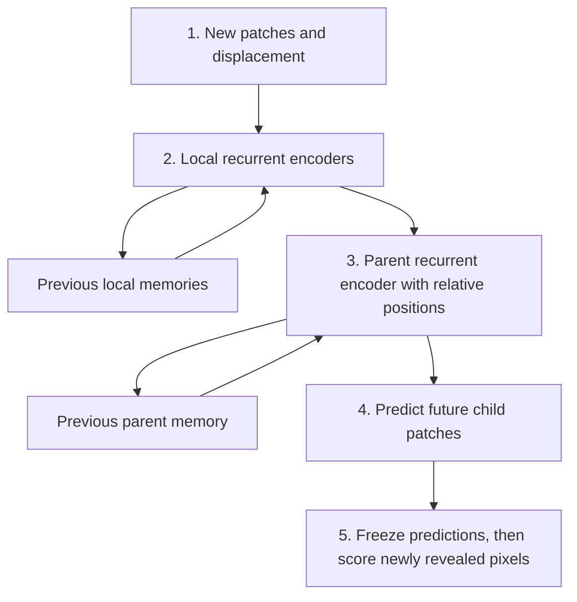



**Research update · completed experiment plus untested directions.** This follows [MORPH: Model of Object Representation and Predictive Homomorphisms](/blog/morph/). The measurements below come from the completed O1 campaign. The populations, moving sensors, and recurrent hierarchy discussed afterward have not been implemented or evaluated in that campaign.

MORPH started with an ambitious question: can an agent build persistent object models whose representations change predictably when it acts? The first experiments reduced that question to something much smaller: encode a simple image, rotate part of its embedding, and decode the expected rotated view.

The latest result is encouraging and incomplete. We now have a model that reconstructs geometric shapes and predicts their rotated views accurately on new instances of familiar shape families. But the encoder does not produce sufficiently consistent pose coordinates across those views. All five final seeds passed 18 of 19 registered checks. The same remaining check failed in every seed.

That is a negative result for the full experiment. It is also a useful separation of two things I had initially hoped would improve together: good image prediction and a dependable internal coordinate system.

## What O1 actually tested

O1 was a bounded architecture and optimization search, not the complete MORPH system. It used synthetic white geometric silhouettes on black backgrounds, rendered with antialiasing to 32 × 32 pixels. The familiar families included ellipses, polygons, concave shapes, holed shapes, and unions of primitives.

The learner received an initial image and known rotation increments in radians. It predicted future views without receiving the intervening target images as inputs. Training included reconstruction and prediction at horizons 1, 2, 4, and 8, plus feature-invariance and pose-equivariance losses. There was no object memory, ownership inference, recurrence, or learned motor calibration.

The encoder split its output into two parts:

- An **invariant feature code**, intended to retain information that survives rotation.
- An **equivariant pose code**, intended to change in a prescribed way under rotation.

Those names describe training objectives. They do not prove that one branch contains pure identity and the other contains pure pose.

The selected recipe used a fully connected encoder with separate feature and pose heads, followed by a convolutional decoder. Its latent contained 32 invariant values and 32 pose values. The pose values formed 16 disjoint coordinate pairs, with four pairs assigned to each harmonic from 1 through 4.

Each pair rotates by its harmonic times the supplied angle. These are rotations of activation coordinates in the embedding, not rotations of the network's learned weights. The group action is fixed; the encoder and decoder must learn to work with it.

The search evaluated 24 configurations across three encoder families: convolutional encoders with separate dense heads, convolutional encoders with a shared projection and output split, and fully connected encoders with separate heads. Two finalists were evaluated across five seeds, with one recipe selected using validation data before the final audit. This does not establish that dense encoders are generally better than convolutional encoders.

The complete campaign consumed 260,000 optimizer updates and 20.83 accounted hours, within its authorized 55-hour cap. Source, data, and checkpoint hashes were frozen, and 4,960 saved prediction tickets were checked for prediction-before-score chronology. That establishes an auditable run; it does not turn an unsuccessful criterion into a successful one.

## The measured result

The primary frozen test contained 512 new objects drawn from familiar shape families.

| Measurement | Final result |
|---|---:|
| Reconstruction foreground MSE, range across five seeds | 0.00463–0.00582 |
| Eight-step foreground MSE, mean across seeds | 0.00717 |
| Eight-step MSE, 95% bootstrap interval | 0.00657–0.00780 |
| Normalized pose-consistency ratio, range across seeds | 0.272–0.334 |
| Required pose-consistency ratio | ≤ 0.10 |
| Registered checks passed | 18 of 19 in every seed |

MSE is mean squared pixel error on intensities from zero to one. The foreground metric uses a renderer-defined support mask; prediction comparisons use the union of source and target foreground. These masks are evaluator information, not learner inputs. Scores are aggregated with family and action-schedule balancing. The confidence interval uses paired seed/family-object bootstrap resampling. An MSE of 0.11 is not an 11% classification error.

*Saved model outputs from the final report, not a scripted illustration. The panel shows seed 0 on the primary test: the first object from each family and the worst object by eight-step foreground error. Rows show inputs, reconstructions, eight-step targets, and predictions. The final column makes a failure visible: the model rounds away the shape's protrusions.*

The distinction between kinds of unseen data matters. New instances from familiar families performed well. Entirely withheld families performed substantially worse:

| Separate diagnostic distribution | Eight-step foreground MSE, range across seeds |
|---|---:|
| Withheld families: crescents and curved strips | 0.083–0.110 |
| Historical grayscale three-ellipse objects | 0.068–0.099 |
| Controlled symmetry set | 0.058–0.073 |

These diagnostic distributions were excluded from recipe selection and primary acceptance. Their errors limit the claim: O1 learned useful prediction within a distribution, not broad geometric generalization.

## How can the pixels be right while the coordinates are wrong?

Let E be the encoder, D the decoder, u the feature code, and p the pose code. Let R rotate the actual image by angle theta, and let rho apply the prescribed rotation to the pose code. The desired relationship is:

$$
p(R_\theta x) \approx \rho(\theta)p(x).
$$

In words: rotating the image and then encoding it should produce approximately the same pose code as encoding it first and rotating that code. The reported pose ratio normalizes the root-mean-square discrepancy by within-object pose-code variation across views, on objects whose rendered views change. It is not an angular error or a percentage of incorrect poses.

The decoded prediction instead tests:

$$
D\bigl(u(x),\rho(\theta)p(x)\bigr) \approx R_\theta x.
$$

These are different requirements. A decoder can map several different latent codes to similar images. Consequently, good reconstruction and good prediction do not guarantee that the two latent routes agree. Our aggregate image scores also do not prove that the routes decode identically on every example.

Two explanations remain open. The discrepancy might lie mostly in redundant directions that barely affect decoded pixels. Alternatively, the decoder might compensate for a meaningful mismatch between the encoder and the prescribed transformation. Both could occur together. We have not yet measured which dominates.

Replacing either the feature or pose branch damaged predictions, so both branches are being used. But replacement can create codes outside the training distribution. It is not proof of clean disentanglement.

There is another distinction here: our rotation matrices already satisfy the group composition law by construction. Applying two rotations composes correctly. What failed was the learned encoder's alignment with those rotations. A later memory or planning module consuming the latent directly may care about that discrepancy even if the image decoder can tolerate it.

## What the homomorphism autoencoder paper establishes

[Keurti et al.'s Homomorphism Autoencoder](https://proceedings.mlr.press/v202/keurti23a/keurti23a.pdf) learns action representations jointly with observation representations. Its toroidal translation experiment uses discrete cyclic x/y shifts, corresponding to a subgroup of SO(2) × SO(2). It reports separate rotation blocks for those axes, a further rotation factor in another setting, identity separation among three shapes, and 128-step prediction after training on two-step trajectories. It also studies SO(3) rotations of a 3D bunny.

Those are stronger demonstrations of learned transformation structure than O1 currently provides. But the paper does not report our normalized pose-consistency gate, and its BCE reconstruction measurements cannot be numerically ranked against our foreground MSE. A matched reproduction is needed to compare performance directly.

The torus also clarifies a possible next task. Horizontal and vertical wraparound movement are two independent circular coordinates. Our current harmonics all respond to one rotation angle; adding more harmonics does not create an independent movement axis.

## Could populations tolerate imperfect consistency?

One possibility is to represent several plausible poses instead of forcing one estimate. This becomes especially relevant for a tiny moving sensor: a patch showing a straight edge may correspond to several places on an object.

A population could retain candidate locations and weights. Movement transports those candidates; each predicts a future patch; new pixels change their weights. Agreement between sensors would mean that their hypotheses support compatible object states after accounting for relative sensor positions. Equal confidence scores alone would not mean agreement.

This is an untested hypothesis for MORPH. It might help if a single-state model fails because observations are genuinely ambiguous. It would not automatically remove redundant latent coordinates or repair a systematically wrong action model. We have not established ambiguity as the cause of O1's failed gate.

A single Gaussian describes uncertainty around one region. Multiple distinct explanations may require multiple peaks or an explicit weighted population, especially when pose wraps around. The useful outcome would be accurate predictions and appropriate uncertainty reduction as new evidence arrives. A distribution that simply widens enough to accommodate everything would not be a success.

O1's failed gate should remain failed. A population experiment would need its own registered question and criteria, including whether the correct alternative survives an ambiguous sequence and gains support when a distinguishing landmark appears.

## From moving patches to a shared recurrent model

Another direction is to move a small sensor over a hidden image and accumulate its glimpses. Imagine seeing a duck through a pinhole. A recurrent encoder could retain observations and displacement information, while a decoder reconstructs the larger region.

Two capabilities must be measured separately. Remembering and placing pixels already observed is spatial memory; a canvas that pastes patches at known coordinates is an essential baseline. Predicting the unseen body from a glimpse of the beak is learned completion and should remain uncertain. A plausible invented duck is not the same as recovering the hidden image.

Multiple local recurrent encoders could then feed a parent recurrent autoencoder. The parent would receive child embeddings and their relative positions, compress them into a larger-scale state, and reconstruct or predict the child observations. Joint training would let parent prediction errors encourage child representations that are easier to combine, while local reconstruction would protect detail.

The following is a proposed computation, not an implemented model:

Reconstructing embeddings that the parent just received tests compression. Predicting withheld or future patches tests whether it learned useful relationships. Pixel-level checks remain necessary: an embedding-only objective could improve because the children discard information.

Shared weights alone do not establish a shared object model or coordinate frame. Two paths ending at the same location should support compatible predictions, but their memories can legitimately differ if one path gathered more evidence. The parent's identity hypothesis can help interpret local patches; its persistence is not independent confirmation that the identity is correct.

Likewise, a parent prediction sent back to a child is context, not a new observation. Recurrent feedback must not count the same evidence repeatedly. That discipline from the original MORPH proposal becomes more important as the hierarchy grows.

## What should earn the next layer?

Stacking this pattern across spatial and temporal scales is an appealing direction. Each level could retain features, track transformations, accumulate uncertain evidence, and predict the level below. But longer timescales need explicit objectives, and actions involving contact, deformation, or irreversible change will need dynamics beyond group rotations.

The immediate research choices are smaller. A frozen-model diagnostic can determine whether O1's actual latent discrepancies affect decoded geometry. A moving-patch experiment can test whether recurrence retains observed detail and improves future prediction. A population comparison can isolate the value of preserving ambiguity. A two-level comparison can test whether parent feedback helps beyond a flat recurrent model with comparable information and capacity.

These should be separate, registered tests rather than one large system whose failures are impossible to attribute. None has started as part of this update.

The useful advance is concrete: structured prediction now works reasonably well for familiar geometric families. The unresolved issue is equally concrete: accurate output has not yet given us the common internal coordinates MORPH would like to use. The next mechanisms need to earn their place by explaining or overcoming that limitation, with new observations providing the evidence.
