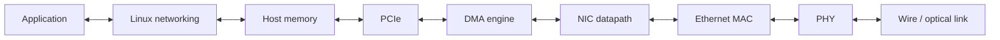
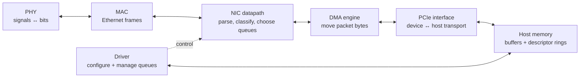
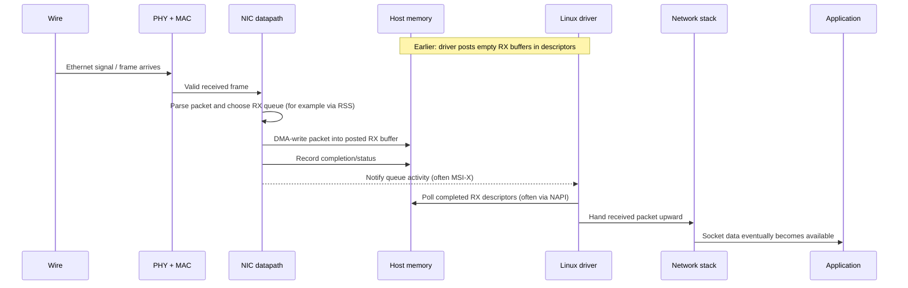
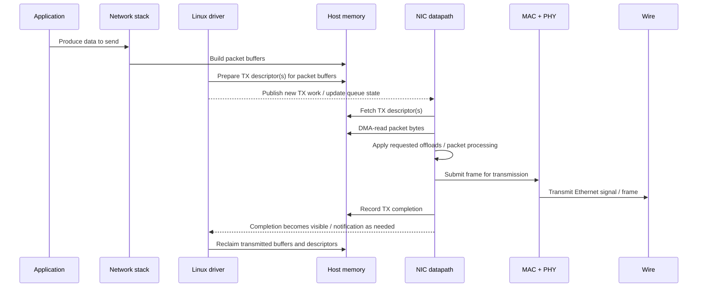
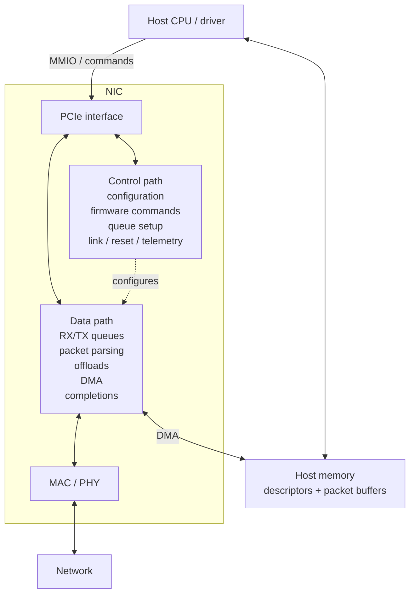
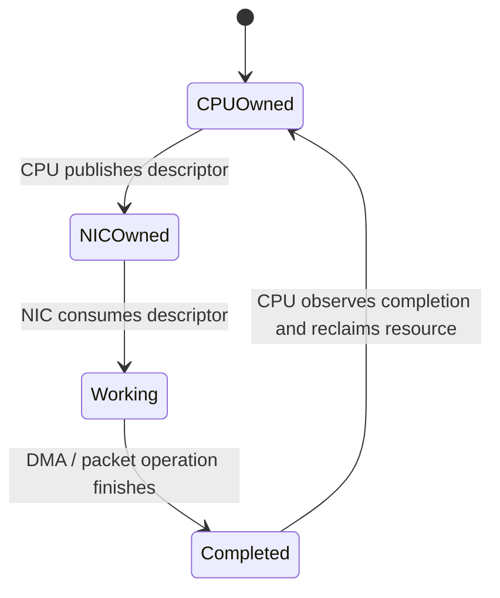

# 01 — The NIC as a System

Before studying individual mechanisms, build one complete mental model of the machine.

A network interface card is not merely an Ethernet port. It is a bridge between two very different worlds:

- a serialized network link carrying frames,
- and a host computer where CPUs operate on memory through caches and virtual-memory abstractions.

The NIC sits between them and continuously translates between **packets on a wire** and **data structures in host memory**.

## Why this matters

Most advanced NIC topics make much more sense once every component has a place in an end-to-end packet path.

DMA, descriptor rings, MSI-X, RSS, NAPI, PCIe ordering, cache locality, and RDMA are not separate tricks. They are mechanisms required to solve specific problems in moving packets through this path efficiently and correctly.

## Why would a data center need custom NIC firmware?

At data-center scale, a NIC is part of the infrastructure rather than just a peripheral. A server fleet may contain thousands or millions of ports, and small differences in packet-processing cost, failure recovery, telemetry, or queue behavior can become operationally significant when multiplied across the fleet.

Custom or tightly controlled NIC firmware can help a data-center operator adapt the device to its own environment. Depending on the NIC architecture, firmware may participate in device initialization, queue management, link behavior, telemetry, offload control, security policy, error recovery, and communication with embedded processors or programmable datapaths.

Typical challenges include:

- **Scale:** a rare firmware bug can become a fleet-wide incident when deployed broadly.
- **Performance:** queue scheduling, offloads, batching, interrupt behavior, and memory traffic can affect latency and throughput.
- **Parallelism:** modern servers have many CPU cores, so traffic must be distributed without creating contention or poor cache locality.
- **Observability:** operators need counters, traces, health information, and failure context when a NIC misbehaves in production.
- **Reliability:** firmware must recover from malformed traffic, link faults, PCIe errors, queue stalls, resets, and partial failures without destabilizing the host.
- **Security and isolation:** firmware may sit on a privileged path between the network and host memory, so validation, update security, access control, and tenant isolation matter.
- **Fleet updates:** firmware needs safe rollout, compatibility checks, rollback strategies, and version management across heterogeneous hardware.
- **Hardware/software coordination:** a firmware change may interact with drivers, operating-system networking, PCIe topology, switch configuration, and application traffic patterns.

This is why NIC firmware engineering is often a whole-system debugging discipline: the visible symptom may be a dropped packet, but the root cause can live in firmware, hardware queues, DMA, PCIe, host memory, the driver, or the network itself.

## The simplest useful mental model

The first picture to keep in mind is the complete path between an application and the wire:

For receive, traffic moves from right to left. For transmit, it moves from left to right.

This picture is deliberately incomplete. The rest of the course will repeatedly open these blocks and explain what is happening inside them.

## Component responsibilities

For now, the blocks only need a brief identity. Later chapters will expand them in detail.

### PHY

Converts electrical or optical signaling into a digital representation of the link, and vice versa.

### MAC

Operates on Ethernet frames: framing, MAC-layer addressing, frame-check handling, and transmission/reception at the Ethernet link layer.

### NIC datapath logic

Processes packets after they reach the NIC. It may parse headers, classify traffic, verify checksums, apply offloads, timestamp packets, collect statistics, and choose queues.

**RSS means Receive Side Scaling.** A multiqueue NIC can hash fields from an incoming flow—commonly addresses, ports, and protocol—and use that hash to steer packets from the same flow toward a selected receive queue. That lets several CPU cores process network traffic in parallel without every packet funneling through one queue.

### Descriptor rings

Shared work queues between the driver and NIC. Descriptors describe host buffers and operations such as "receive into this buffer" or "transmit these bytes."

### DMA engine

Moves packet data between the NIC and host memory without requiring the CPU to copy every byte itself.

### PCIe interface

Carries traffic between NIC and host, including DMA reads/writes, CPU MMIO accesses, and interrupt-related transactions.

### Driver

Configures the device and manages the software side of its queues: allocating buffers, posting descriptors, handling notification/polling, reclaiming completions, and controlling device state.

## Walk through one received packet

The receive path is easiest to understand as an interaction between the network, NIC, memory, driver, and application.

The important idea at this stage is that **the driver posted buffers before the packet arrived**. The NIC does not ask the CPU to copy an arriving packet byte-by-byte; it DMA-writes into a host buffer the driver has already made available.

## Walk through one transmitted packet

Transmit is the complementary interaction, with the same actors in the opposite direction.

The symmetry is useful:

- **RX:** driver provides empty buffers; NIC fills them.
- **TX:** driver provides filled buffers; NIC reads them.

In both directions, descriptors tell the NIC where the host memory lives and ownership moves between software and hardware.

## The first important distinction: control path vs data path

A NIC contains both relatively infrequent **control-path** activity and extremely frequent **data-path** activity.

### Control path

Relatively infrequent operations such as configuring queues, changing MTU or MAC settings, programming RSS configuration, reading health information, loading firmware, or resetting the device.

These often involve MMIO, firmware commands, or management interfaces.

### Data path

The repeated work performed for packets: consume descriptors, parse/classify traffic, perform DMA, generate completions, notify or interact with polling, and recycle buffers.

A major theme of high-performance networking is to make this path cheap, parallel, predictable, and observable.

## A second important distinction: ownership

For every shared queue element or packet buffer, someone must know whether the CPU or NIC is currently allowed to use it.

This sounds simple, but it is one of the foundations of driver correctness.

Later lessons will show why memory-ordering barriers may be required around these ownership transitions.

## Questions this course will answer

At this point several details should remain unresolved. They are intentional.

For example:

- How can a device address host RAM if applications use virtual addresses?
- How does the NIC know when software has added a descriptor?
- How does software know when hardware has finished with it?
- Why do drivers use rings instead of ordinary linked lists?
- When does the CPU see DMA writes in its caches?
- Why are MSI-X interrupts well suited to multiqueue NICs?
- Why doesn't a high-speed NIC interrupt once per packet?
- How can many CPU cores process traffic without fighting over the same cache lines?
- Which behaviors belong in fixed-function hardware, firmware, the driver, or programmable datapath logic?
- How do you debug a queue that stalls only under production load?

Those questions become the spine of the rest of the curriculum.

## Knowledge check

You should be able to answer these without memorizing implementation-specific details:

1. What two worlds does a NIC bridge?
2. Why does a NIC need DMA?
3. What role does PCIe play in packet movement?
4. What is the purpose of an RX descriptor?
5. Who normally allocates host-side receive buffers: the NIC or the driver?
6. Does the CPU copy every arriving packet from the NIC into RAM?
7. What is the broad difference between MAC and PHY?
8. What does RSS try to accomplish?
9. What is the difference between the NIC control path and data path?
10. Sketch the RX and TX packet paths at block-diagram level.

## Durable ideas

This first lesson is only an orientation map. Do not try to memorize a final set of rules yet.

For now, be able to redraw the high-level packet path and identify the major blocks. The more durable performance and correctness principles—descriptor ownership, memory ordering, queue scaling, cache locality, interrupt behavior, and firmware/driver boundaries—will be introduced when the course reaches the mechanisms that make them concrete.

## Next lesson

Next: **Ethernet from Wire to MAC** — build the physical and link-layer portion of the packet path before moving inward toward PCIe and DMA.

[← Back to NIC Firmware Engineering](/courses/nic-firmware/)
