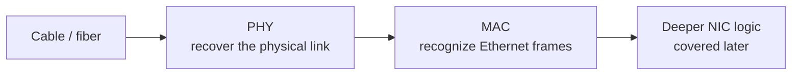
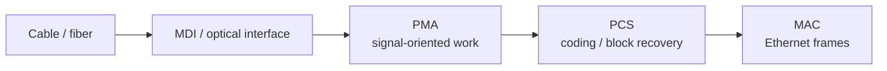
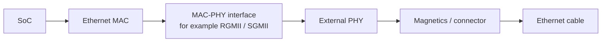
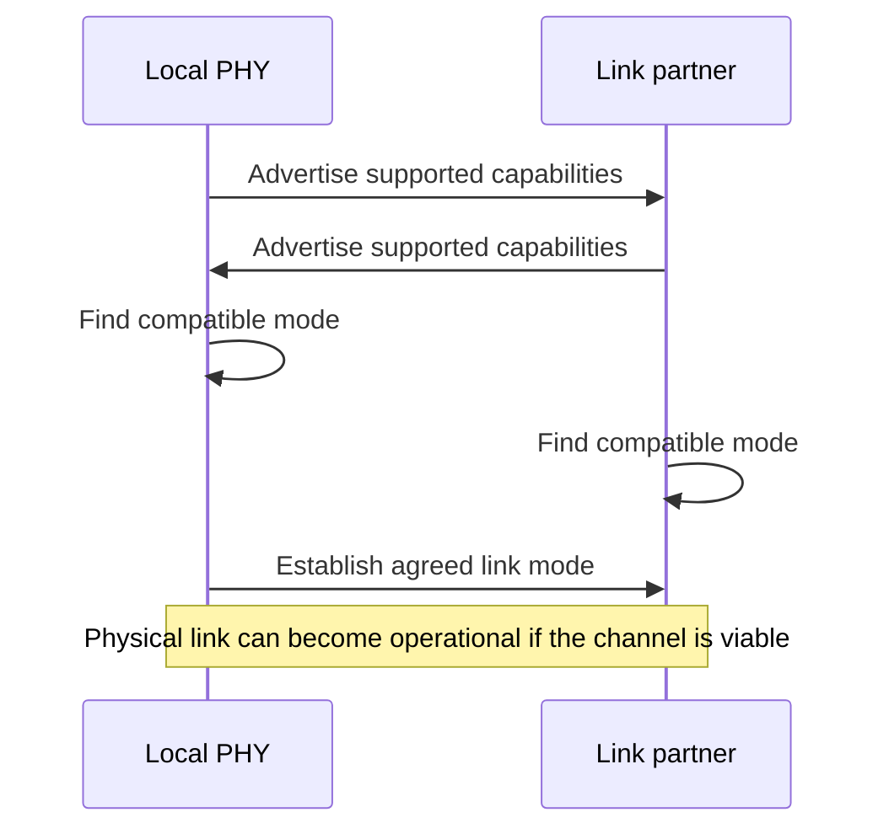
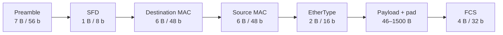
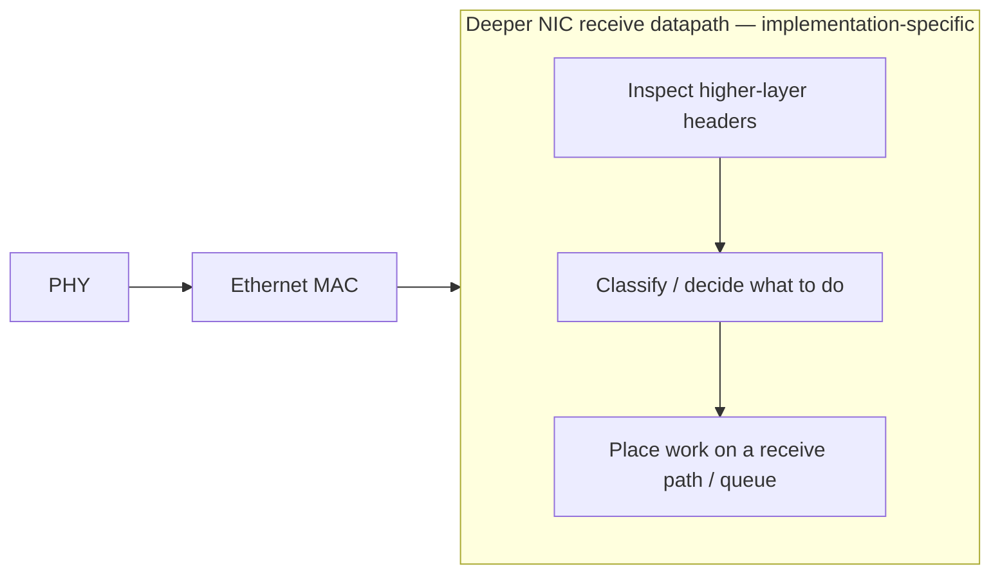
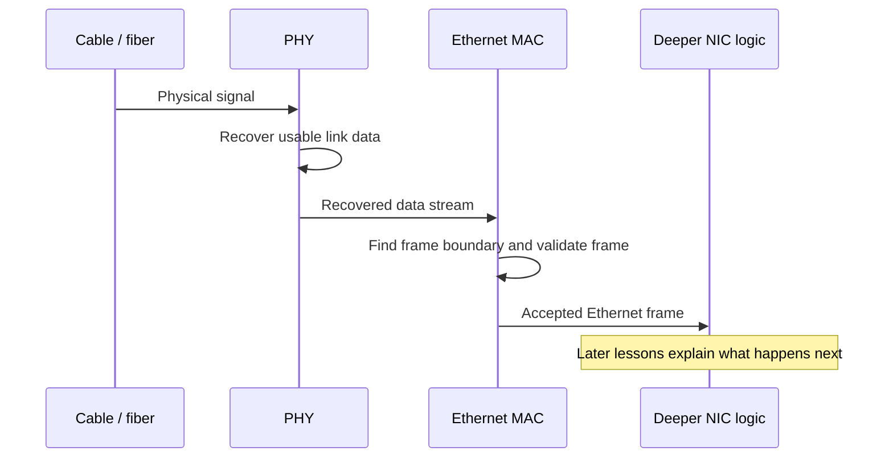
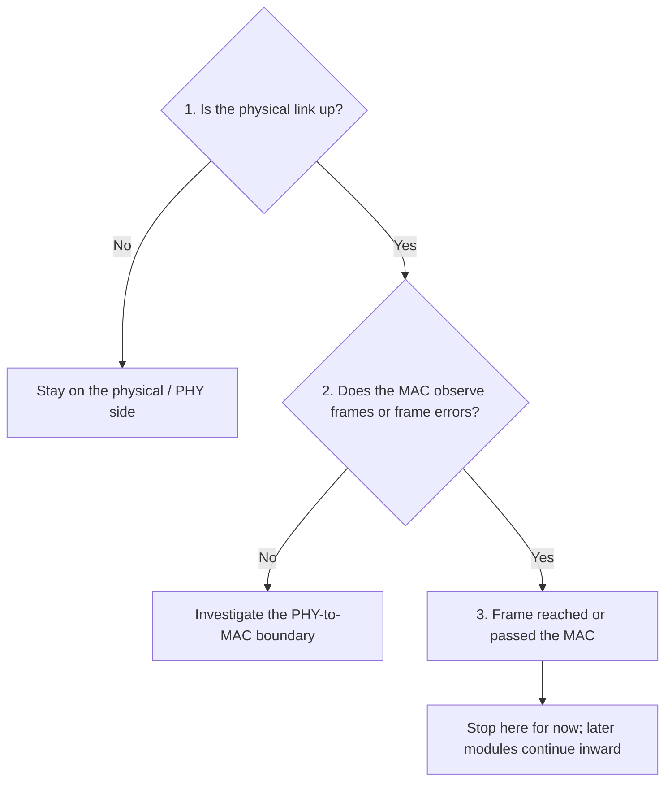

# 02 — Ethernet from Wire to MAC

The first lesson treated the NIC as one connected system. Now zoom in on the network-facing edge of that system.

When we say a packet "arrives at the NIC," several layers of hardware have already done substantial work before software or the deeper NIC datapath can do anything with it.

This lesson builds the path from the physical medium to a concrete Ethernet frame. It intentionally stops before PCIe, DMA, multiqueue steering, and other mechanisms that have not been taught yet.

## What you should already know

This lesson assumes only the mental model from Module 1:

- a NIC bridges the packet-oriented network and the memory-oriented host;
- the **PHY** handles the physical representation of the link;
- the **MAC** handles Ethernet frames;
- deeper NIC logic exists beyond the MAC, but we have not studied its internal organization yet.

If a term belongs to a later module, this lesson will label it as a preview rather than relying on it as assumed knowledge.

## Why this matters

A firmware or driver engineer debugging a dead or unstable network interface needs to know **where the failure could physically be**.

"The Ethernet link is broken" might mean:

- no usable signal is reaching the receiver,
- the PHY cannot establish or maintain the link,
- the PHY-to-MAC connection is misconfigured,
- frames reach the MAC but fail validation,
- or valid frames leave the MAC and the problem is farther inside the NIC.

The goal is to stop thinking of the Ethernet connector as if it feeds packet bytes directly into software.

## The physical-to-frame pipeline



That is the main model for this lesson.

Inside the PHY there are additional sublayers and implementation blocks that are useful to recognize in documentation:



The exact partitioning depends on Ethernet generation and hardware implementation. Do not memorize these as a universal chip block diagram. For now, the important transition is:

> **physical signal → recovered digital link data → Ethernet frame**

## PHY, PCS, PMA, SerDes, and MDI

These terms appear constantly in NIC documentation, schematics, driver code, and datasheets.

### MDI

**MDI — Medium Dependent Interface** — is the physical connection toward the network medium.

For copper Ethernet, think of the electrical interface toward the magnetics and cable. For optical systems, the physical implementation differs, but the same conceptual boundary exists: this is where the device meets the medium.

### PMA

**PMA — Physical Medium Attachment** — handles signal-oriented work close to the medium.

Depending on the Ethernet technology, this can include functions such as serialization/deserialization, clock recovery, signal conditioning, and alignment.

### PCS

**PCS — Physical Coding Sublayer** — sits above the PMA and deals with the coding used to represent data on the link.

Its exact work depends strongly on Ethernet generation. The important idea is that the wire does not simply carry the Ethernet frame byte-for-byte in the same representation the MAC sees. Physical-layer encoding must first be decoded into a usable digital stream.

### SerDes

A **serializer/deserializer (SerDes)** converts between parallel internal data and high-speed serial signaling.

At high link rates, SerDes behavior becomes a major part of signal-integrity and link-debugging work. Equalization, lane alignment, and training can matter before the MAC ever sees a frame.

### PHY

"PHY" is often used for the physical-layer device or block containing much of this machinery.

A useful simplification is:

> **PHY: make a reliable digital link out of the physical medium.**

Later lessons can examine PHY management and MDIO in detail. For now, the important boundary is that a working PHY presents recovered link data toward the MAC.

## The PHY and MAC may be separate chips

On an embedded board, the MAC may live inside an SoC while the Ethernet PHY is a separate IC.



That creates another boundary that can fail independently.

For example, a board can report that the PHY has established link with its link partner while still failing to pass frames because the MAC-to-PHY interface has incorrect timing, clocking, mode configuration, or pin setup.

This distinction is particularly important in embedded Linux systems where device-tree configuration, pinmux, clocks, PHY mode, and driver setup all meet at this boundary.

## What does link up actually mean?

A lit link LED does **not** mean that Linux networking is working end-to-end.

At a high level, link-up means the two ends have established enough agreement for the physical connection to operate.

Depending on the Ethernet technology, the peers may establish parameters such as supported link speed and other link capabilities.

The important debugging lesson is:

> **Link up proves something about the physical connection. It does not prove that valid frames are reaching the MAC or that anything farther inside the NIC or host works.**

## Autonegotiation

Ethernet peers often need to determine which mutually supported operating mode to use.

Conceptually:



Real autonegotiation is technology-specific and more complicated than this diagram. For this lesson, retain only the idea that both ends establish compatible link parameters rather than software blindly assuming a speed.

## From recovered data to an Ethernet frame

Once the physical layers have recovered usable data, the MAC operates on Ethernet frames.

For an ordinary **untagged Ethernet II** frame, the on-wire layout is:

| Field | Length | Bit length | Example / meaning |
|---|---:|---:|---|
| Preamble | 7 bytes | 56 bits | normally `55 55 55 55 55 55 55` |
| SFD | 1 byte | 8 bits | normally `D5` |
| Destination MAC | 6 bytes | 48 bits | receiver address |
| Source MAC | 6 bytes | 48 bits | sender address |
| EtherType | 2 bytes | 16 bits | identifies payload protocol |
| Payload + optional pad | 46–1500 bytes | 368–12000 bits | higher-layer data; short payloads are padded |
| FCS | 4 bytes | 32 bits | CRC over the Ethernet frame fields from destination through payload/pad |

Ignoring VLAN tags for now, the Ethernet frame from **Destination MAC through FCS** is therefore normally **64–1518 bytes**. The 7-byte preamble and 1-byte SFD are transmitted on the link but are usually discussed separately from the frame-length calculation.

There is also an **inter-packet gap** between transmitted frames. It is not another frame field, so we will leave it out of the byte breakdown for now.



### Example 1: a minimum-size ARP request

Consider a host at MAC `02:00:00:00:00:01`, IP `192.168.1.10`, asking:

> Who has `192.168.1.1`?

A representative Ethernet II frame can look like this before the FCS is appended:

```text
Preamble:        55 55 55 55 55 55 55                 7 bytes
SFD:             d5                                      1 byte

Destination MAC: ff ff ff ff ff ff                       6 bytes
Source MAC:      02 00 00 00 00 01                       6 bytes
EtherType:       08 06                                    2 bytes  (ARP)

ARP payload:
  Hardware type: 00 01                                    2 bytes  (Ethernet)
  Protocol type: 08 00                                    2 bytes  (IPv4)
  HW addr len:   06                                       1 byte
  Proto addr len:04                                       1 byte
  Opcode:        00 01                                    2 bytes  (request)
  Sender MAC:    02 00 00 00 00 01                       6 bytes
  Sender IP:     c0 a8 01 0a                              4 bytes  (192.168.1.10)
  Target MAC:    00 00 00 00 00 00                       6 bytes  (unknown)
  Target IP:     c0 a8 01 01                              4 bytes  (192.168.1.1)
                                                        --------
  ARP payload:                                             28 bytes

Padding:         00 ... 00                                18 bytes
FCS:             <CRC-32 calculated by transmitter>        4 bytes
```

Why 18 bytes of padding?

The ARP message itself is only 28 bytes. Ethernet requires at least 46 bytes in the payload/pad region for this ordinary untagged frame:

\[
46 - 28 = 18\text{ bytes of padding}
\]

Now add the fields counted in the standard 64-byte minimum frame size:

\[
6 + 6 + 2 + 46 + 4 = 64\text{ bytes}
\]

That 64-byte count starts at the destination MAC and includes the FCS. Preamble and SFD are additional on-wire bytes.

This is a useful first real frame because every byte has a reason to exist.

### Example 2: an IPv4 packet carried by Ethernet

If the EtherType bytes are:

```text
08 00
```

the MAC does not interpret the whole IPv4 packet. At the Ethernet layer, it only needs to know that the bytes after the EtherType belong to an IPv4 payload.

A simplified beginning might be:

```text
Destination MAC  00 11 22 33 44 55
Source MAC       66 77 88 99 aa bb
EtherType        08 00                <-- IPv4
Payload          45 00 ...            <-- IPv4 header begins here
FCS              <4-byte CRC>
```

The first payload byte `45` belongs to IPv4, not Ethernet. We will later learn how deeper NIC logic may inspect those higher-layer bytes, but the MAC-level frame boundary is already complete.

### Preamble and SFD

The **preamble is 7 bytes (56 bits)** and is normally the repeating pattern:

```text
55 55 55 55 55 55 55
```

The **Start Frame Delimiter (SFD) is 1 byte (8 bits)**:

```text
d5
```

Together they give the receiver a recognizable lead-in and mark the transition to the destination address that begins the MAC frame contents.

### Destination and source addresses

Each Ethernet MAC address is **6 bytes = 48 bits**.

The destination address comes first, followed by the source address:

```text
Destination: 6 bytes
Source:      6 bytes
```

They are link-layer addresses, not IP addresses.

### EtherType

For Ethernet II, the EtherType field is **2 bytes = 16 bits**.

Common examples include:

```text
08 00  IPv4
08 06  ARP
86 dd  IPv6
```

For now, treat EtherType as the label that tells the next layer what kind of payload follows.

### Payload and padding

For the ordinary untagged frame model used here, the payload plus any required padding is **46–1500 bytes**.

A short higher-layer message such as ARP therefore needs padding. A larger IP packet may already be long enough that no pad is needed.

### FCS

The **Frame Check Sequence is 4 bytes = 32 bits**.

It contains a CRC used to detect corruption in the frame. The receiver recomputes/checks that value and normally rejects a frame whose FCS does not match.

Many NICs remove the FCS before delivering packet data to host software, so a normal packet capture may not show those four bytes even though they existed on the wire.

## What the MAC is responsible for

For this course, use this mental model:

> **The PHY gives the MAC a usable link-level data stream; the MAC recognizes valid Ethernet frames and produces the corresponding frame stream for transmit.**

Receive-side MAC work can include:

- recognizing frame boundaries,
- handling MAC addressing/filtering behavior,
- checking frame length and format,
- checking the FCS,
- collecting MAC-level error statistics,
- and delivering accepted frames toward deeper NIC logic.

Transmit-side work includes constructing the required Ethernet framing behavior and sending it toward the physical layer.

The precise division of responsibilities varies by implementation, so avoid assuming every feature associated with Ethernet literally executes inside one block named `MAC`.

## Where does packet parsing begin?

The phrase **packet parser** is a functional description, not a standardized hardware module in the same sense that "Ethernet MAC" names a well-defined protocol function.

A particular NIC might implement header inspection using hardwired logic, a programmable pipeline, microcode, several classifier blocks, or some combination of these. Datasheets may use different names.

So a less misleading block diagram is:



The important architectural boundary is not "MAC chip → parser chip." It is:

> **The MAC finishes Ethernet framing; deeper NIC logic may then inspect the contents of the valid frame.**

Later modules will give names and mechanisms to that deeper logic. For example, RSS is one possible queue-selection mechanism, but you do not need RSS to understand this lesson.

## A receive walk from cable to NIC datapath



Notice where this lesson stops: **at an accepted Ethernet frame**.

We are deliberately not yet tracing queue steering, descriptor ownership, DMA, interrupts, or CPU processing. Those mechanisms make more sense once their prerequisites have been taught.

## A practical debugging ladder

This is useful, but the full NIC debugging ladder belongs later in the course. At this point you only know enough to use three checkpoints confidently:



For this lesson, that is enough:

1. **PHY/link evidence** tells you whether the physical connection is operating.
2. **MAC counters or frame errors** tell you whether usable frames are reaching the frame layer.
3. If frames are valid at the MAC, the failure may be deeper inside the NIC or host—but we have not learned those layers yet.

Later lessons will extend this ladder one boundary at a time as PCIe, DMA, descriptors, interrupts, queues, and the driver become familiar concepts.

## Common misconceptions

### "The PHY receives Ethernet packets"

At a high level people often say this, but it hides an important boundary. The PHY primarily deals with the physical representation of the link; the MAC is where Ethernet frames become the useful abstraction.

### "Link up means the network stack should work"

No. It only establishes that a much lower portion of the path is operational.

### "The MAC and PHY are always inside the same NIC chip"

No. They may be integrated, or the MAC may connect to an external PHY through an interface such as RGMII or SGMII.

### "FCS is the same as a TCP checksum"

No. Ethernet FCS protects the frame at the link layer. TCP/UDP/IP checksums operate at different protocol layers and have different coverage and purposes.

## Knowledge check

These questions intentionally use only concepts introduced in Modules 1 and 2.

1. What conceptual boundary separates the PHY from the MAC?
2. What are PCS and PMA doing that the MAC should not need to care about?
3. Why can a system have link-up but still pass no valid Ethernet frames?
4. What is the purpose of autonegotiation at the level described in this lesson?
5. How many bytes are the preamble and SFD?
6. How many bytes are each source and destination MAC address?
7. What does the EtherType field tell you?
8. What is the purpose and size of the FCS?
9. Why did the example ARP request need 18 bytes of padding?
10. Is a "packet parser" necessarily one standardized hardware block? Explain.
11. If the PHY reports link but the MAC sees no frames, which boundary would you investigate next?
12. Sketch an untagged Ethernet II frame and label each field with its byte length.

## Mini experiment: inspect a real Ethernet frame

Capture one packet on a Linux system using a tool such as Wireshark or `tcpdump`, then identify:

- destination MAC;
- source MAC;
- EtherType;
- where the next protocol begins.

If the capture does not contain preamble, SFD, or FCS, do not assume they were absent from the wire. Ask instead **where the capture was taken in the receive path and which link-layer fields the NIC or capture interface preserved**.

The goal is not yet to decode every protocol. It is to make the Ethernet frame boundary concrete.

## What to carry into the next lesson

Keep this sequence clear:

```text
physical medium
    ↓
PHY: recover and maintain the physical link
    ↓
MAC: recognize and produce Ethernet frames
    ↓
deeper NIC logic: implementation-specific work on accepted frames
```

And keep the basic untagged Ethernet II frame in your head:

```text
7 B       1 B     6 B       6 B       2 B       46–1500 B      4 B
Preamble | SFD | Dest MAC | Src MAC | EtherType | Payload/Pad | FCS
```

Once a valid frame reaches deeper NIC logic, a new question becomes central:

> **How does this PCIe device communicate with the host before it can move packet data into system memory?**

That is the next layer inward.

## Next lesson

Next: **PCIe for NIC Engineers** — enumeration, BARs, MMIO, bus mastering, PCIe transactions, and how the host and NIC communicate before DMA can make sense.

[← Previous: The NIC as a System](/courses/nic-firmware/01-nic-as-a-system/) · [Back to NIC Firmware Engineering](/courses/nic-firmware/)
