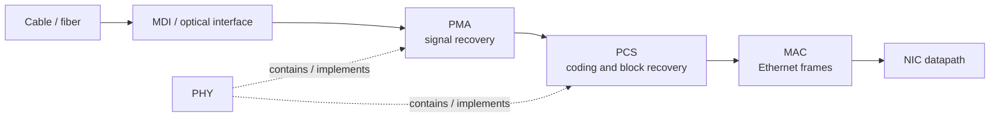
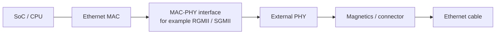
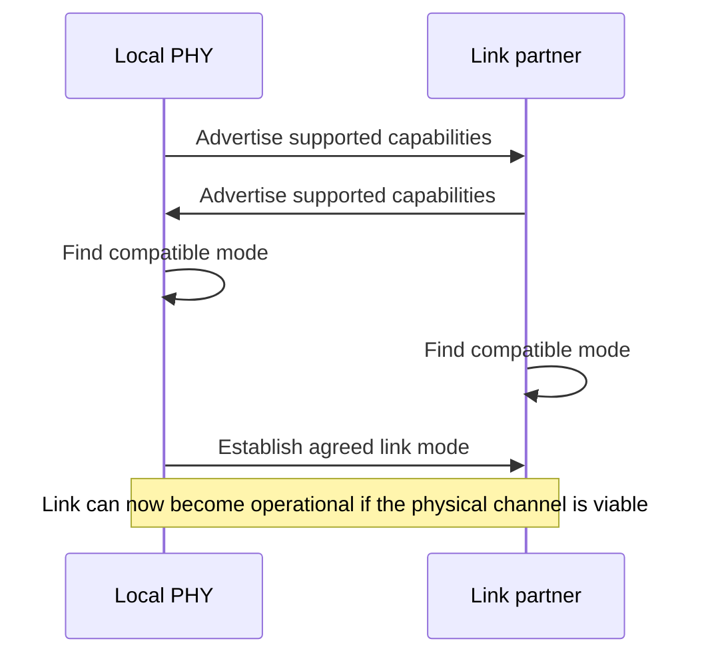
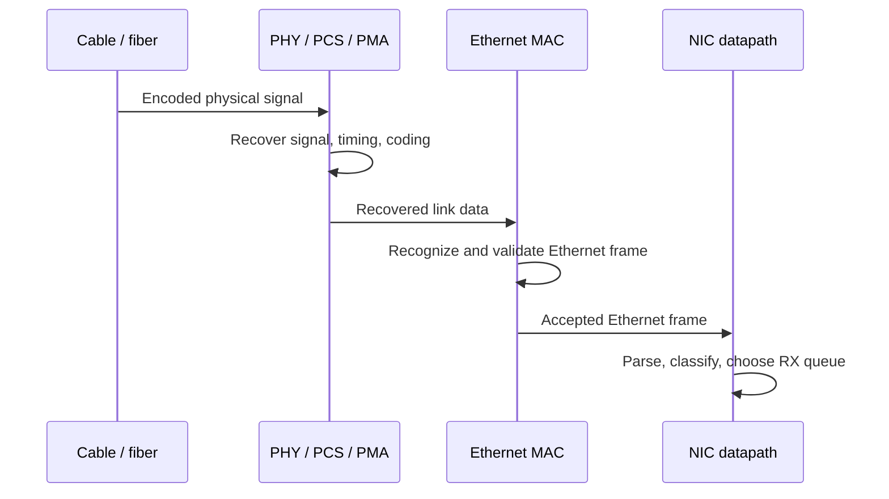
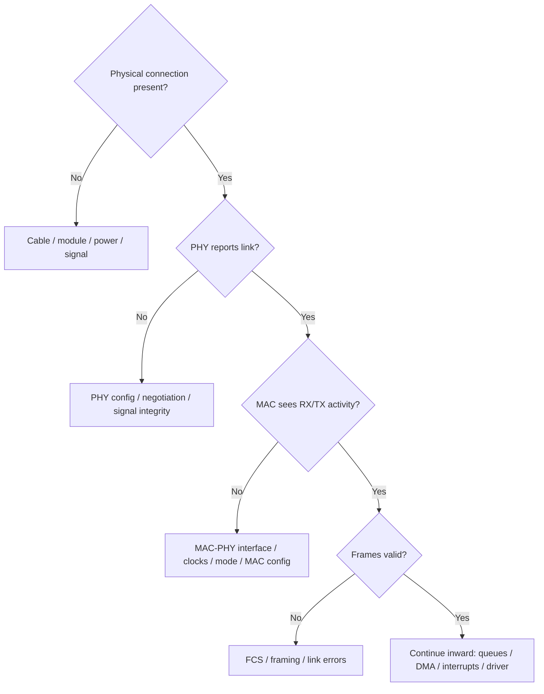

# 02 — Ethernet from Wire to MAC

The first lesson treated the NIC as one connected system. Now zoom in on the network-facing edge of that system.

When we say a packet "arrives at the NIC," several layers of hardware have already done substantial work before the NIC datapath can inspect an Ethernet frame.

This lesson builds the path from the physical medium to the MAC without trying to cover every Ethernet standard or PHY register yet.

## Why this matters

A firmware or driver engineer debugging a dead or unstable network interface needs to know **where the failure could physically be**.

"The Ethernet link is broken" might mean:

- no usable signal is reaching the receiver,
- the PHY cannot establish or maintain the link,
- autonegotiation selected unexpected parameters,
- the PHY-to-MAC interface is misconfigured,
- frames reach the MAC but fail validation,
- or the MAC works and the actual problem is farther inside the NIC.

The goal is to stop thinking of the Ethernet connector as if it feeds packet bytes directly into software.

## The physical-to-frame pipeline



The exact partitioning depends on Ethernet generation and hardware implementation, but this is a useful first model:

- the **physical side** deals with signals and encoded symbols/blocks;
- the **MAC side** deals with Ethernet frames.

The PHY is the bridge between those worlds.

## PHY, PCS, PMA, SerDes, and MDI

These terms appear constantly in NIC documentation, schematics, driver code, and datasheets.

### MDI

**MDI — Medium Dependent Interface** — is the physical connection toward the network medium.

For copper Ethernet, think of the electrical interface toward the magnetics and cable. For optical systems, the physical implementation differs, but the same conceptual boundary exists: this is where the device meets the medium.

### PMA

**PMA — Physical Medium Attachment** — handles signal-oriented work close to the medium.

Depending on the Ethernet technology, this can include functions such as serialization/deserialization, clock recovery, signal conditioning, and alignment.

### PCS

**PCS — Physical Coding Sublayer** — sits above the PMA and deals with the coding used to represent data on the link.

Its exact work depends strongly on Ethernet generation. The durable idea is that the wire does not simply carry the Ethernet frame byte-for-byte in the same representation the MAC sees. Physical-layer encoding must be decoded into a usable digital stream.

### SerDes

A **serializer/deserializer (SerDes)** converts between parallel internal data and high-speed serial signaling.

At high link rates, SerDes behavior becomes a major part of signal integrity and link-debugging work. Equalization, lane alignment, and training can matter before the MAC ever sees a frame.

### PHY

"PHY" is often used for the physical-layer device or block containing much of this machinery.

A useful simplification is:

> **PHY: make a reliable digital link out of the physical medium.**

Later lessons can examine PHY management and MDIO in detail. For now, the important boundary is that a working PHY presents recovered link data toward the MAC.

## The PHY and MAC may be separate chips

On an embedded board, the MAC may live inside an SoC while the Ethernet PHY is a separate IC.



That creates another interface that can fail independently.

For example, a board can report that the PHY has established link with its link partner while still failing to pass packets because the MAC-to-PHY interface has incorrect timing, clocking, mode configuration, or pin setup.

This distinction is particularly important in embedded Linux systems where device-tree configuration, pinmux, clocks, PHY mode, and driver setup all meet at this boundary.

## What does link up actually mean?

A lit link LED does **not** mean that Linux networking is working end-to-end.

At a high level, link-up means the physical/link partners have established enough agreement for the PHY-level connection to operate.

That may include negotiation of parameters such as:

- supported link speed,
- duplex behavior on technologies where it is relevant,
- pause/flow-control capabilities,
- and other technology-specific features.

The exact negotiation mechanism varies across Ethernet standards.

The important debugging lesson is:

> **Link up proves something about the physical connection. It does not prove that the MAC, DMA engine, descriptor rings, driver, IP configuration, or application path works.**

## Autonegotiation

Ethernet peers often need to determine which mutually supported operating mode to use.

Conceptually:



Real autonegotiation is technology-specific and more complicated than this diagram. For this lesson, retain the idea that both ends exchange capabilities and establish compatible link parameters rather than software blindly assuming a speed.

## From recovered data to an Ethernet frame

Once the physical layers have recovered usable data, the MAC operates on Ethernet frames.

A simplified Ethernet frame looks like this:

```text
+----------+-----+-------------+-------------+------------+---------+
| Preamble | SFD | Destination |   Source    | Type/Len   | Payload |
+----------+-----+-------------+-------------+------------+---------+
                                                        ...
+----------------+-----+
| Payload / Pad  | FCS |
+----------------+-----+
```

A more useful conceptual view is:


### Preamble and SFD

The preamble and **Start Frame Delimiter (SFD)** help establish the beginning of the Ethernet frame on the link.

### Destination and source addresses

Ethernet MAC addresses identify the destination and source at the link layer. They are not IP addresses and solve a different problem from IP routing.

### EtherType

For Ethernet II frames, the EtherType identifies the protocol carried in the payload—for example IPv4, IPv6, or ARP.

### Payload and padding

The frame carries higher-layer data. Short frames may require padding to meet Ethernet's minimum frame-size requirements.

### FCS

The **Frame Check Sequence (FCS)** contains a CRC used to detect corruption of the Ethernet frame.

A receiver that detects an invalid FCS normally treats the frame as corrupted rather than delivering it as an ordinary valid packet.

## What the MAC is responsible for

For this course, use this mental model:

> **The PHY gives the MAC a usable link-level data stream; the MAC turns that stream into valid Ethernet frames and turns outgoing frames back into the form required by the PHY.**

Receive-side MAC work can include:

- recognizing frame boundaries,
- handling MAC addressing/filtering behavior,
- checking frame length and format,
- checking the FCS,
- collecting MAC-level error statistics,
- and delivering accepted frames toward the NIC datapath.

Transmit-side work includes constructing the required framing behavior and sending frames toward the physical layer.

The precise division of responsibilities varies by implementation, so avoid assuming every feature called an "Ethernet feature" literally executes inside the MAC block.

## Where does packet parsing begin?

Once a valid Ethernet frame leaves the MAC, richer NIC datapath logic can inspect it.


This is where the boundary from **Ethernet framing** to **NIC packet processing** becomes useful.

The MAC does not need to decide which CPU core should process a TCP flow. Later datapath logic can parse higher-layer headers, compute an RSS hash, and steer the packet toward a receive queue.

## A receive walk from cable to NIC datapath



Notice where this lesson stops: **before DMA**.

The next several lessons will explain how the NIC crosses PCIe and places that accepted frame into host memory.

## A practical debugging ladder

When an Ethernet interface does not work, debug from the lowest layer upward instead of changing unrelated software settings at random.



Useful evidence can come from multiple places:

- PHY link and error registers,
- MAC statistics,
- NIC hardware counters,
- Linux interface statistics,
- `ethtool`,
- packet captures,
- and, on hardware bring-up, scopes or other signal-analysis equipment.

The exact tools depend on which boundary is under suspicion.

## Common misconceptions

### "The PHY receives Ethernet packets"

At a high level people often say this, but it hides an important boundary. The PHY primarily deals with the physical representation of the link; the MAC is where Ethernet frames become the useful abstraction.

### "Link up means the network stack should work"

No. It only establishes that a much lower portion of the path is operational.

### "The MAC and PHY are always inside the same NIC chip"

No. They may be integrated, or the MAC may connect to an external PHY through an interface such as RGMII or SGMII.

### "FCS is the same as a TCP checksum"

No. Ethernet FCS protects the frame at the link layer. TCP/UDP/IP checksums operate at different protocol layers and have different coverage and purposes.

## Knowledge check

1. What conceptual boundary separates the PHY from the MAC?
2. What are PCS and PMA doing that the MAC should not need to care about?
3. Why can a system have link-up but still pass no packets?
4. What is the purpose of autonegotiation?
5. What is the FCS intended to detect?
6. Why is an Ethernet MAC address different from an IP address?
7. If the PHY reports link but the MAC receives nothing, what boundary would you investigate next?
8. Where would RSS logically sit relative to the MAC and DMA engine?
9. Why is it useful to debug an interface from the physical layer inward?

## What to carry into the next lesson

You do not need to memorize every Ethernet sublayer yet. Keep three boundaries clear:

```text
physical medium
    ↓
PHY: recover and maintain the physical link
    ↓
MAC: recognize and produce Ethernet frames
    ↓
NIC datapath: parse, classify, steer, queue
```

Once a valid frame reaches the NIC datapath, a new question becomes central:

> **How does this PCIe device communicate with the host and eventually move packet data into system memory?**

That is the next layer inward.

## Next lesson

Next: **PCIe for NIC Engineers** — enumeration, BARs, MMIO, bus mastering, PCIe transactions, and how the host and NIC communicate before DMA can make sense.

[← Previous: The NIC as a System](/courses/nic-firmware/01-nic-as-a-system/) · [Back to NIC Firmware Engineering](/courses/nic-firmware/)
