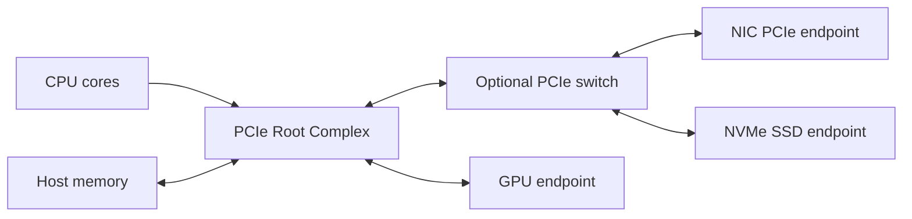
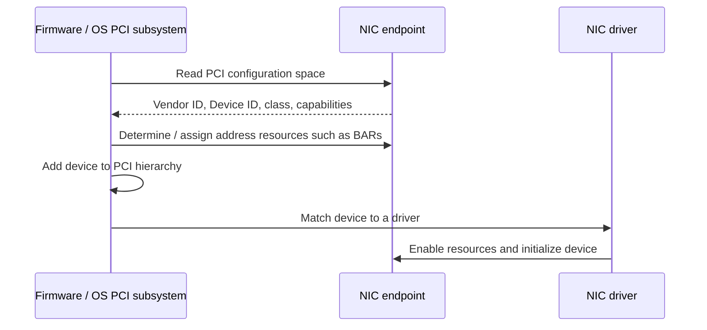
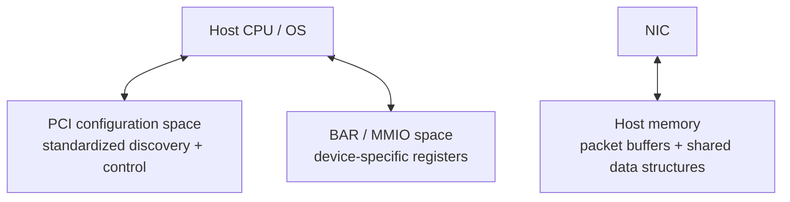
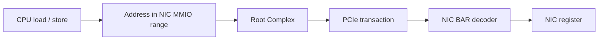
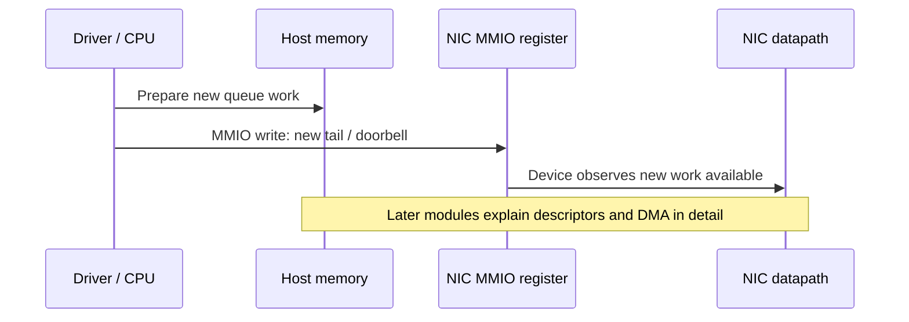
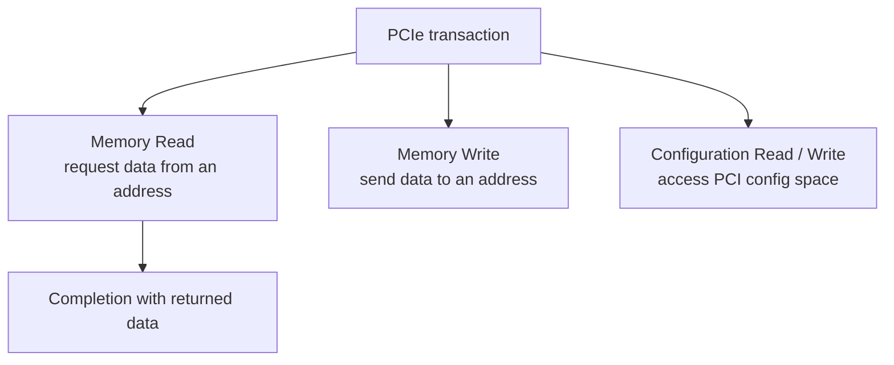
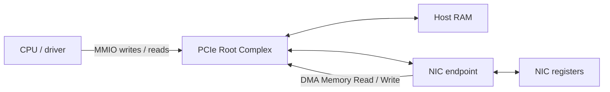
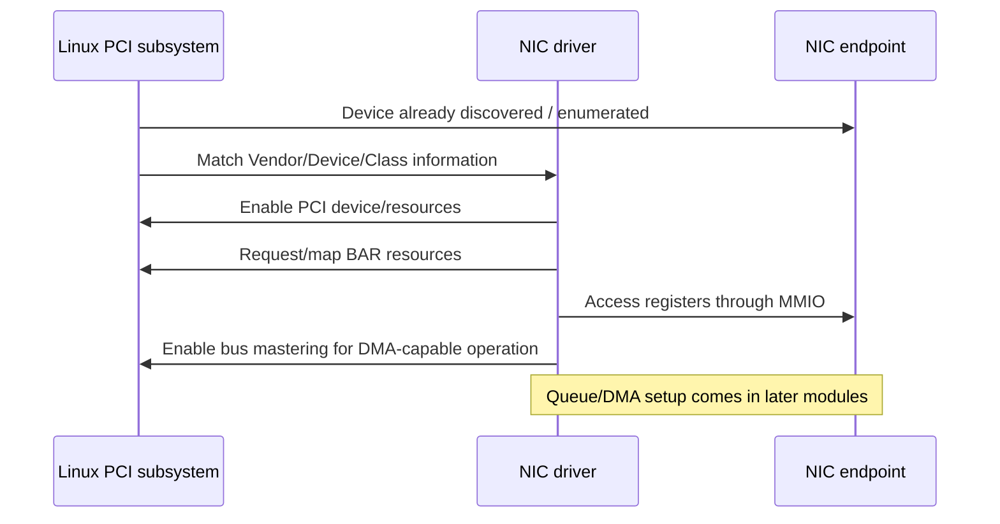
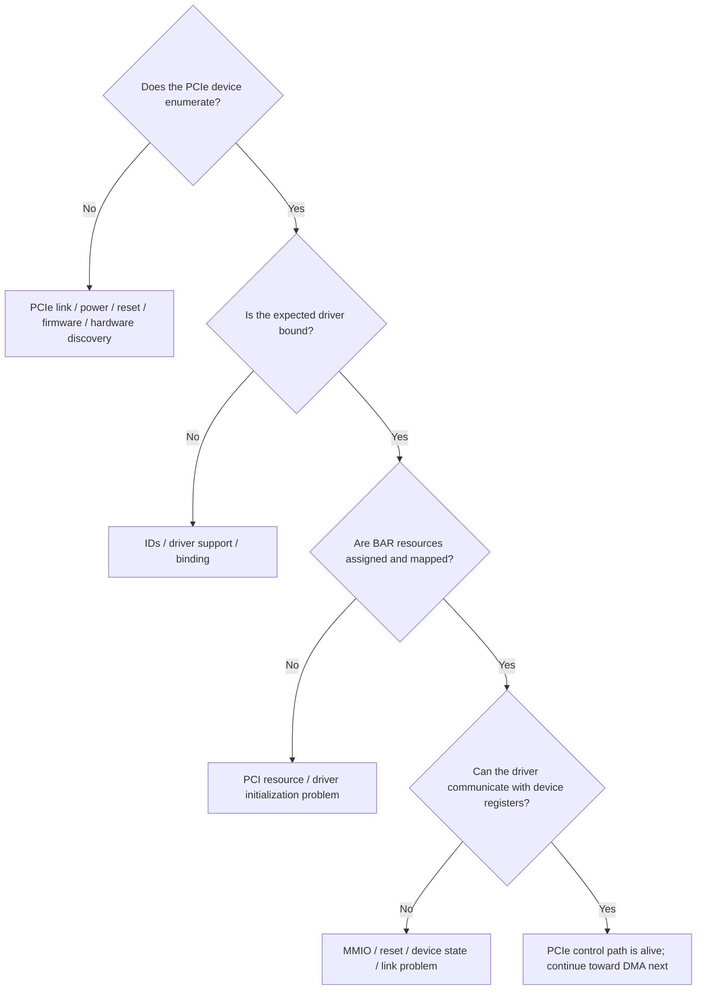

# 03 — PCIe for NIC Engineers

The first two modules followed a packet from the wire through the PHY and MAC. Now we move to the other side of the NIC: **the connection between the NIC and the host computer**.

The key idea for this lesson is:

> **PCIe is the transport that lets the host configure the NIC and lets the NIC initiate transactions toward host memory.**

This lesson deliberately stops before explaining DMA address translation, IOMMUs, scatter/gather, or descriptor-ring mechanics. First we need to understand how a NIC becomes a usable PCIe device at all.

## What you should already know

This lesson assumes only the following ideas from Modules 1 and 2:

- a NIC bridges the network side and the host-memory side;
- the PHY and MAC turn physical signaling into valid Ethernet frames;
- the driver configures and manages the NIC;
- packet data ultimately moves between the NIC and host memory;
- DMA is the broad mechanism that lets the NIC move that data without the CPU copying every byte.

You do **not** need to know yet how DMA addresses are constructed or how descriptor rings work internally.

## PCIe is not just a shared data bus

It is tempting to picture PCIe as a bundle of wires carrying addresses and data like an older parallel bus.

A better model is a **packetized, point-to-point interconnect**.



The **Root Complex** connects the CPU/memory system to the PCIe hierarchy.

A NIC is normally a PCIe **Endpoint**. It participates in PCIe transactions but is not the root of the hierarchy.

PCIe switches can fan one upstream connection into several downstream endpoints.

## Links and lanes

A PCIe connection is called a **link**. A link can contain multiple **lanes**, commonly described as:

```text
x1   x2   x4   x8   x16
```

More lanes allow more data to move in parallel.

A link also negotiates a PCIe generation/speed. The exact signaling details are not important yet. For now, remember that a device can be physically installed in a wide slot but negotiate a narrower or slower link than expected.

That becomes a useful debugging question later:

> Is the NIC working correctly but connected through less PCIe bandwidth than intended?

On Linux, `lspci -vv` commonly exposes both the device's link capabilities and the currently negotiated link state.

## Before a driver can use the NIC, the system must discover it

When the machine boots, system software must determine which PCIe devices exist and what resources they require.

This discovery process is usually called **enumeration**.

At a high level:



The exact division of work between platform firmware and the operating system depends on the platform. The durable idea is that the NIC does not simply appear to the driver as a raw chunk of hardware. It first participates in a standardized PCI discovery and resource-allocation process.

## Configuration space: the NIC's standardized identity card

Every PCIe function has **configuration space** containing standardized information the host can inspect before the device-specific driver knows how the NIC works internally.

Important examples include:

- Vendor ID;
- Device ID;
- Class Code;
- Command and Status registers;
- Base Address Registers (BARs);
- capability structures;
- PCIe link and device capabilities.

A Linux PCI address such as:

```text
0000:03:00.0
```

is commonly read as:

```text
segment/domain : bus : device . function
0000             03    00       0
```

The shorter form `03:00.0` is often enough when only one PCI segment is involved.

### Device versus function

One physical PCIe device can expose more than one **function**. Each function has its own configuration-space identity.

For an ordinary single-function NIC, you may only see function `.0`.

Later, technologies such as SR-IOV will make the distinction between a physical device and multiple PCI functions much more important.

## Three address spaces to keep separate

A major source of PCIe confusion is treating every address as though it refers to ordinary RAM.

For this course, keep these three spaces distinct:



They solve different problems.

### Configuration space

Used to identify the PCIe function, discover capabilities, allocate resources, and enable important PCI-level behavior.

### BAR / MMIO space

Used by the CPU and driver to access **device registers**.

### Host memory

Ordinary system RAM. The NIC can later perform DMA transactions to buffers and data structures placed there.

That distinction leads to one of the most important mental models in this course:

> **MMIO is primarily the CPU talking to the device. DMA is primarily the device talking to host memory.**

Both travel through PCIe, but they are not the same operation.

## BARs: giving device registers an address

A **Base Address Register (BAR)** describes an address region the PCI device wants the host to map into the system's I/O or memory address space.

Modern NICs primarily use **memory-mapped I/O (MMIO)** BARs.

Conceptually:



The address is routed to the NIC rather than to DRAM because the platform has assigned that address range to the device's BAR.

A BAR might expose registers for things such as:

- device status;
- reset/control;
- queue configuration;
- interrupt configuration;
- statistics;
- queue head/tail state;
- doorbells.

The precise registers are NIC-specific.

### What a BAR is not

A BAR is **not** normally a pointer to a packet buffer in RAM.

It is an address window through which host software reaches device resources, most commonly registers.

Host packet buffers are a different problem and belong to DMA, which is the next module.

## MMIO: loads and stores that reach hardware

Once the driver maps a BAR, it can access device registers through MMIO.

Conceptually, code might perform an operation equivalent to:

```text
write queue_tail = 42
```

but that write does not simply update a normal cached variable in RAM. It becomes a device transaction routed through the PCIe hierarchy.

Operating systems provide special MMIO accessors because device registers have different semantics from ordinary memory.

For Linux driver code, you will commonly encounter functions such as:

```text
readl()
writel()
```

Do not yet memorize their exact ordering guarantees. The important point is that drivers should use the architecture/OS-approved device-I/O mechanisms rather than treating an MMIO register as an ordinary C variable.

Memory ordering around MMIO and DMA becomes important later in the course.

## A concrete example: the doorbell

Suppose software has prepared some new transmit work in host memory.

How does the NIC know it should look for that work?

A common pattern is a **doorbell register**.



The exact implementation varies, but the pattern is powerful:

- bulk data structures live in RAM;
- a small MMIO register update tells the NIC that something changed.

Why not put all packet data in MMIO registers? Because MMIO is a poor mechanism for moving large packet payloads compared with DMA to ordinary memory.

## Bus mastering: allowing the NIC to initiate transactions

So far, the host has been initiating accesses toward the NIC.

For DMA, the direction of initiative changes.

A PCI device operating as a **bus master** can initiate PCIe transactions instead of only responding to host requests.

For a NIC, this is what makes operations such as these possible:

```text
TX: NIC initiates Memory Reads  → fetch packet data from host memory
RX: NIC initiates Memory Writes → place received packet data into host memory
```

The PCI Command register contains a **Bus Master Enable** control. A driver normally enables bus mastering as part of bringing a DMA-capable PCI device online.

Enabling bus mastering does **not** mean the NIC should be thought of as having unrestricted magical access to every byte of RAM. The operating system, DMA mappings, platform architecture, and possibly an IOMMU determine which device-visible addresses are valid. That is Module 4.

## PCIe transactions: only the minimum model for now

PCIe carries requests as packetized transactions.

You will eventually encounter the term **TLP — Transaction Layer Packet**.

For this lesson, only distinguish a few transaction intentions:



A Memory Read requires the requested data to come back in a completion.

A normal Memory Write is **posted**: the requester sends the write without waiting for a successful-write completion packet in the ordinary case.

That distinction will matter later when we discuss performance and ordering, but you do not need the TLP header format yet.

## Put the pieces together: host configuration versus packet movement

We can now make the Module 1 PCIe block more precise.



The two important paths are:

### Control-oriented path

```text
CPU
→ PCIe MMIO transaction
→ NIC BAR
→ NIC register
```

### Data-movement path

```text
NIC
→ PCIe Memory Read / Write
→ host memory
```

The second path is DMA. We know **where it travels** now; Module 4 will explain how software safely gives the NIC addresses and buffers to use.

## What happens when a Linux NIC driver starts?

Without diving into driver source yet, a simplified lifecycle looks like this:



Real drivers have many more steps. The goal here is only to place the PCIe-specific operations in the right order.

## A practical debugging ladder for PCIe

Now we can extend the debugging model by one layer beyond Module 2.



We still stop before diagnosing descriptor-ring or DMA failures because those concepts have not been established yet.

## Common misconceptions

### "PCIe is just the wire used for DMA"

Too narrow. PCIe also carries configuration accesses, MMIO register transactions, interrupts such as MSI/MSI-X, and other device traffic.

### "A BAR points to host RAM"

Usually not. A NIC BAR typically maps device registers or other device resources into host address space.

### "MMIO and DMA are the same thing because both use PCIe"

No. MMIO is usually a host-initiated access to device resources. DMA is a device-initiated access to host memory.

### "If Linux sees the NIC in `lspci`, packet DMA must work"

No. Enumeration proves that a lower layer of the PCIe/device path is working. DMA setup, queue configuration, interrupts, and packet processing can still fail later.

### "Bus mastering means the NIC can ignore the operating system's memory rules"

No. It means the device is capable of initiating transactions. Which addresses it can legitimately use is controlled by the DMA-mapping and platform mechanisms we will study next.

## Mini lab: inspect a real PCIe NIC

On a Linux system with a PCI or PCIe network device, identify the device and map the lesson's concepts onto real system state.

### 1. Find the NIC

```bash
lspci -nn | grep -i -E 'ethernet|network'
```

You should see something similar to:

```text
03:00.0 Ethernet controller [0200]: Vendor Device [1234:5678]
```

Do not worry if the exact format differs.

Record:

- BDF (`03:00.0` in this example);
- Vendor ID;
- Device ID;
- device class.

### 2. Inspect capabilities and link state

```bash
sudo lspci -vv -s 03:00.0
```

Look for information such as:

- `Region` entries — BAR-backed resources;
- `LnkCap` — link capability;
- `LnkSta` — negotiated link state;
- the kernel driver in use;
- whether bus mastering is enabled, often visible as `BusMaster+` in the command/status summary.

Do not try to change any PCI configuration fields for this lab.

### 3. Inspect Linux's resource view

Replace the BDF with your device:

```bash
cat /sys/bus/pci/devices/0000:03:00.0/resource
```

Each row describes a PCI resource range. Compare those ranges with the `Region` lines reported by `lspci`.

You are not expected to understand every flag yet. The goal is simply to connect:

```text
BAR in PCI configuration
        ↓
assigned host address range
        ↓
Linux resource entry
        ↓
driver can map that range as MMIO
```

### 4. Find the bound driver

```bash
readlink /sys/bus/pci/devices/0000:03:00.0/driver
```

Record the driver's name. We will eventually open that driver source and find where it maps BARs and enables the device.

## Knowledge check

1. What role does the PCIe Root Complex play in the host?
2. What does PCI enumeration discover or assign before the NIC driver can fully initialize the device?
3. What is PCI configuration space used for?
4. What is a BAR, and why is it different from a packet buffer in host RAM?
5. What is the practical difference between MMIO and DMA?
6. Why would a driver write a doorbell register rather than copy an entire packet through MMIO?
7. What does bus mastering enable a NIC to do?
8. For ordinary PCIe transactions, why does a Memory Read need a completion while a posted Memory Write normally does not?
9. If `lspci` can see the NIC but the driver cannot communicate with its registers, which part of the path would you investigate before blaming packet DMA?
10. Draw the two paths: CPU → NIC register and NIC → host RAM.

## What to carry into the next lesson

Keep three address spaces separate:

```text
PCI configuration space
    discovery and standardized control

BAR / MMIO space
    CPU ↔ device registers

host RAM
    packet buffers and shared data structures
```

And keep this asymmetry clear:

```text
CPU initiating toward NIC registers = MMIO
NIC initiating toward host RAM      = DMA
```

PCIe provides the transport for both.

Now we are ready for the next question:

> **How does a driver give a PCIe device safe, usable addresses for real host-memory buffers?**

## Next lesson

Next: **DMA Fundamentals** — DMA mappings, device-visible addresses, IOMMUs, coherent versus streaming mappings, scatter/gather, and the exact RX/TX direction of device memory transactions.

[← Previous: Ethernet from Wire to MAC](/courses/nic-firmware/02-ethernet-wire-to-mac/) · [Back to NIC Firmware Engineering](/courses/nic-firmware/)
