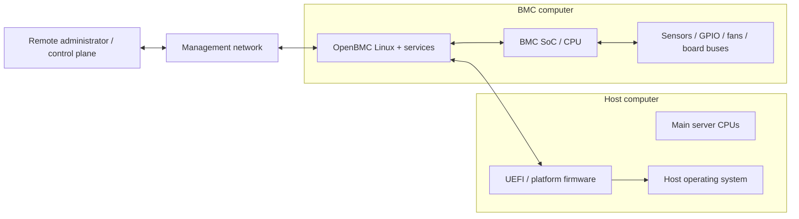
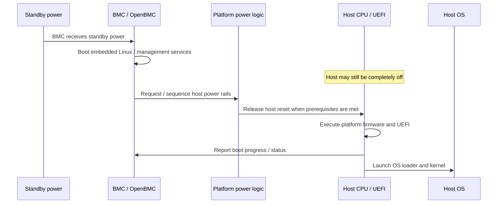
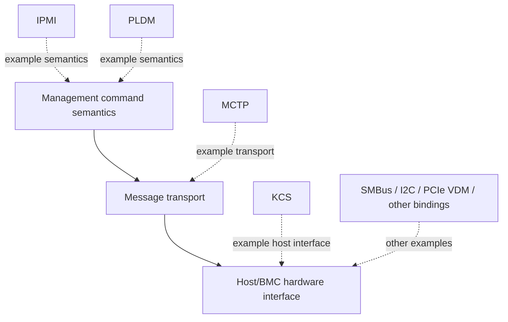
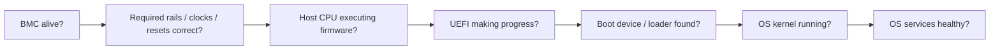

# 01 — Server Firmware as a System

Before learning OpenBMC services, UEFI phases, or management protocols, build one whole-machine picture.

A modern server contains at least two important computing worlds:

- the **host system**, where the main CPUs run UEFI and eventually the operating system,
- and the **management system**, where a separate Baseboard Management Controller (BMC) can remain alive independently of the host.

The central idea is that the BMC is not merely a peripheral attached to the host. It is a **separate embedded computer whose job is to observe, control, recover, and remotely manage the host platform**.

## The simplest useful mental model



The exact hardware links between BMC and host vary by platform. Over the course we will replace the vague `OpenBMC ↔ UEFI` connection with concrete mechanisms such as KCS/IPMI, MCTP/PLDM, UART, shared memory, GPIO, and other board-specific channels.

## The BMC can be alive while the host is off

Servers commonly have a standby-power domain that powers the BMC and selected management circuitry before the main host rails are enabled.

That makes an important sequence possible:



This independence explains how an administrator can remotely power on, reset, inspect, or recover a server whose main operating system is unavailable.

## Where UEFI fits

UEFI belongs primarily to the **host firmware world**.

Its job is broader than "load Linux." Before an OS kernel can run, platform firmware must establish enough of a working machine to hand control to it: initialize essential hardware, discover resources, prepare memory and I/O, expose firmware interfaces, choose a boot target, and launch an OS loader.

For now, use this simplified host path:

```text
host power/reset
    ↓
early platform firmware
    ↓
UEFI initialization
    ↓
UEFI boot manager / OS loader
    ↓
OS kernel
    ↓
runtime system
```

Later lessons will make the internal UEFI phases concrete rather than treating UEFI as one monolithic block.

## Where OpenBMC fits

OpenBMC is an embedded Linux firmware distribution for the BMC.

At a high level it gives the management controller software for things such as:

- platform power and reset control,
- temperature, voltage, current, and fan monitoring,
- inventory and field-replaceable-unit information,
- event logging,
- watchdog and recovery behavior,
- remote console access,
- firmware update,
- management-network APIs,
- and communication with host firmware and the host operating system.

An important mental model for later is:

> OpenBMC is not one daemon. It is a Linux system containing many cooperating services, with D-Bus acting as a major internal integration layer.

## Host-to-BMC communication is layered

One source of confusion in platform firmware is that several protocol names appear together even though they live at different layers.

For now, do **not** memorize all of them. Just keep this shape in mind:



The exact layering depends on the protocol stack in use. This course will deliberately separate these concepts so names like **IPMI over KCS** and **PLDM over MCTP** become mechanically understandable instead of vocabulary to memorize.

## One server, several consoles and viewpoints

When debugging platform firmware, "the console" is ambiguous.

You may have:

- a BMC serial console,
- a host UART console carrying UEFI/OS output,
- Serial over LAN that the BMC exposes remotely,
- SSH into the BMC Linux environment,
- a UEFI shell,
- an OS shell after boot,
- management API responses over Redfish or IPMI.

A strong platform engineer learns to correlate these viewpoints rather than staring at only one log stream.

## Control does not imply execution

The BMC may control whether the host powers on, but the BMC does not normally execute UEFI on behalf of the host.

Conceptually:

```text
BMC:    "Power rails are ready; release/reset the host."
Host:   executes its own firmware on its own CPU(s)
UEFI:   initializes the host platform
BMC:    observes status, handles management requests, may influence policy
```

That separation will matter repeatedly when diagnosing whether a failure belongs to:

- board power/reset logic,
- BMC software,
- host firmware,
- host/BMC communication,
- or the operating system.

## A first debugging framework

If a server "doesn't boot," do not begin with UEFI source code.

First ask which boundary failed:



Each boundary has different evidence. Later labs will attach specific logs, buses, commands, and hardware observations to this flow.

## Connection to the Arm RD-V3 learning path

The Arm learning path provides a concrete simulated platform where both BMC and host firmware can run before physical silicon is available.

While working through it, use this lesson as the map. Every command or log should answer one of these questions:

- Am I looking at the BMC or the host?
- What power/boot state is the host currently in?
- Which processor is executing this code?
- Which communication channel is being exercised?
- Is this a control-plane operation or host boot execution?
- What evidence would tell me which side failed?

If an external tutorial introduces a mechanism before this course has explained it, add a comment or question rather than inventing the missing details. Those questions should drive later lessons.

## Knowledge check

1. Why is it useful for the BMC to run from standby power?
2. Is OpenBMC executed by the host CPU or by a separate management processor?
3. Where does UEFI execute?
4. Why can a remote administrator sometimes reboot a machine whose host OS is frozen?
5. What is the difference between controlling host power and executing host firmware?
6. Name three distinct ways you might observe a server during early boot.
7. Why should IPMI, PLDM, MCTP, and KCS not all be thought of as equivalent protocols at the same layer?
8. If the BMC is reachable but the host UART is completely silent after power-on, what broad subsystem boundaries would you investigate before debugging the OS?

## Mini-experiment

As you work through the Arm RD-V3 material, create a two-column note:

| Observation | Which computer / layer? |
|---|---|
| BMC Linux boot log | BMC computer |
| UEFI console line | Host firmware |
| `ipmitool` request | Management command crossing a host/BMC or network/BMC interface |
| SOL output | Host serial data being exposed through the BMC |

Keep adding rows whenever a new component or acronym appears. The goal is to force every new term into the whole-machine model.

## For now, carry one picture forward

Do not memorize the entire management stack yet.

Remember this:

> A server contains a host computer and an independently manageable embedded computer. UEFI brings up the host; OpenBMC manages the platform around it; the two coordinate through explicit hardware and protocol interfaces.

## Next lesson

Next: **Power, Reset, and Boot Ownership** — what can run before the host CPU, which rails and reset domains matter, and how the BMC participates in turning a server into an executing machine.

[← Back to OpenBMC & UEFI Platform Firmware](/courses/openbmc/)
